# 우분투 리눅스 4

# 6.핵심 개념과 기본 명령어

## 6.1 핵심기본개념

1. 대소문자를 구분한다.
2. 명령어 유형은 내부명령어와 외부 명령어로 구분한다.
3 실행파일로 제공하는 것은 외부 명령어이며, 확장자가 없으며 실행권한이 있다.
4 쉘 해석기로 제공하는 것은 내부 (BUILTIN)명령어이다.
5. 파이프를 통하여 명령어 조합이 가능하다.
6. 사용권한에 따라사용가능한명령과사용할수없는명령이 있다.
7. 모든 디렉터리, 장치, 파일 등을 파일이라는 단일 구조로 사용한다.
8 옵션 형식이 다양하다
9. 모든 명령은 백그라운드/포 그라운드 동작이 가능하다
10 리다이렉션으로 출력 방향을바꿀수있다.

### 텍스트 모드로시작하기

1. /etc/default/grub 편집
    GRUB_CMDLINE_LINUX_DEFAULT="quiet splash"를
    GRUB_CMDLINE_LINUX_DEFAULT="quiet splash text" 로 변경

 2. sudo update-grub 명령어로 grub 재설정 후 다시시작

### 그래픽 모드로시작하기

1. /etc/default/grub 편집 GRUB_CMDLINE_LINUX_DEFAULT="quiet splash text"를 GRUB_CMDLINE_LINUX_DEFAULT="quiet splash"로 변경
2. sudo update-grub 명령어로 grub 재설정 후 다시시작

## 6.2 기본 명령어

### 로그인

```bash
Ubuntu 10.01 LTS coffee-desktop tty3 
coffee-desktop login:
```

### 로그아웃

```bash
exit
logout
```

### 계정확인

```bash
# : root
$ : user
```

### 디렉토리 이동

```bash
원하는 디렉토리 이동
cd [dir]
상위 디렉토리 이동
cd ..
절대경로 이동
cd /[dir1]/[dir2]
홈 디렉토리 이동
cd
cd ~
```

### 디렉토리 내용보기

```bash
내용보기
ls
ls -al
a는 숨김파일 보기 l은 옵션
```

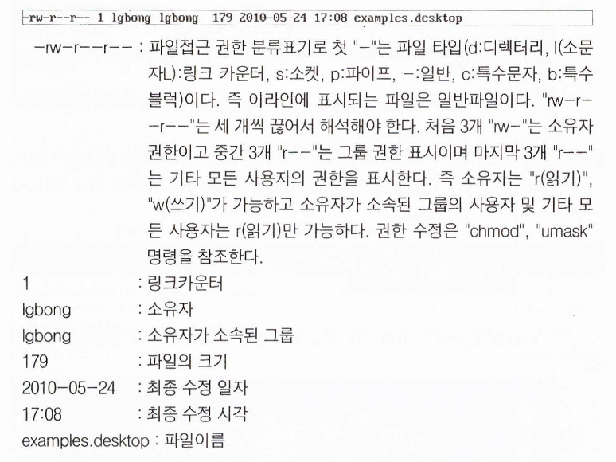

### 메뉴얼

```bash
man [-acdfFhkKtwW] [-m system] [-p string] [-C config_file] [-M path] [-P pager] [-S section_list] [section] name ...
```

### 파일 다운로드

```bash
wget [option]...[url]
```

### 파일 설치하기

```bash
dpkg [option] deb [패키지명]
```

### 시스템 종료

```bash
shutdown [-t sec] [-rkhnd time] [warning-message]
즉시 종료
halt [-n] [-w] [-d] [-f]
다시시작
reboot [-n] [-w] [-d] [-f]
```

### 현재 디렉토리 보기

```bash
pwd
```

### 메세지 보내기

```bash
wall [message]
```

### 리다이렉션

```bash
ls>/dev/pts/1
```

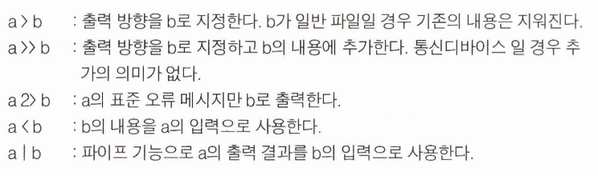

### 프로그램 추가

```bash
apt-get [-sqdyfmubV] [-o= config_string] [-c= config_file]
[-t= { target_release_name | target_release_number_expression |
target_release_codename }]
{update|upgrade|dselect-upgrade|dist-upgrade|install pkg
[ {=pkg_version_number |/target_release_name |/target_release_codename
}] ...| remove pkg... |purge pkg... |source pkg
[ { =pkg_version_number |/target_release_name |/target_release_
codename
}] ...|build-dep pkg...|check |clean |autoclean |autoremove |
{-v |--version} |{-h |--help} }
```

```bash
설치
install
업데이트
update
업그레이드
upgrade
소스 
source
```

```bash
요즘은 apt가 더 많이 쓰인다.
apt
```

### 메세지 만들기 및 보기

```bash
cat [option] [file]
```

### 현재 사용자 확인

```bash
finger [-lmsp][user][user@host]
who [-imqsuwHT] [--count] [--idle] [--heading] [--help] [--message] [--mesg] [--version] [--writable] [file] [am i]
자기 자신 확인
who am i
```

### 화면지우기

```bash
clear
```

### 파일 복사하기

```bash
cp [options] source dest
```

### 디렉토리 생성

```bash
mkdir [-p] [-m mode] [--parents] [--mode=mode] [--help] [--version] dir...
```

### 디렉터리 삭제

```bash
rmdir [-p] [--parents] [--help] [--version] dir...
```

### 파일 삭제

```bash
rm [-dfirvR] [--directory] [--force] [--interactive] [--recursive] [--help] [--version] [--verbase] name...
```

### 디렉터리 파일채로 강제 삭제

```bash
rm -rf dir
```

### 파일 이동

```bash
mv [options] source dest
```

### 디스크 공간 확보

```bash
df [-aikPv] [-t fstype] [-x fstype] [--all] [--inodes] [--type=fstype] [--exclude-type=fstype] [--kilobytes] [--portability] [--print-type] [--help] [--version] [filename...]
```

### 사용가능한 디스크 공간 확인

```bash
du [-abcklsxDLS] [--all] [--total] [--count-links] [--summarize] [--bytes] [--kilobytes] [--one-file-system] [--separate-dirs] [--dereference] [--dereference-args] [--help] [--version] [filename...]
```

### 사용한 디스크 공간 확인

```bash
fdisk [-l] [-v] [-s 파티션] [장치이름]
```

### 파일 변환하기

```bash
dd [--help] [--version] [if=flle] [of=flle] [ibs=bytes] [obs=bytes] 
[bs=bytes] [cbs=bytes] [skip=blocks] [seek=blocks) [count=blocks]
[conv={ascii,ebcdic,ibm,block,unblock.lcase,ucase,swab,noerror,notrunc, sync})
```

### 날짜 계산 및 변경

```bash
date [-u] [-d datestr] [-s datestr] [--utc] [--universal] [--date=datestr]
[--set=datestr] [--help] [--version] [+FORMAT] [MMD-Dhhmm[[CC]YY] [.ss]]
```

### 파일 찾기

```bash
find [-H] [-L] [-P] [-D debugopts] [-Olevel] [path...] [expression]
```

### 프로세스 확인하기

```bash
ps [options]
```

### 프로세스 강제종료

```bash
kill [-s signal|-p] [-a] [--] pid ...
```

### 마운트하기

```bash
mount[-fnrvw] [-t 파일시스템유형][-o 옵션] 장치디렉토리
```

### 마운트 해제하기

```bash
umount [-nv] 장치|디렉토리 [...]
```

### 파일시스템 검사하기

```bash
fsck [-AVRTNP] [-s] [-t 파일시스템유형] [파일시스템옵션] 파일시스템 [...]
```

### 도스 명령어 지원

```bash
mtools
```

### 파일 시스템 만들기

```bash
mkfs [-V] [-t 형태] [fs -options] 장치이름 [블럭]
```

### 접근 권한 변경하기

```bash
chmod [-Rcfv] [--recursive] [--changes] [--silent] [--quiet] [--verbose] [--help] [--version] mode file...
```

```bash
umask [-S] [모드]
```

### 화면제어모드

```bash
stty [설정..]
```

## 6.3 vi 편집기

가볍고 익숙해지면 편한 편집기 

"vi"에는 크게 세 가지 모드가 있다. 

첫째는 명령 (ESC)모드이고 둘째 는 편집 (입력, i)모드, 셋째는 확장(콜론, :)모드이다.

### 파일편집하기

```bash
vi filename
```

### 환경설정하기

```bash
vi .vimrc
```

### 글입력하기

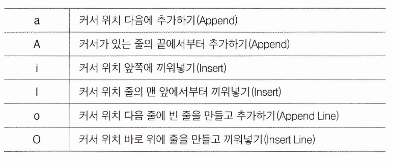

### 커서이동

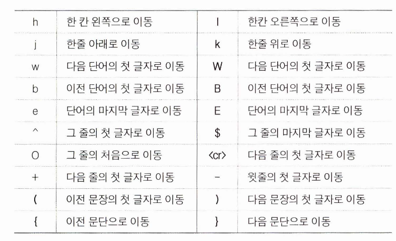

대문자명령은 무조건 띄어쓰기 전까지를 한 단어로 취급한다.

### 글 수정

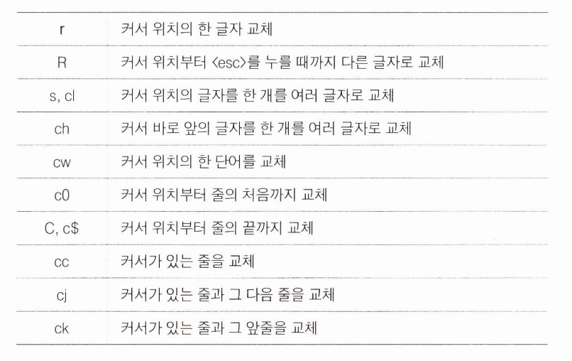

### 글 삭제

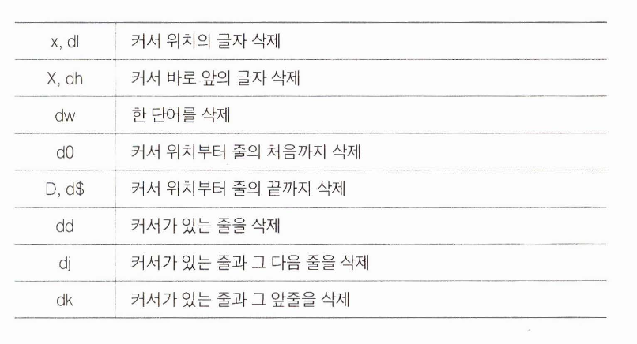

### 복사 붙여넣기

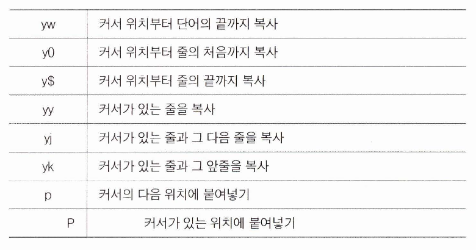

### 기타

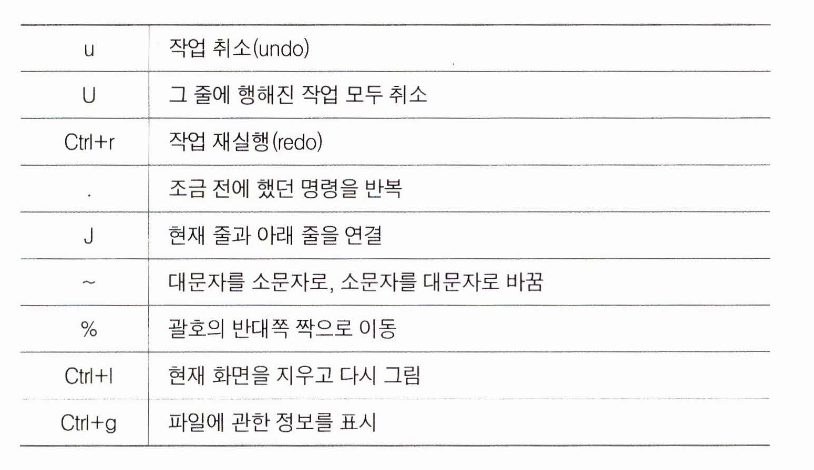

### 종료

```bash
esc :wq(저장후 종료)
esc :q(종료)
esc :q!(강제종료)
```

## 6.4 "vi" 중급 사용자로

<tab> 자동완성

### 화면이동

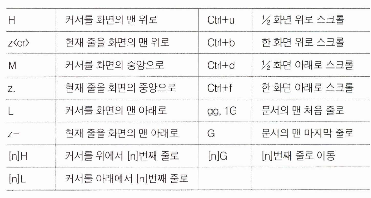

### line idx 표시

```bash
:set number<er>또는 :set nu<er>
:set nonumber<er> 또는 :set nonu<er>
```

### 북마크

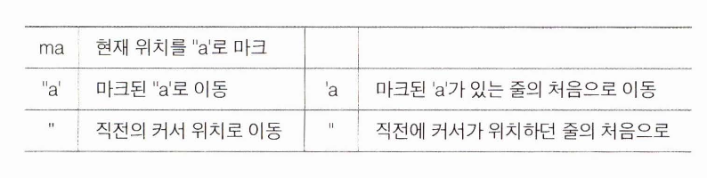

### 여러개의 버퍼 사용

[n]번째 버퍼에 있는 내용을 붙여넣기 위해서는다음과같이 입력하면된다.(n은 1~9)

```bash
np 
nP
```

### 패턴검색 및 교체

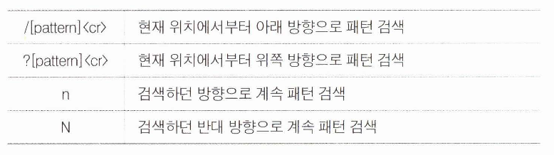

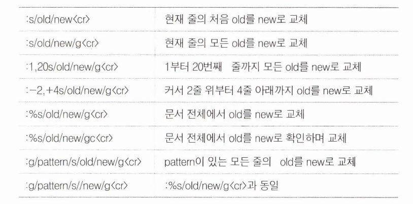

### vi에서 UNIX 명령 실행

```bash
:!bash<cr>
![command] <er>
:!latex %; xdvi %<.dvi<cr>
```

### 콜론 모드

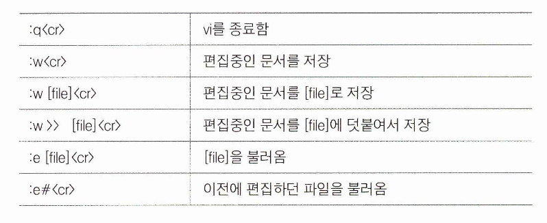

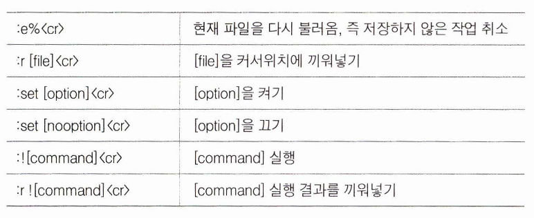

```bash
:r !date<cr> # 현재위치에 날짜와 시간 삽입
:r !sort phone<cr> # phone파일을 정렬하여 삽입
```

## 6.5 vi의 고수로

상용구와 매크로는 생략

## 6.6 vim의 특별한기능

### 정규식

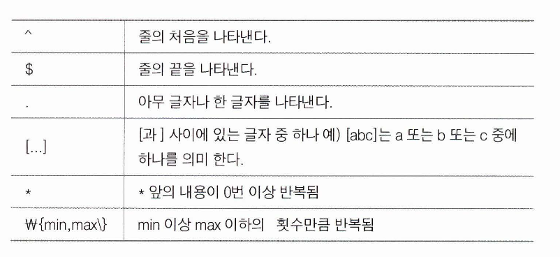

```bash
# 줄의 맨 처음에 나오는 "linux"만검색
/^linux<er> 

# 3~5자리로 이루어진 모든숫자를 검색
/[0123456789]W{3,5W}<cr>
/[0-9]W{3,5W}<cr>

# 'ab'로 시작하는 소문자로 되어 있는 모든단어를 삭제
:%s/ab[a-z]*//g<er>

# 'ab'로 시작하는 소문자로 되어 있는 모든단어 를 삭제
:1,$s/the /fhe l<cr>
# "l,$'’는 첫줄부터 마지막 줄까지 를 의미
```

## 6.7 필자의 당부

"vi"의 고수가 되기 위해서 위의 내용을 무조건 외우려고 하지 말자. 머리로 외우려고 하지 말고 손으로 익혀야한다. 한꺼번에 모든것을 익히려 하지 말고 일단 어떤 기능이 있다는 것 정도만 알아두자. 그리고 직접 문서를 편집하면서 필요할 때 마다 사용 방법을 찾아보자. 처음에는 좀 귀찮겠지만, 그러는 동안 실력이 늘 것이다.

⇒ 느낌아니깐

# 7. 관리명령어

## 7.1관리 명령어

### 파이프로 명령어 조합하기

|를 이용해서 명령어를 조합해서 쓸 수 있다.

### Is 고급 사용자

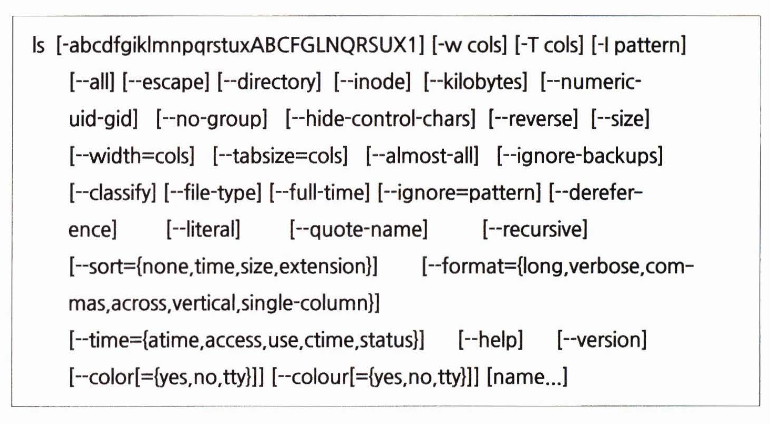

### In 고급사용자

```bash
ln [OPTION]. .. [-T] TARGET LINK_NAME
ln [OPTION]... TARGET
ln [OPTION]... TARGET... DIRECTORY
ln [OPTION] ...-t DIRECTORY TARGET...
```

Archive(묶기)와 압축하기

```bash
gzip [ -acdfh|LnNrtvV19] [-S suffix] [name ...]
```

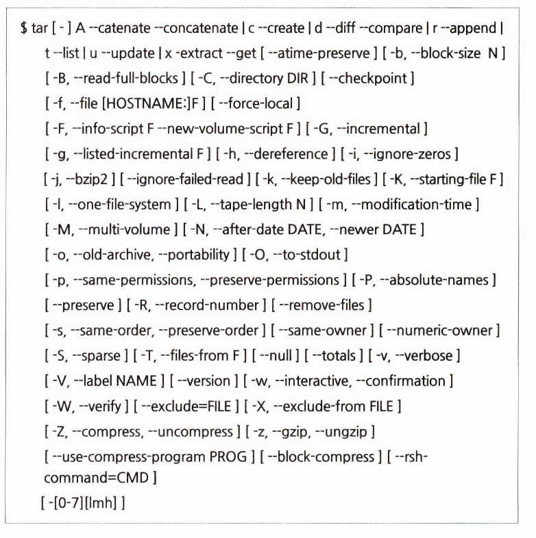

### mc 파일 관리자

```bash
mc [-abcCdfhPstuUVx] [-l log] [dir1 [dir2]] [-e [file]] [-v file]
```

### 백그라운드 작업

```bash
명령어 &
```

### 커널에서 보내는 메시지 보기

```bash
dmesg [-c] [-r] [-n level] [-s bufsize]
```

### 커널 버전 확인하기

```bash
uname [-snrvma] [--sysname] [--nodename] [--release] [--machine] 
[--all] [--help] [--version]
```

### 시스템 정보 확인하기

```bash
cat /proc/cpuinfo;
```

### 메모리 정보 확인하기

```bash
cat /proc/meminfo
```

### 디스크 정보 확인하기

```bash
cat /proc/diskinfo
```

### 비밀번호 조작

```bash
cat /etc/passwd
vi /etc/shadow
```

### 사용자 추가하기

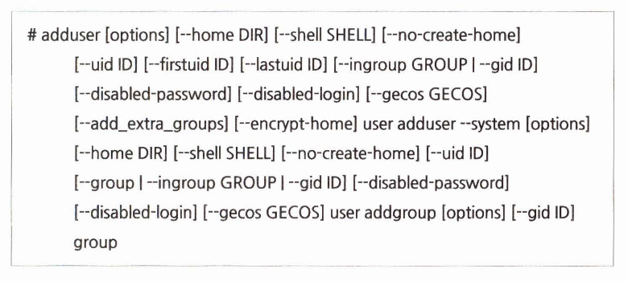

### 예약 실행하기

"cron"은 반복적인 일을 수 행하도록 예약하는 것

"at”는 일정시간 이후에 해당 작업을 수행하라는 명령

```bash
at [-V] [-q queue] [-f file] [-mldbv] TIME 
at -c job [job...]
cron [-f] [-l] [-L loglevel]
crontab [-u 사용자ID] 파일
crontab [-u사용자ID] {-l|-r|-e}
```

## 7.2네트워크 관련 설정 및 명령어

```bash
ifconfig [-v] [-a] [-s] [interface]
ifconfig [-v] interface [aftype] options | address ...
```

ifconfig를 이용해 네트워크 정보를 알 수 있다.

### ping 테스트

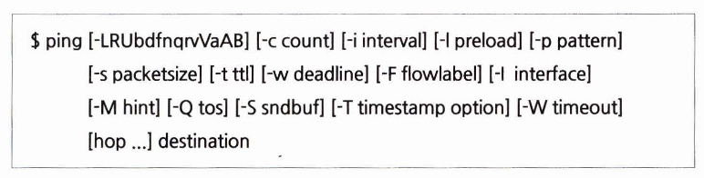

### 패킷 전달과정 확인하기

```bash
sudo apt install traceroute
```

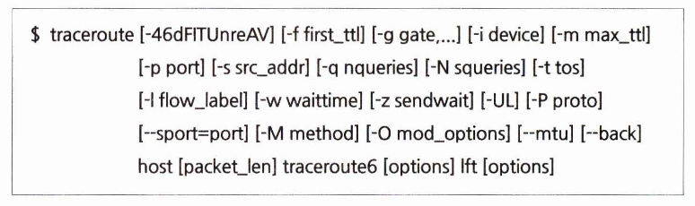

### 방화벽 재 실행

```bash
sudo /etc/init.d/networking restart
```

### 실행중인 모듈 확인하기

```bash
lsmod [-hV]
```

### 사용자 계정 전환하기

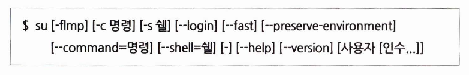

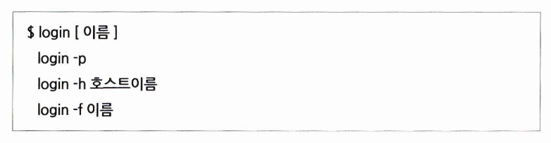

### 문자세트 변환하기

```bash
convmv [options] FILE(S) ...DIRECTORY(S)
```

### 프로그램 수행 내역 추적하기

```bash
strace [-dffhiqrtttTvxx] [-acolumn] [-eexpr] ...[-ofiIe] [-ppid] ...[-sstrsize] 
[-uusername] [-Evar=val] ...[-Evar] ...[command[arg ...]]
strace -c [-eexpr] ...[-Ooverhead] [-Ssortby] [command[arg ...]]
```

### 압축 해제한 파일만 골라서 삭제하기

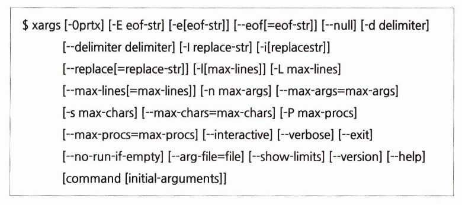

### 프로세스 족보 확인하기

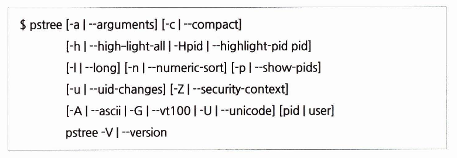

### 정렬하기

```bash
sort [OPTION]... [FILE]...
sort [OPTION]...--filesO-from=F
```

### 프로세스 지속적으로 확인하기

```bash
top -hv | -bcHisS -d delay -n iterations -p pid [, pid ...]
```

### 리눅스 명령어 종합정리

교재참고