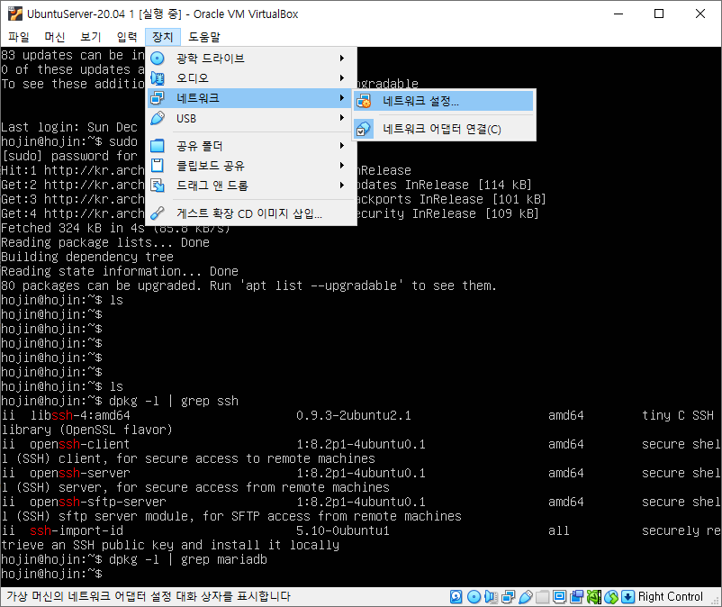
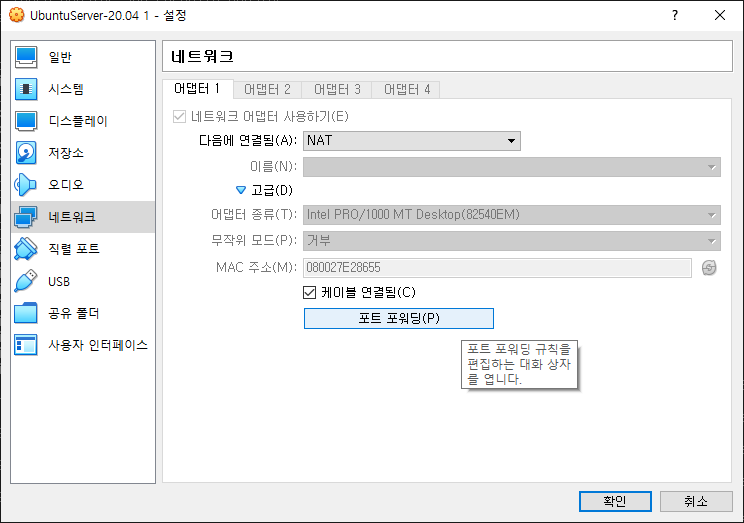

# 외부접속
---
로컬 컴퓨터외의 컴퓨터에서 접속을 하기 위해서는 접근을 허용해 주어야 합니다.


<br>

## 외부에서 접속하기
---
DB는 기본적으로 외부로부터 접속을 되지 않도록 설정되어 있다.

`/etc/mysql/mariadb.conf.d/50-server.conf` 파일을 수정합니다. 
`bind-address` 부분을 주석 처리합니다.

```
$ sudo vi /etc/mysql/mariadb.conf.d/50-server.cnf
```

아래아 같은 부분을 찾아 수정을 합니다.

```
# Instead of skip-networking the default is now to listen only on
# localhost which is more compatible and is not less secure.
#bind-address            = 127.0.0.1
```

<br>

## 외부 접속을 위한 root 사용자 계정 변경
---
두번째, DB의 사용자는 권한을 `사용자명@호스트/IP주소` 형태로 관리 합니다.
기본값은 `root@localhost` 로 되어 있어 `localhost` 외의 컴퓨터에서 접속이 불가능 하다.


```sql
create user '아이디'@'%' identified by '비밀번호';
grant all privileges on *.* to '아이디'@'%';
```

기본적으로 MariaDB의 root 계정은 localhost의 터미널 계정에서만 접속이 가능합니다. 

만일 다른 외부툴을 이용하여 접속을 하기 위해서는 권환을 추가해 주어야 합니다.

이러한 접속 가능한 컴퓨터를 지정하는 사용자 계정은 동적으로 IP를 할당받는 환경에서는 접속이 어려울수 있다. 
매번 컴퓨터를 켤때마다 IP주소가 변경되기 때문이다.


```
MariaDB [(none)]> create user 'root'@'%' identified by '패스워드';
Query OK, 0 rows affected (0.005 sec)

MariaDB [(none)]> grant all privileges on *.* to 'root'@'%';
Query OK, 0 rows affected (0.012 sec)

MariaDB [(none)]> flush privileges;
Query OK, 0 rows affected (0.001 sec)
```

> 로컬 호스트란?
> 127.0.0.1
> :::1
> Localhost
> Server 현재 자신의 컴퓨터를 가리키는 동일한 의미


또는 특정 IP 영역으로 선택할때는 다음과 같이 할 수도 있습니다.

```
Grant all privileges on *.* to 사용자명@’192.168.1.%’ IDENTIFIED BY ‘1234’;
```

`%`는 해당 아이피를 모드 허용하는 `xxx`값과 같다.

Grant 는 사용자를 생성해 주는 SQL문 이다.

Grant 사용권환 ON 데이터베이스명.테이블 to 사용자명@’호스트’ IDENTIFIED BY ‘비밀번호’;

 
사용권한을 모두 부여할 경우에는 ALL PRIVILEGES 로 입력하면 됩니다.

모든 스키마와 데이블을 지정할 경우 *.* 로 입력합니다.


#### 서버를 재시작 합니다
설정을 변경한후 서비스를 재시작 합니다. 이제 다른 컴퓨터에서도 DB에 접속이 가능하다.

```
$ sudo systemctl restart mariadb
```

#### 방화벽 허용
우분투의 기본적인 방화벽은 UFW입니다. 
UWF는 iptables를 좀 더 쉽게 설정할 수 있도록 한 것입니다.
UWF는  간단한 방화벽 구성에는 문제가 없지만 수준 높은 방화벽 구성을 하기 위해서는 iptables 룰을 직접 사용해야 합니다.

```
$ sudo ufw allow 3306
```
> 마리아DB는 mysql과 동일하게 3306 포트를 사용합니다.


#### Virtual Box 포트 포워드 허용

VirtualBox, VmWare등의 가상 환경 솔루션을 통하여 외부에서 DB에 접속을 하기 위해서는 포트 설정이 필요로 합니다. 

[장치] >[네트워크]>[네트워크 설정] 을 선택합니다.



고급을 선택하여 설정창을 확대합니다. `포트 포워딩`을 선택합니다.



3106 포트 포워딩을 추가합니다. MariaDB는 Mysql과 동일하게 3106 포트 번호를 이용합니다.


<br>

## 원격으로 접속하기
---
다른 서버에 접속을 할 경우에는 mysql -h 서버주소 -u 사용자명 -p 를 입력합니다.

윈도우 컴퓨터에서 VirtualBox로 Mariadb를 접속해 봅니다.

```
C:\Bitnami\wampstack-8.0.0-0\mysql\bin>mysql -u root -p
Enter password: ******
Welcome to the MySQL monitor.  Commands end with ; or \g.
Your MySQL connection id is 14
Server version: 5.5.5-10.3.25-MariaDB-0ubuntu0.20.04.1 Ubuntu 20.04

Copyright (c) 2000, 2020, Oracle and/or its affiliates. All rights reserved.

Oracle is a registered trademark of Oracle Corporation and/or its
affiliates. Other names may be trademarks of their respective
owners.

Type 'help;' or '\h' for help. Type '\c' to clear the current input statement.

mysql>
```

성공적으로 접속이 되는 것을 확인할 수 있습니다.

