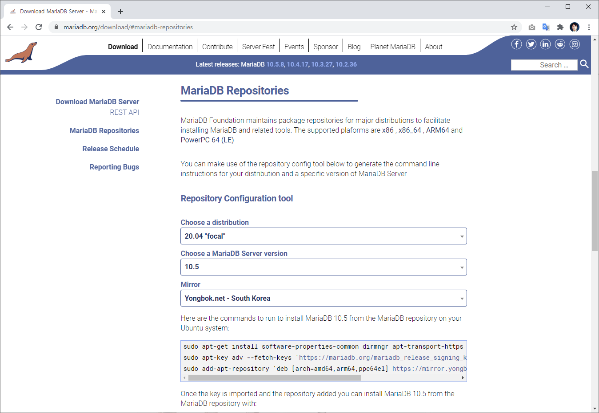

# 마리아DB 패키지 설치
---
패키지를 이용하여 MariaaDB를 설치해 보도록 합니다.

<br>

## 설치 여부 확인
---
중복 설치를 방지하기 위해서 먼저 mariadb가 설치되어 있는지 확인해 보도록 합니다.

```
$dpkg -l | grep mariadb
```

아무런 메시지가 없다면, 설치된 mariadb 패키지가 없다는 의미 입니다.

<br>

## MariaDB 최신버젼
---
리눅스 패포판은 기본적으로 `최신 버젼`의 패키지를 제공하지 않습니다. 
최신의 mariadb를 설치하기 위해서는 목록을 갱신해 주어야 합니다.

저장소의 목록은 https://mariadb.org/download/#mariadb-repositories 에서 확인을 할 수 있습니다.





Linux 패보판 운영체제와 설치하고자 하는 MaraiaDB 버젼을 선택합니다. 
그럼 입력해야 하는 목록을 자동적으로 생성해 줍니다. 이를 실행합니다.


```bash
$ sudo apt-get install software-properties-common dirmngr apt-transport-https
$ sudo apt-key adv --fetch-keys 'https://mariadb.org/mariadb_release_signing_key.asc'
$ sudo add-apt-repository 'deb [arch=amd64,arm64,ppc64el] https://mirror.yongbok.net/mariadb/repo/10.5/ubuntu focal main'
```

새로운 패키지 저장소 목록을 추가했다면, 목록을 갱신합니다.

```bash
$ sudo apt update
```

<br>

## 패키지 설치
---
최신 버젼의 Mariadb를 설치할 수 있도록 목록을 갱신하였습니다. 
다음과 같이 명령을 입력하여 mariadb를 설치합니다.

```
$ sudo apt install mariadb-server -y
```


설치가 완료 되었면 자동으로 MariaDB가 실행됩니다. 다음과 같이 프로세스를 확인해 봅니다.

```
hojin@hojin:~$ ps -ef | grep mysql
mysql       4815       1  0 15:32 ?        00:00:00 /usr/sbin/mariadbd
hojin       5812    2266  0 15:34 pts/0    00:00:00 grep --color=auto mysql
```

<br>

## 버젼확인하기
---
설치된 mariadb를 확인합니다.

```
hojin@hojin:~$ sudo mariadb --version
mariadb  Ver 15.1 Distrib 10.3.25-MariaDB, for debian-linux-gnu (x86_64) using readline 5.2
```

