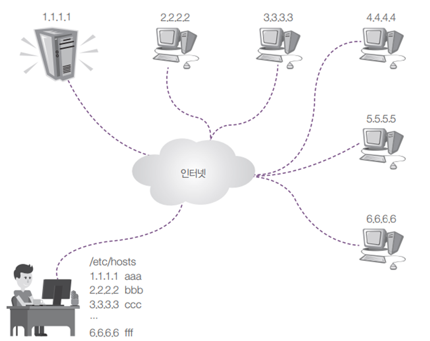
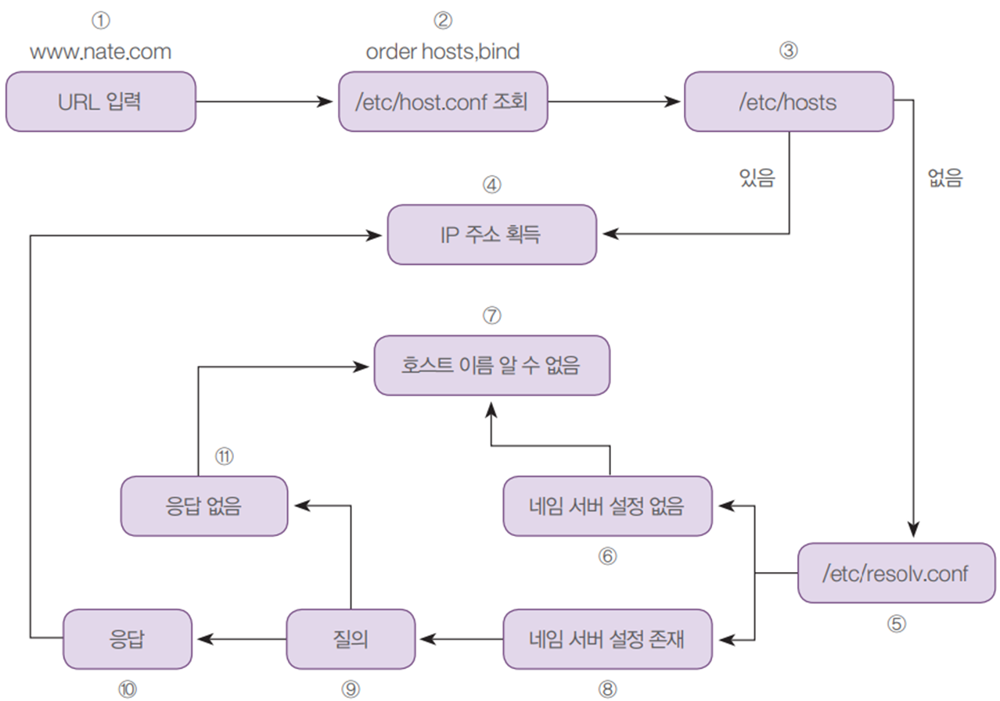
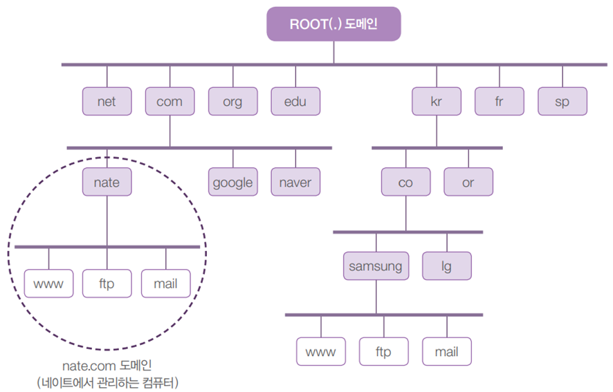
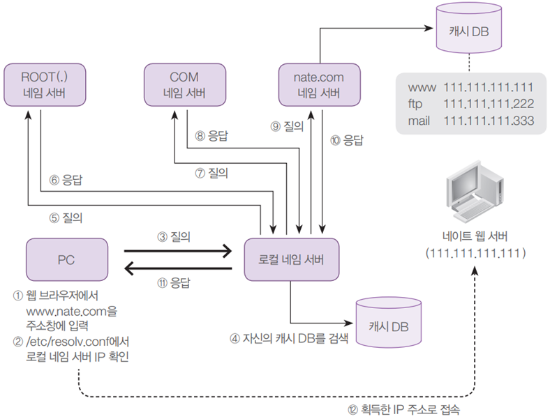

# Domain Name System
Linux 서버의 DNS는 도메인 이름을 IP 주소로 변환하여 네트워크의 리소스를 찾고 연결하는 서비스입니다.

## DNS란?
서버 네트워크의 DNS(도메인 이름 시스템)는 도메인 이름을 IP 주소로 변환하여 사용자가 네트워크의 리소스를 찾고 연결할 수 있도록 하는 계층적 명명 시스템입니다.

도메인 네임을 IP 주소로 변환시켜 알려 주는 역할 \
* Domain Name : 컴퓨터의 ip주소를 사람이 기억하기 쉽게 단어로 부름
* 예) www.naver.com → 120.50.132.112

## dns 역사

### 가장 초기의 네트워크 접속 방법 

* 컴퓨터가 몇 대 안 됨
* 사용자가 모두 외워서 직접 IP주소로 접근함


### hosts 파일을 이용하여 네트워크 접속
인터넷에 연결된 컴퓨터가 수십 ~ 수백대로 늘어남에 따라서 `hosts` 파일에 URL과 IP주소를 매핑하여 기록해 놓는 방식을 사용합니다.

* 예)  102.54.94.97 naver.com
* 38.25.63.10  google.com
* 127.0.0.1 localhost


### Windows의 경우
```
C:\Windows\system32\drivers\etc\hosts
```

### 리눅스의 경우

```
/etc/hosts
```



네임 서버를 이용하여 네트워크 접속

* 기하급수적으로 늘어나는 네트워크 상의 컴퓨터에 대한 모든 IP 정보를 파일 하나에 기록하는 것은 무리

* 이름 해석(Name Resolution)을 전문적으로 해 주는 서버 컴퓨터가 필요해짐 (=DNS 서버 = 네임 서버) 

* 네임 서버는 인터넷에서 변화하는 모든 컴퓨터의 URL과 IP 정보를 실시간 제공

* 사용자는 URL만 외우면, ip주소를 몰라도 됨


## 실습
Domain name으로 ip를 찾아보자

* nslookup


`/etc/hosts` 파일 수정

실습목표

* /etc/hosts 파일의 작동을 이해한다.

* 네임 서버가 하는 기본적인 역할을 이해한다.

* IP주소를 얻기 위해 어떤 순서로 작동하는지 확인한다.

Domain name과 ip를 바꿔보자.

* [www.naver.com](http://www.naver.com/)의 ip을
   [www.daum.net](http://www.daum.net/)로 변경

결과 화면 (엉뚱한 사이트로 접속)


## IP주소를 얻는 내부 흐름



Order hosts,bind hosts 먼저 조회하고, 그 후에 resolv.conf를 본다는 의미


## 도메인 이름 체계

초창기 인터넷에서는 1대의 네임 서버만으로도 충분히 IP주소와 이름의 관리가 가능

하지만 인터넷이 폭발적으로 확장되면서, 몇 대의 네임 서버로는 실시간으로 인터넷 상의 수많은 컴퓨터들을 관리할 수가 없게 되었음

그래서 트리 구조와 같은 `도메인 이름 체계`를 고안함




## 로컬 네임 서버가 작동하는 순서

* PC가 사용하는 네임 서버가 `/etc/resolv.conf` 파일에 `nameserver IP주소`로 설정되어 있는데, 
   이 네임 서버를 로컬 네임 서버라고 부름

* 그래서 www.nate.com의 IP주소를 요구하면 이 로컬 네임 서버에 질문을 함

* 로컬 네임 서버가 혼자서 모든 컴퓨터 도메인 이름을 관리할 수는 없기 때문에, 다음처럼 동작




