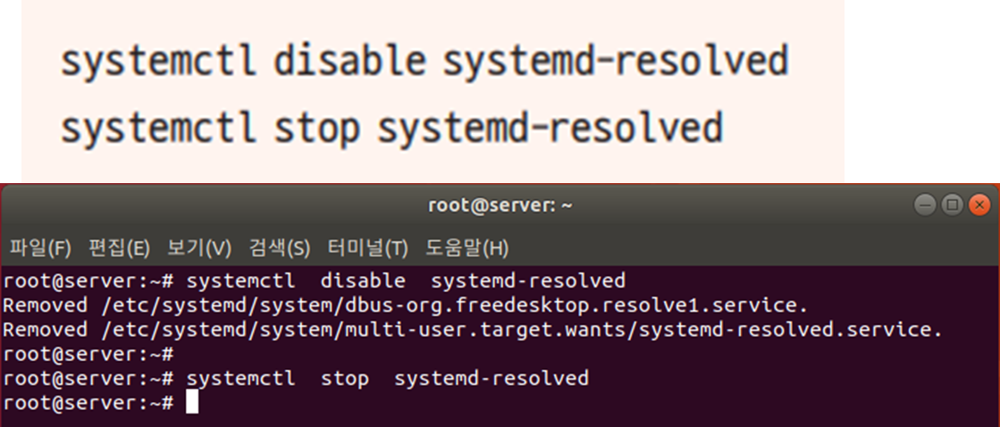
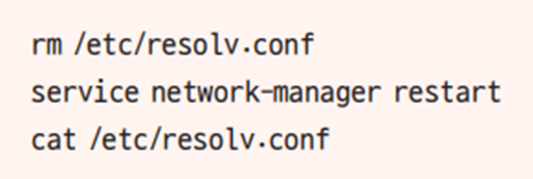
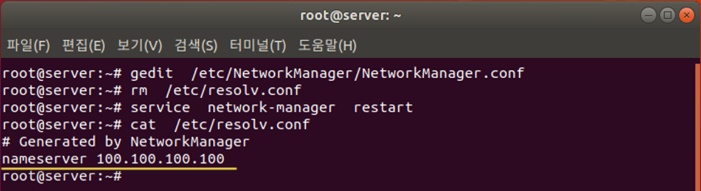
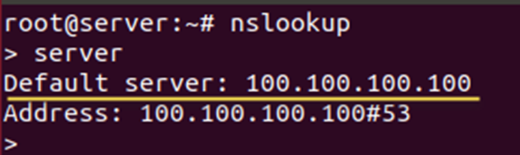
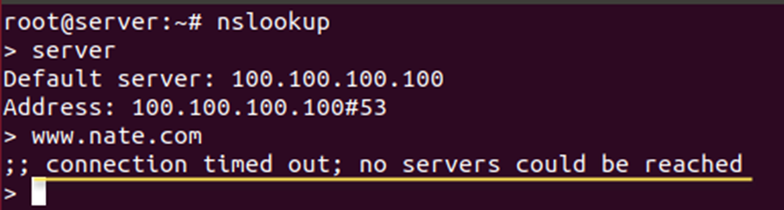
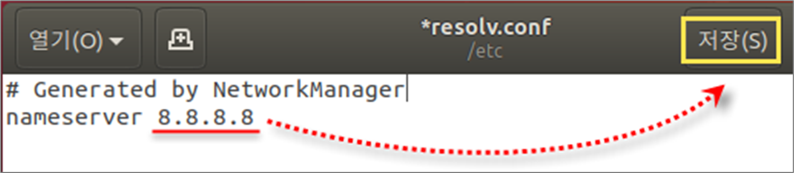
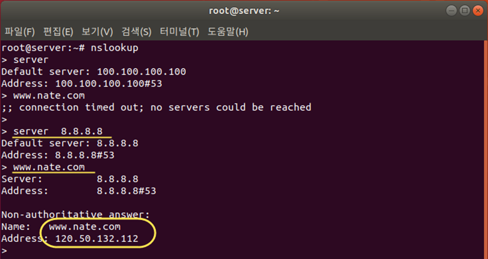

# 실습 DNS 서버 변경

## DNS 서버 작동 확인하기
기존 인터넷 연결 정상인지 확인헤 봅니다.

* 바탕화면 왼쪽의 [Firefox 웹 브라우저]를 클릭, www.google.com에 접속
  → 별 문제가 없다면 정상적으로 접속될 것

## nm-connection-editor 명령 입력

* 잘못된 DNS 주소인 ‘100.100.100.100’을 입력하고 저장한 후 [네트워크 연결] 창 닫기      

  → DNS 서버가 고장 나거나 주소를 잘못 입력한 경우 서버가 응답하지 않음

5-3 만약 systemd-resolved 데몬이 돌고 있으면 종료시킨다. 

`/etc/NetworkManager/NetworkManager.conf` 

[main] 아래에 다음 한 줄을 추가하여 저장한 후 종료

DNS 서버가 설정되어 있는 resolv.conf 파일을 다음 명령으로 삭제

* network-manager 서비스를 시작하여 DNS가 100.100.100.100인 것을 확인

* Network-manager를 재시작하면서 resolv.conf 새로 생성

## reboot 명령으로 재부팅

* 5-7 웹 브라우저를 실행하여 다시 www.google.com에 접속

* → 한동안 접속을 시도하다가 실패할 것

## DNS 서버 테스트하기

* 6-1 터미널에서 nslookup 명령을 입력하면 프롬프트가 ‘>’로 바뀜

* ‘server’를 입력했을 때 나오는 결과가 현재 Server에 설정된 DNS 서버 주소

* 기본으로 설정된 DNS 서버 주소는 /etc/resolv.conf 파일에 설정한 잘못된 주소인 100.100.100.100

‘www.google.com’을 입력하면 오류 메시지가 나타남

현재 설정된 DNS 서버 주소(100.100.100.100)가 응답하지 않기 때문

## Resolv 수정
vi 에디터나 gedit로 /etc/resolv.conf 파일 열기

* 정상 작동을 확인한 구글의 ‘8.8.8.8’을 입력한 후 저장

웹 브라우저를 실행하여 잘 접속되는지 확인 è 정상 동작 

* 6-5 DNS 서버를 영구적으로 설정하기 위해 다시 nm-connection-editor 명령 사용

* 정상적인 DNS 서버 주소인 ‘8.8.8.8’을 입력하고 저장

* reboot 명령으로 재부팅

server 새로운 DNS서버 IP주소 확인

* DNS 서버 주소 변경 완료 : 8.8.8.8

* 다시 ‘www.google.com’ 입력 – 정상 동작 확인

