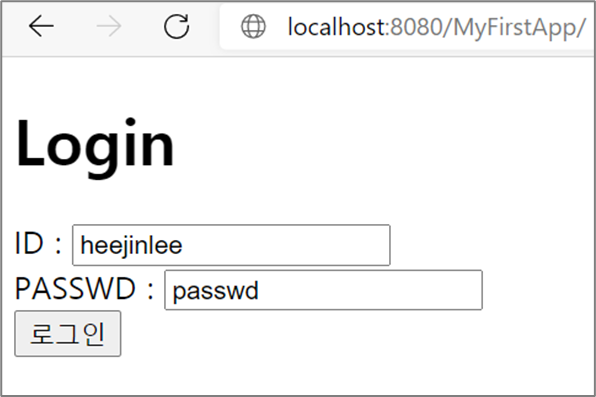
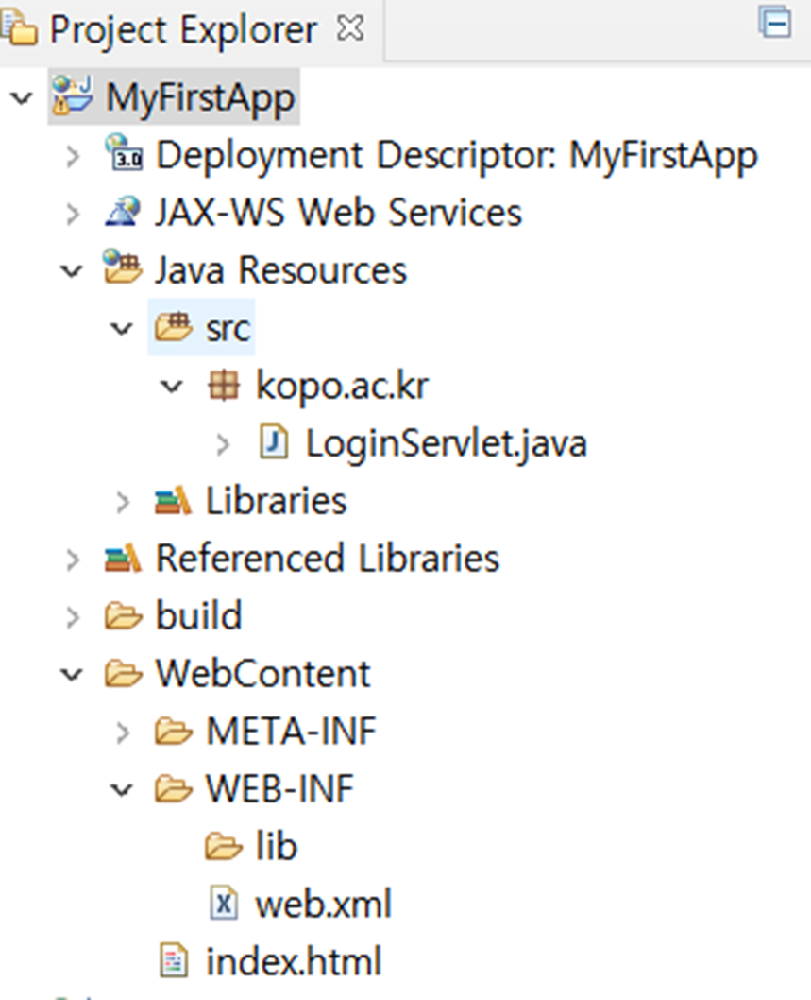
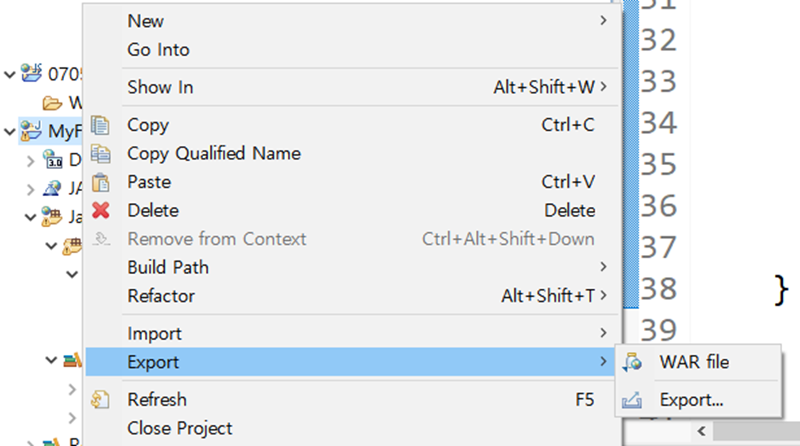

## 톰켓 연동 개발
war를 제작헤 보고 web-was 설정을 변경합니다.

## 학습목표
* Servlet을 실행하고 war 를 만든다
* web/was 설정을 수정한다.


## Web 서버와 WAS
`Servlet`을 build 하려면 `Servlet-api.jar` 라이브러리가 필요합니다.

* $TOMCAT_HOME/lib/servlet-api.jar, jsp-api.jar 에서 copy함
* jre 말고, jdk가 설치 되어 있으면 ok
* Eclipse의 해당 프로젝트에 library 적용


## 이클립스와 톰켓 연동

* 미리 tomcat을 설치한 후, eclipse에게 tomcat 버전과 install한 위치를 알려준다.

* Run on server  - tomcat 선택 

* 정상 동작을 확인하고 war를 만들어서 was에 배포한다.


## 실습: login Servlet

login servlet 실행

```
http://localhost:8080/MyFirstApp/index.html
http://localhost:8080/MyFirstApp
```




GET 방식으로 전

http://localhost:8080/MyFirstApp/login?id=heejinlee&passwd=passwd


Servlet 을 작성해 보자

* New- Dynamic Web Project
  - Generate web.xml




WebContent/index.html

```
<!DOCTYPE html>
<html>
<head>
<meta charset="EUC-KR">
<title> MyFirstApp-Login </title>
</head>
<body>

<h1> Login </h1>
<form action="login" method="get">
<label id= "id_id"> ID   : </label> 
<input type ="text" id="id_id" name="id" /><br>
<label id= "id_passwd"> PASSWD  : </label> 
<input type ="text" id="id_passwd" name="passwd"/><br>
<input type ="submit" value ="로그인"/>
</form>

</body>
</html>
```


Src/LoginServlet.java

```
protected void doGet(HttpServletRequest request, HttpServletResponse response) throws ServletException, IOException {
// TODO Auto-generated method stub

String id = request.getParameter("id");
String passwd = request.getParameter("passwd");

response.setContentType("text/html;charset=euc-kr");
PrintWriter out = response.getWriter();
out.println("ID : " + id +"<br>");
out.println("PASSWORD : " + passwd + "<br>");


response.getWriter().append("Served at: ").append(request.getContextPath());
}

```


WebContent/WEB-INF/web.xml

Web.xml 에 servlet mapping 넣어줌

```
……  
 <welcome-file-list>
    <welcome-file>index.html</welcome-file> 	
	……
 </welcome-file-list>

  <servlet>
  	<servlet-name>LoginServlet</servlet-name>
  	<servlet-class>kopo.ac.kr.LoginServlet</servlet-class>
  </servlet>
  
  <servlet-mapping>
  	<servlet-name>LoginServlet</servlet-name>
  	<url-pattern>/login</url-pattern>
  </servlet-mapping> 
</web-app>

```





Servlet을 호출할 때, Tomcat의 주소를 쓰지 않아도 된다.

* Tomcat의 주소가 노출되지 않음. Ip, port모두

* Tomcat의 주소가 변경가능 


## apache와 tomcat 둘다 활용

* DocumentRoot는 apache에서 처리.

* MyFirstApp은 Tomcat인 ajp13_Worker가 처리 


* Apache
  - Index.html
    - Static file, apache document root 하위의 directory에 대한 Link들

* * [http://localhost](http://localhost/) 접속하면 apache의 index.html이 보임


* Tomcat
  * MyFirstApp deploy
  * Greeting deploy 


* 설정
  * MyFirstApp, Greeting인 경우 tomcat으로 요청 보내기
  * 나머지는 apache에서 담당


Greeting app

* 인사와 시간을 찍어주는 servlet 하나만 존재


Greeting app

* Src/HiServlet.java


```
protected void doGet
(HttpServletRequest request, HttpServletResponse response) 
throws ServletException, IOException {
// TODO Auto-generated method stub

SimpleDateFormat format1 =
 			 new SimpleDateFormat ( "yyyy-MM-dd HH:mm:ss"); 
Date time = new Date();
String time1 = format1.format(time); 

response.getWriter().println("\n  Hi !!! \n");
response.getWriter().println(time1);

response.getWriter().append("\n Served at: ")	.append(request.getContextPath()); 
 
}
```


* WEB-INF/Web.xml

```
<servlet>
  <servlet-name>HiServlet</servlet-name>
  <servlet-class> kopo.ac.kr.HiServlet </servlet-class>
</servlet>
  
<servlet-mapping>
  <servlet-name>HiServlet</servlet-name>
  <url-pattern>/hi</url-pattern>
</servlet-mapping>

```


WebContent/greeting.html

* 동작 확인용


Apache Document Root에 index.html과 directory 추가

* dir 추가

* MyFirstApp, Greeting 추가 – 요청이 tomcat으로 가는지, apache로 오는지 확인


Apache Document root/index.html


```
<!DOCTYPE html PUBLIC "-//W3C//DTD XHTML 1.0 Strict//EN"
   "http://www.w3.org/TR/xhtml1/DTD/xhtml1-strict.dtd">
<html xmlns="http://www.w3.org/1999/xhtml" xml:lang="en" lang="en">
<head>
    <title>Hello Hello</title>
</head>
<body> 
<p> <a href="index2.html">index2.html in the same directory</a> </p>
<p> <a href="/MyFirstApp/">Login</a>  </p> 
<p> <a href="/Greeting/">context path가 Greeting인 경우 - index.html이 없어서 동작 안함</a>  </p>
<p> <a href="/Greeting/greeting.html">/Greeting/greeting.html 실행 - 정상 동작</a></p>
<p> <a href="/Greeting/hi">/Greeting/hi 실행 - 정상 동작</a>  </p>
<p> <a href="/Greeting/abc.html">apache에는 존재하는 Greeting/abc.html - 동작 안함</a></p> 
<p> <a href="/dir">index.html in the director "dir"- Apache - 정상 동작</a></p>
</body>
</html>

```


War는 compile된 java 코드인 class로 이루어짐.

War로 배포시 java source code를 같이 배포하지 않는경우가 대부분

* 보안상의 문제 – 코드를 알면 취약점 파악 용이
* 회사 대외비 – 코드를 알면 원천 기술 공개되므로 (solution 회사들)


Java Decompiler

* Class로 이루어진 war를 java source file로 볼수 있게 해주는 것

* http://java-decompiler.github.io/


