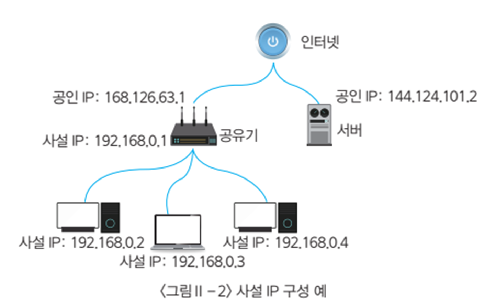
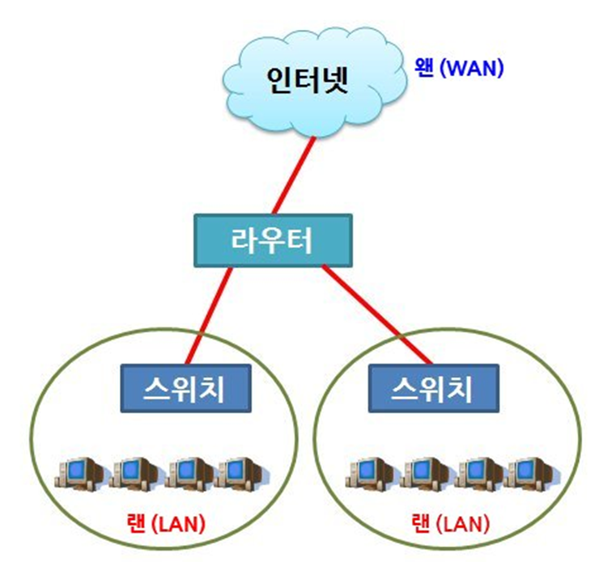
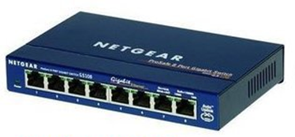

# 네트워크

## 네트워크 구성
현대의 수많은 컴퓨터 들을 네트워크망을 통하여 서로 연결되어 있습니다. 또한, 이렇게 컴퓨터들을 연결해주는 망을 네트워크라 합니다.

많은 수의 컴퓨터들이 서로 연결을 하기 위해서는 다양한 장비들이 필요로 합니다. 
> 각각의 장비들은 충돌되지 않고 서로를 인식할수 있도록 IP 주소와 MAC 주소를 가지고 있습니다.

### 유선 네트웍

### 무선 네트웍
* wifi란?
> 정리과제

## LAN
---
LAN (Local Area Network)

* 작은 영역의 네트워크 연결

* 네트워크의 최소 단위 (사이즈는 다양)

* 장치: 허브, 스위치(L2)

Layer 2 은 LAN, Layer 3은 WAN임

## WAN
---
WAN (Wide Area Network)

* 중대형 영역의 네트워크 연결

* 지역간/국가간 네트워크 연결

* 장치 : 라우터(L3) 

## 스위치 와 허브
---
같은 네트워크 안의 연결을 돕는 통신 장치 (외부망으로 나가지 못함)

### 허브

* 하나의 네트워크 라인에 여러대의 컴퓨터를 분배하는 장치

* 한번에 하나의 컴퓨터에만 데이터 전송 가능

* 멀티탭 같은 역할

* 저가 장비

### 네트워크 스위치(network switch)

* 허브와 같은 기능, 하나의 네트워크 라인에 여러대의 컴퓨터를 분배하는 장치

* 높은 데이터 전송 대역으로, 허브보다 향상된 네트워크 속도를 제공

* 처리 가능한 패킷의 숫자가 크고, 송신과 수신이 동시에 일어남

* 동시에 여러 컴퓨터로 데이터를 전송 가능

* 허브보다 고가 장비

## 라우터
---

서로 다른 network를 연결해 주는 장치

L3 레벨 Network Layer를 담당하는 장치

데이터가 출발지에서 목적지 까지 정확하게 이동할수 있도록 연결해 주는 장치

* 데이터 안에 도착 router가 적혀 있음

다양한 사용

* 가정용 : 유무선 공유기
  - 가정용 내부 network을 만듬

* 기업용
  - 기업용 내부 망을 만듬

