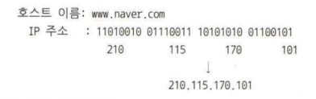
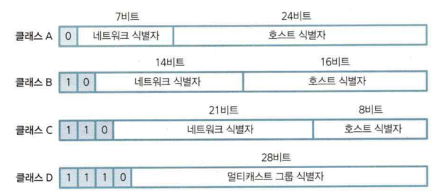
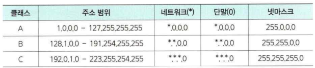

# IP 주소 체계
인터넷에 연결된 장비들은 서로간 통신을 위하여 IP주소를 사용합니다.

## 물리적 주소
하드웨어 제조사에서 부여한 기기 고유의 주소를 말합니다.
예) Mac Address, Device Id, IRQ

## 논리적 주소
물리적 장치에 논리적인 IP를 할당합니다. 하나의 장치에 여러개의 IP 주소가 할당될 수 있다.

## IP주소 체계
* 네트워크 식별자와호스트 식별자로 구성
* 네트워크 식별자: 네트워크 구분. 다른 단말 등과 이 부분이 같으면 동일한 네트워크(허브 둥으로 단순 연결) , 아니 면 다른 네트워크( 라우팅을 통한 다른 네트워크로 접근)
* 호스트 식별자: 각각의 단말, 서 버. 장비. 랜카드 별로 유일한한 개의 IP 부여

### IP주소 표기

IP 주소 체계는 2진수를 10진 표기로 사용.  

네트워크 식별자와 호스트 식별지를 나타내는 비트 크기에 따라 IP 주소의 클래스를 구분

IP 주소의 클래스는 A, B, C클래스로 구분됨.

