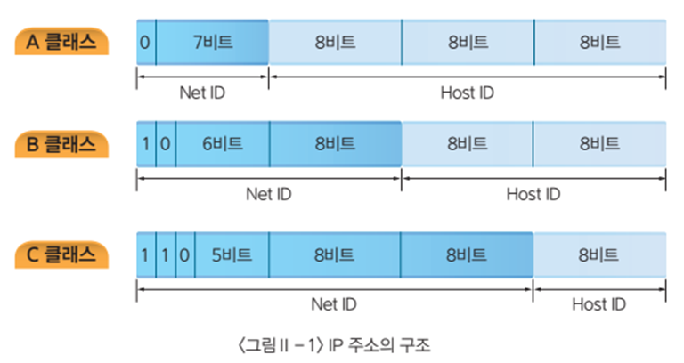

# 클래스
iP 주소를 네트워크 주소와 호스트 주소로 구분하는 방법입니다. 하나의 네트워크에서 몇 개의 호스트 주소를 가질 수 있느냐에 따라 클래스를 나눌 수 있다.

## IPv4 시대의 네트워크 구분
원래 예전에는 `IPv4` 주소는 단순한 8비트의 네트워크 영역과 해등 네트워크 내의 호스트 주소를 가리키는 영역으로 단순하게 구분되어 있었다.

| Class | 네트워크   아이디 | IP 대역               | 사설 IP 대역         | 첫번째   앞의 8bit |
| --------- | ------------------------- | ----------------------------- | -------------------------------- | ------------------------------ |
| A         | 8bit                      | 0.0.0.0  ~127.255.255.255     | 10.0.0.0   ~10.255.255.255       | 0xxx  xxxx  ~                  |
| B         | 16bit                     | 128.0.0.0  ~191.255.255.255   | 172.16.0.0   ~  172.31.255.255   | 10xx  xxxx  ~                  |
| C         | 24bit                     | 192.0.0.0  ~223.255.255.255   | 192.168.0.0   ~  192.168.255.255 | 110x  xxxx  ~                  |
| D         |                           | 224.0.0.0  ~239.255.255.255   | -                                | 1110  xxxx  ~                  |
| E         |                           | 240.0.0.0  ~  255.255.255.255 | -                                | 1111  xxxx  ~                  |

## 클래스 도입
수많은 컴퓨터가 네트워크와 접속함에 따라서 주소가 부족해 지기 시작 되었습니다.  한정된 자원인 IP주소를 체계적으로 나눠 쓸 필요가 있어 IP 주소 클래스가 등장하게 되었다.

* class a
* class b
* class c

