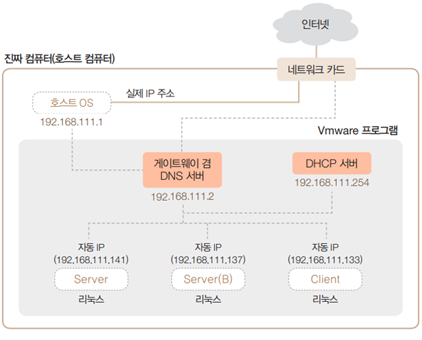

# IP주소
네트워크상에 연결된 컴퓨터를 유일하게 구분하는 번호 체계입니다.  

## IP주소란?
IP 주소는 인터넷 프로토콜 (IP)을 사용하여 네트워크 상의 컴퓨터나 다른 네트워크 장치들을 식별하는데 사용되는 고유한 숫자입니다. IP 주소는 네트워크 상에서 컴퓨터 간의 통신을 가능하게 하며, 각각의 컴퓨터는 IP 주소를 갖고 있어서 인터넷 상에서 식별될 수 있습니다. 

## IP 주소의 종류
IP 주소는 `IPv4`와 `IPv6` 두 가지 버전이 있습니다. IPv4는 32비트로 구성되며 대부분의 인터넷 기기에서 사용됩니다. IPv6는 128비트로 구성되며 더 많은 주소 공간을 제공합니다.

## IP 주소 체계
각 8 bit 씩 4개의 번호로 이루어짐
> 8 bit = 2^8 =  256

### ip의 주요 역할
네트워크를 나타내는 네트워크 id와 호스트를 나타내는 호스트 id로 구분된다. 

* Ex) Server의 IP 주소는 192.168.111.141, 모든 컴퓨터에서 자기 자신을 의미하는 IP 주소는 127.0.0.1

## 특수 용도의 IP
---

### 네트워크 주소
네트워크 중에서 해당 네트워크를 구분할 수 있는 대표주소

* 해당 네트워크의 가장 앞 주소
* 컴퓨터 4대의 IP 주소를 보면 앞의 세 자리가 ‘192.168.111’로 같고 뒤의 한 자리만 다름
* 이 4대의 컴퓨터는 같은 네트워크에 있고, 
  서브넷 마스크는 공통으로 C 클래스(255.255.255.0)를 사용
  → 이 경우 네트워크 주소는 192.168.111.0

### 브로드캐스트 주소
소속된 네트워크의 모든 컴퓨터가 수신하는 주소

* 해당 네트워크의 가장 마지막 주소
* Ex) 그림의 브로드캐스트(broadcast) 주소는 192.168.111.255

### 게이트웨이
내부 네트워크를 외부와 연결하기 위한 컴퓨터 또는 장비가 가지는 주소

* 인터넷을 사용하기 위해 외부 네트워크에 접속하려면 게이트웨이의 IP 주소를 알아야 함

* 게이트웨이에는 내부로 향하는 문(네트워크 카드)과 외부로 향하는 문(네트워크 카드)이 있어야 함
  → 네트워크 카드가 2개 장착되어야 함

* 게이트웨이 주소는 VMware에서 제공하며 192.168.○○○.2로 고정되어 있음

## 실습
---

### 실습 IP 주소 찾기
다음의 IP주소와 서브넷 마스크를 보고, 해당하는 클래스, 서브넷 마스크의 프리픽스 값, 네트워크 주소, 브로드캐스트 주소를 답하시오

| (1)                    |           |
| -------------------------- | --------- |
| ip                         | 10.1.1.1  |
| Subnet mask                | 255.0.0.0 |
| Public/Private             |           |
| IP  Class                  |           |
| Subnet mask  prefix        |           |
| Network ip                 |           |
| Network broadcast  address |           |

| (2)                    |               |
| -------------------------- | ------------- |
| ip                         | 200.10.10.10  |
| Subnet mask                | 255.255.255.0 |
| Public/Private             |               |
| IP  Class                  |               |
| Subnet mask  prefix        |               |
| Network ip                 |               |
| Network broadcast  address |               |

| (3)                    |             |
| -------------------------- | ----------- |
| ip                         | 172.3.3.3   |
| Subnet mask                | 255.255.0.0 |
| Public/Private             |             |
| IP  Class                  |             |
| Subnet mask  prefix        |             |
| Network ip                 |             |
| Network broadcast  address |             |

| (4)                    |               |
| -------------------------- | ------------- |
| ip                         | 172.3.3.3     |
| Subnet mask                | 255.255.224.0 |
| Public/Private             |               |
| IP  Class                  |               |
| Subnet mask  prefix        |               |
| Network ip                 |               |
| Network broadcast  address |               |

### 실습 subnet 나누기

* P회사에 네트워크를 구축하려 한다. 3개의 부서가 아래와 같은 ip요청이 있을 때, 향후를 위하여 효율적으로 서브네팅을 해보아라. 

* 회사가 구매한 IP는 200.1.1.0/24이다. 

| A부서       |      |
| ------------------- | ---- |
| 요청 IP 개수        | 100  |
| 실제 할당할 IP 개수 |      |
| Network  id         |      |
| IP 범위             |      |

| B부서       |      |
| ------------------- | ---- |
| 요청 IP 개수        | 25   |
| 실제 할당할 IP 개수 |      |
| Network  id         |      |
| IP 범위             |      |

| C부서       |      |
| ------------------- | ---- |
| 요청 IP 개수        | 2    |
| 실제 할당할 IP 개수 |      |
| Network  id         |      |
| IP 범위             |      |

