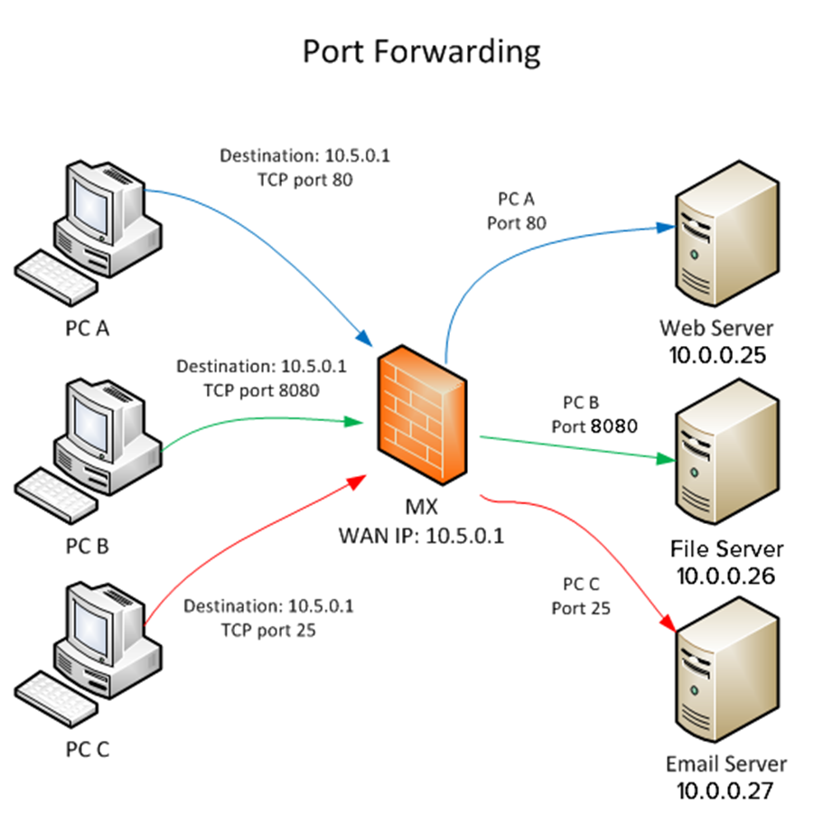

# NAT (Network Address Translation)

## 네트워크 주소 변환 
---
IP 패킷에 있는 출발지 및 목적지의 IP 주소를 바꿔 재기록 하면서 네트워크 트래픽을 주고 받게 하는 기술

## 장점
---

### IP 주소 절약
하나의 공인 IP를 사용하여 여러대의 호스트가 인터넷에 접속할 수 있다.

* 예) 집에 외부 IP 하나만 있고, 내부의 많은 기기들이 내부 IP를 사용하여 인터넷 통신할 수 있다.

### 보안
NAT 동작 특성상 내부의 IP를 숨길 수 있다.

* 예) 라우터를 통해서 나가는 내부 ip는 외부에 노출이 되지 않기 때문에, 안쪽의 ip로 직접 공격할 수 없다. 

## Port Forwarding 
---
[컴퓨터 네트워크](https://ko.wikipedia.org/wiki/컴퓨터_네트워크)에서 [패킷](https://ko.wikipedia.org/wiki/네트워크_패킷)이 [라우터](https://ko.wikipedia.org/wiki/라우터)나 [방화벽](https://ko.wikipedia.org/wiki/방화벽_(네트워킹))과 같은 네트워크 게이트웨이를 가로지르는 동안 하나의 [IP ](https://ko.wikipedia.org/wiki/IP_주소)[주소](https://ko.wikipedia.org/wiki/IP_주소)와 [포트 번호](https://ko.wikipedia.org/wiki/포트_번호) 결합의 통신 요청을 다른 곳으로 넘겨주는 [네트워크 주소 변환](https://ko.wikipedia.org/wiki/네트워크_주소_변환)(NAT)의 응용

* 이 기법은 게이트웨이(외부망)의 반대쪽에 위치한 보호/내부망에 상주하는 호스트에 대한 서비스를 생성하기 위해 흔히 사용

* 통신하는 목적지 IP 주소와 포트 번호를 내부 호스트에 다시 매핑함으로써 이루어진다.

### port forwarding실습 
> VMWare Player

* HOST OS에서 가상 머신 OS로 접속하는 것은 너무 쉽다.

* 내 옆사람의 컴퓨터의 가상머신에 접속해 보자.

> Googling 
> * VMWare player Port forwarding 
> * VMWare player network manager download
> * https://www.tobias-hartmann.net/2018/12/download-vmnetcfg-exe-fuer-vmware-workstation-15-x-player/

* https://togll.tistory.com/26

* https://renesys.tistory.com/144

## 네트워크 인터페이스(NIC) 디바이스 명명 규칙
---

### 명명 규칙을 만든 이유

* 여러 개의 네트워크 카드를 동시에 사용하는 일이 많아 지면서 체계화된 명명 규칙 필요.

* 통신방법에 따른 분류, 슬롯 종류에 따른 분류

* 이전엔 eth0,eth1, 이런식으로 명명

* OS의 Systemd에 의해 결정

### 디바이스명 명명 규칙

* 앞의 두자리 'en'의 경우 인터페이스 타입을 뜻합니다.
  - en – 이더넷
  - wl - 무선 LAN
  - ww - 무선 WAN

* 슬롯별 설정
  - s33은 BIOS에서 PCI express 핫 플러그 슬롯 인덱스 번호(여기서는 33)를 제공할때 사용됩니다.

