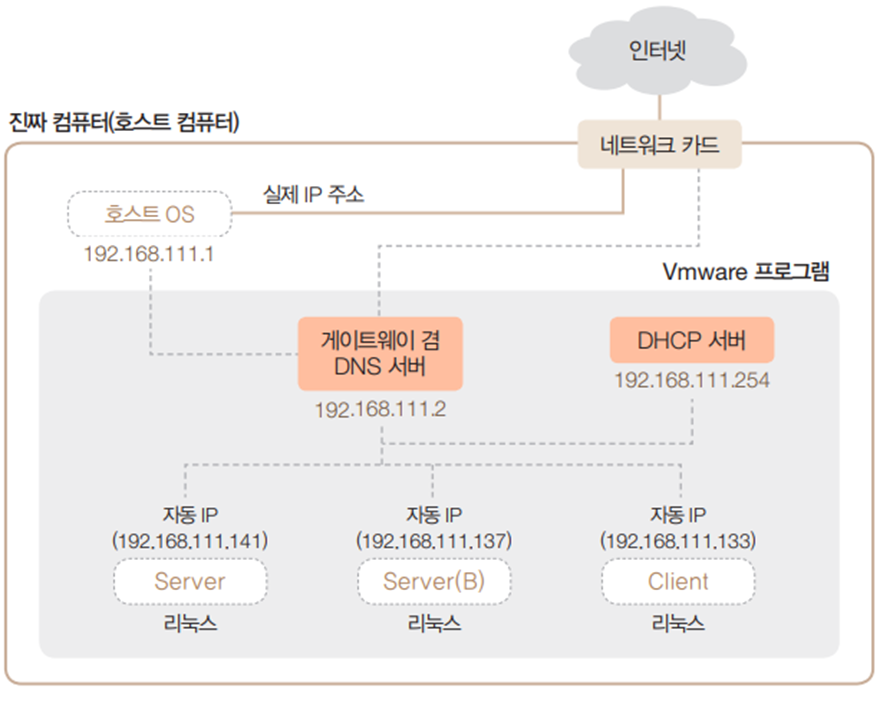
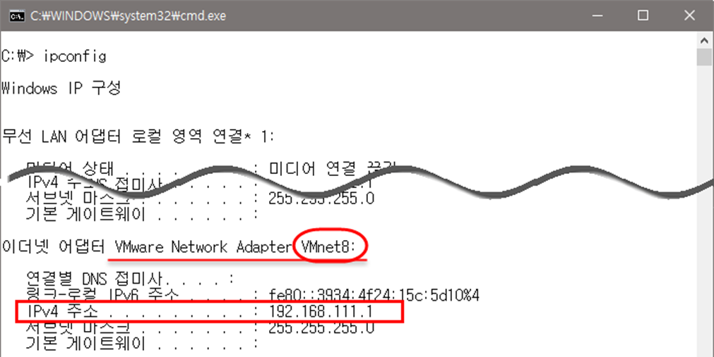
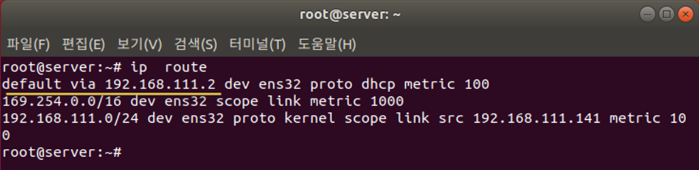
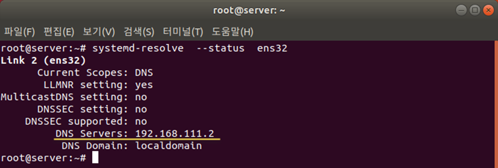
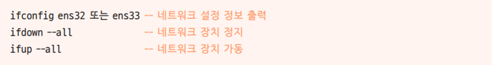
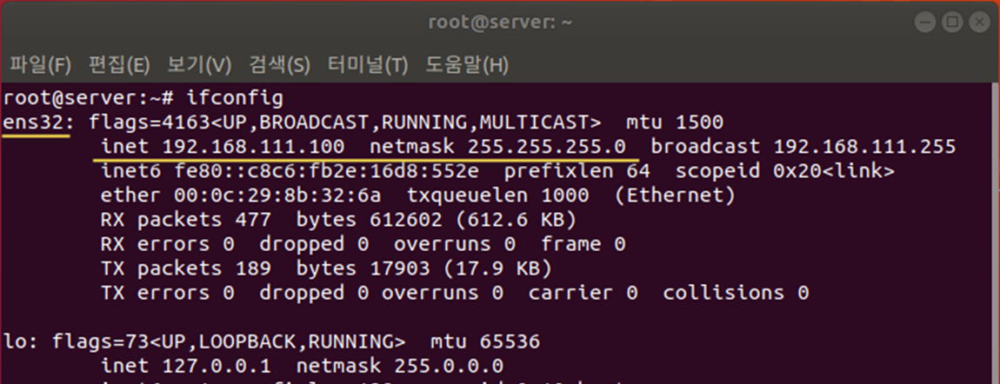
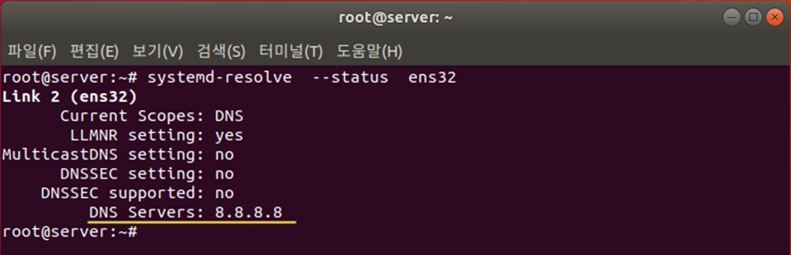
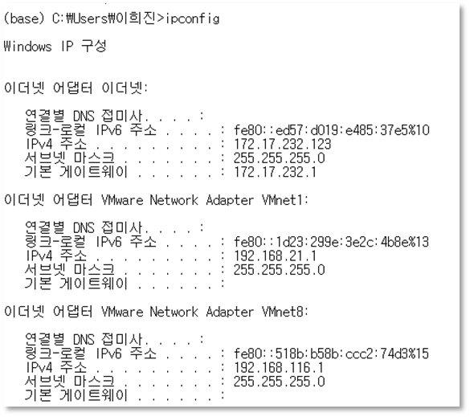
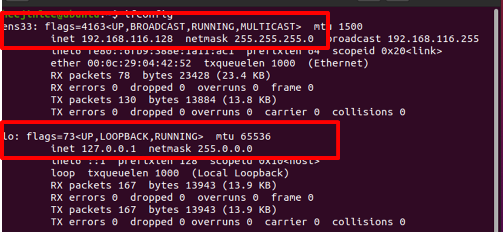
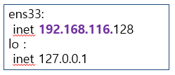

# 네트워크 정보 파악


### 설정된 네트워크 환경

* 호스트 OS에는 가상 IP 192.168.111.1이 자동으로 할당

* 호스트 OS에는 실제로 사용하는 별도의 IP 주소 존재

* 192.168.111.2는 게이트웨이와 DNS 서버 역할을 모두 하는 가상 장치의 IP 주소

* 192.168.111.254는 DHCP 서버 역할을 하는 가상의 주소

* Server, Server(B), Client는 모두 자동으로 IP를 할당받도록 설정됨

* 이 IP 정보는 가상 DHCP 서버(192.168.111.254)에서 할당받음





### 네트워크 관련 정보

* 가상머신에 인터넷을 연결하려면 각 가상머신에 네트워크 관련 정보를 입력해야 함

* 네트워킹이 정상적으로 이루어지려면 각 가상머신(게스트 OS)에 IP 주소, 서브넷 마스크(subnet mask), 게이트웨이(gateway) 주소, DNS(Domain Name System) 서버 주소 입력

### VMWare 네트워크 정보 확인
* 윈도우에서 `cmd`로 명령 프롬프트가 실행, ipconfig 명령 실행
* 'Vmware Network Adapter VMnet8’ 부분 확인



## 실습1: 가상머신에 할당된 IP주소 확인하기


가상머신 부팅하기

할당된 IP 주소 확인하기

* 각각의 터미널을 열고 ifconfig 명령 입력
* ifconfig 명령어가 없는경우 : 
       apt-get install net-tools
* 현재 할당된 IP 주소 확인(컴퓨터 환경에 따라 다름) 


게이트웨이 정보 확인하기

* 현재 설정된 게이트웨이의 정보는 ip route 명령으로 확인 가능




* 현재 설정된 DNS 서버의 정보는 systemd-resolve --status ens32 명령으로 확인 가능




## 네트워크 설정과 명령

리눅스에서의 네트워크 장치 이름

- 리눅스에 랜 카드가 장착되면 Ubuntu 18.04 LTS는 자동으로 이 장치의 이름을 ens32 또는 ens33으로 인식

- 랜 카드의 이름은 네트워크 정보를 파악하거나 네트워크를 정지 또는 가동할 때 이용




nm-connection-editor

* nm은 Network Manager의 약자

* 네트워크와 관련된 작업은 대부분 이 명령어를 바탕으로 실행 가능

* nm-connection-editor 명령으로 설정하는 사항은 아래와 같음
  - 자동 IP 주소 또는 고정 IP 주소 사용 결정
  - IP 주소, 서브넷 마스크, 게이트웨이 정보 입력
  - DNS 정보 입력
  - 네트워크 카드 드라이버 설정
  - 네트워크 장치(ens32 또는 ens33) 설정


systemctl start/stop/restart/status networking

* 네트워크의 설정을 변경한 후 변경된 내용을 시스템에 적용하는 명령

 → nm-connection-editor 명령을 실행하여 내용을 변경한 후에는 반드시 systemctl restart 

   networking 명령을 실행하는 것

* restart 옵션은 stop과 start 옵션이 합쳐진 것

* status 옵션은 현재 작동(active) 또는 정지(inactive) 상태를 나타냄


ifconfig 장치명

* 해당 장치의 IP 주소와 관련 정보를 출력하는 명령어


nslookup

* DNS 서버의 작동을 테스트하는 명령어


ping IP 주소 또는 URL

* 해당 컴퓨터가 네트워크상에서 응답하는지 테스트하는 간편한 명령어

* 상대 컴퓨터가 네트워크상에서 아무 이상 없이 작동되는지 확인할 때 주로 사용


### /etc/resolv.conf

* DNS 서버의 정보와 호스트 이름이 들어 있는 파일

* 임시로 사용되는 파일이며 네트워크를 재시작하면 초기화됨


## 실습2 : 고정 IP 주소 변경하기

터미널 열기

IP 정보 확인하기

* nm-connection-editor 명령 입력
* [네트워크 연결] 창이 나타나면 설정된 네트워크 정보를 확인

​    장치의 이름은 ‘유선 연결 1’이며, 현재는 IP 주소를 자동으로 할당받도록 되어 있음


## 실습: 고정 IP 주소 변경하기 

고정 IP로 설정 변경하기

* 방식을 ‘수동’으로 변경하고 <추가> 클릭

​    주소에는 ‘192.168.○○○.100’, 넷마스크에는 ‘255.255.255.0’, 

​    게이트웨이에는 ‘192.168.○○○.2’ 입력

​    이때 [그림 4-1]에서 확인한 자기 컴퓨터의 숫자를 ○○○에 넣어야 함

​    DNS 서버에는 ‘8.8.8.8’ 입력


  3-2 <저장> 클릭, 입력 내용을 저장하고 [네트워크 연결] 창 닫기

  3-3 설정을 적용하기 위해 터미널에서 reboot 명령으로 컴퓨터 재부팅


고정 IP로 설정된 내용 확인하기

  4-1 바탕화면에서 마우스 오른쪽 버튼을 클릭하여 [터미널 열기] 선택

  4-2 변경한 설정 내용이 적용된 것을 ifconfig 명령으로 확인





netstat -rn 명령으로 게이트웨이 확인


설정된 DNS 서버 정보를 systemd-resolve --status ens32 명령으로 확인




## 시스템 설정

gnome-control-center 명령으로 다양한 환경 및 하드웨어 등을 설정


### 네트워크 설정

nm-connection-editor 명령은 앞에서 여러 번 사용


## 실습3 : Host OS network 파악

Windows network


```
이더넷 어댑터 이더넷
IPv4 주소 : 172.17.232.123

이더넷 어댑터 Vmware Network Adapter VMnet1
IPv4 주소 : 192.168.21.1

이더넷 어댑터 Vmware Network Adapter VMnet8
IPv4 주소 : 192.168.116.1

```





## 실습: 가상머신 네트워크 확인

### 2개 결과 

ens33: 

 inet 192.168.116.128 

lo : 

 inet 127.0.0.1


### 127.0.0.1 -> 사용중인 컴퓨터의 지칭하는 ip





## 실습: 가상머신 네트워크 확인
```
이더넷 어댑터 이더넷 => 이건 실제 pc ip 
IPv4 주소 : 172.17.232.123

이더넷 어댑터 Vmware Network Adapter VMnet1
IPv4 주소 : 192.168.21.1

이더넷 어댑터 Vmware Network Adapter VMnet8
IPv4 주소 : 192.168.116.1

```



Host OS(windows) ip와 Guest OS (가상머신) ip의 subnet이 같은것 

* 192.168.116.x è Vmware Network Adapter VMnet8에 연결됨

* VMnet8은 뭐지? 
  - VMWare에서 설정한 network 중에 8번 network 

* 가상머신의 network는 어떻게 설정 되어 있는가?  è NAT

* NAT 설정이면 8번 network를 사용한다. 


