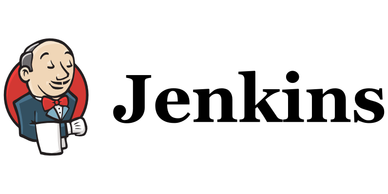

# [CI/CD] 플랫폼

# 젠킨스 (Jenkins)

**`젠킨스**(Jenkins)`는 소프트웨어 개발 시 [지속적 통합](https://ko.wikipedia.org/wiki/%EC%A7%80%EC%86%8D%EC%A0%81_%ED%86%B5%ED%95%A9)(continuous integration) 서비스를 제공하는 툴이다. 다수의 개발자들이 하나의 프로그램을 개발할 때 버전 충돌을 방지하기 위해 각자 작업한 내용을 공유 영역에 있는 Git등의 저장소에 빈번히 업로드함으로써 지속적 통합이 가능하도록 해 준다. [`MIT 라이선스`](https://ko.wikipedia.org/wiki/MIT_%EB%9D%BC%EC%9D%B4%EC%84%A0%EC%8A%A4)를 따른다.

### 안정적인 빌드/배포 환경

소스 버전 관리 툴과 연동하여 `코드 변경을 감지`하고, `자동화 테스트를 포함한 빌드를 수행`하여 **소프트웨어 품질을 향상**시킬 수 있다.  빌드 결과물을 `지속적으로 배포`하도록 설정하여 개`발 프로세스 전체를 자동화`할 수 있다.

### 다양한 활용 및 손쉬운 확장

Jenkins는 MIT 오픈 소스 소프트웨어로 사용자가 많아 문서화가 잘 되어 있다. 빌드/배포 이외에도 스케쥴링을 이용한 배치 작업에도 활용되는 등 다양한 적용 사례들을 참고할 수 있다. 플러그 인을 직접 개발하여 기능을 확장하는 것도 가능하다.

### 단점

- 설치형으로 AWS EC2를 사용한다면, `젠킨스만을 위한 인스턴스가 필요`하다
- 플러그인이 다양한 만큼 `세팅이 복잡`하다

### 사용 방법

- Jenkins 설치
- Github Webhook 생성
- SSH 설정
- Build Script 작성
- Deploy Script 작성

[Jenkins User Documentation](https://www.jenkins.io/doc/)

# TeamCity

`TeamCity`는 **JetBrains의 빌드 관리 및 지속적 통합 서버**로써 `Java 환경에서 실행`되며 Visual Studio 및 IDE와 통합될수있는데, Windows 및 Linux 서버에 모두 설치할 수 있으며 .NET 및 개방형 스택 프로젝트도 지원한다.

클라우드와 직접 호스팅을 위한 서버로 사용이 가능한데 서버는 **`무료이다!`**

물론 무제한 빌드와 더 많은 기능을 사용하려면 유료로 사용해야 하지만, `상업용으로도 무료`이기 때문에 일반 기업에서도 무료로 사용할 수 있을 정도의 규모이다.

[TeamCity](https://www.jetbrains.com/ko-kr/teamcity)

# Travis CI

**`Travis CI`**는 깃허브에 호스팅되는 소프트웨어 프로젝트의 빌드, 테스트를 위해 사용된다.

Travis CI는 비공개 프로젝트(private)에는 다양한 유료 플랜을, 오픈 소스(public)에는 무료 플랜을 제공한다. TravisPro는 고객 자신의 하드웨어에서 사유 버전의 커스텀 디플로이를 제공한다.

소스는 기술적으로 free software이며 허가 라이선스 하에 깃허브에서 단편적으로 이용이 가능하다. 

## 장점

- 설치 필요 없이, Github와 연동하여 .travis.yml 설정 파일만 설정하면 된다.
- public repository에 한해 무료 오픈소스 웹 서비스이다.

## 단점

- Private Repository의 경우 유료 1달 69$

### 사용방법

- Github ID로 Travis CI 로그인
- 레포지토리 상태 활성화
    - Travis와 Github를 상호 연결해야하는데, 중요한 것은 해당 레포지토리의 Admin 이어야 가능하다.
- 프로젝트에 .travis.yml 설정 파일 생성
    - Travis CI가 프로젝트를 빌드하기 위해서는 `.travis.yml`
    이라는 파일이 해당 레포지토리의 루트에 존재해야 한다
- git push를 통한 빌드 실행
    - `.travis.yml` 이라는 파일에서 지정된 branch로 push 이벤트가 발생하면 빌드를 실행한다.

**AWS CodeDeploy 응용**

- Code Deploy는 저장 기능이 없기 때문에 **jar를 보관할 수 있는 `AWS S3 bucket`** 이용
- `AWS S3`에 jar 파일 전달 및 빌드
- 배포를 위해 `AWS S3`에서 `AWS CodeDeploy`로 파일 전달
- CodeDeploy를 통해 `EC2 instance에 자동 배포`

[Travis CI Documentation](https://docs.travis-ci.com/)

# Github Actions

`GitHub Actions`를 사용하여 레포지토리에서 바로 소프트웨어 개발 `워크플로를 자동화`, `사용자 지정 및 실행`합니다.

GitHub Actions를 사용하면 자동으로 코드 저장소에서 어떤 **이벤트(event)가 발생했을** **때** 특정 작업이 일어나게 하거나 주기적으로 어떤 작업들을 반복해서 실행시킬 수도 있다.

예를 들어, 누군가가 코드 저장소에 Pull Request를 생성하게 되면 GitHub Actions를 통해 해당 코드 변경분에 문제가 없는지 각종 검사를 진행할 수 있다. 어떤 새로운 코드가 메인(main) 브랜치에 유입(push)되면 GitHub Actions를 통해 소프트웨어를 빌드(build)하고 상용 서버에 배포(deploy)할 수도 있다. 뿐만 아니라 매일 밤 특정 시각에 그날 하루에 대한 통계 데이터를 수집시킬 수도 있다.

## 사용방법

- Github Repository의 Action에서 workflow 생성
- yml 파일 설정

## 장점

- 설치 없이 바로 Repository에서 관리가 가능
- yml 파일을 통한 쉬운 설정

## 단점

- Private Repository에 한해 요금 발생

[GitHub Actions Documentation - GitHub Docs](https://docs.github.com/en/actions)