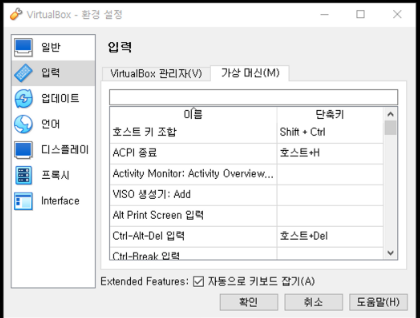

# 0424

# Rocky Linux에서 마우스 뺴는 법

- Ubuntu에서는 마우스가 쉽게 로컬 OS로 빠져서 어떤 작업을 수행하기에 편리하다.
- 하지만 Rocky Linux에서는 마우스를 로컬 OS로 뺴내기 위해서는 작업 관리자 버튼을 눌러 화면 전환을 해야하기 때문에 여간 불편한 것이 아니다.
- 이를 해결하기 위해서는 다음과 같이 한다.
    1. Rocky를 켜고 작업 관리자로 한번 마우스를 로컬 OS로 옮긴다.
    2. 우측 하단 버튼을 클릭한 후 키보드 설정 버튼을 누른다
    
    ![Untitled](# 0424

# Rocky Linux에서 마우스 뺴는 법

- Ubuntu에서는 마우스가 쉽게 로컬 OS로 빠져서 어떤 작업을 수행하기에 편리하다.
- 하지만 Rocky Linux에서는 마우스를 로컬 OS로 뺴내기 위해서는 작업 관리자 버튼을 눌러 화면 전환을 해야하기 때문에 여간 불편한 것이 아니다.
- 이를 해결하기 위해서는 다음과 같이 한다.
    1. Rocky를 켜고 작업 관리자로 한번 마우스를 로컬 OS로 옮긴다.
    2. 우측 하단 버튼을 클릭한 후 키보드 설정 버튼을 누른다
    
    
    
    1. 호스트 키 조합에서 단축키를 누르고 본인이 희망하는 키를 입력한다.
    
    
    
    1. 이제는 Rocky Linux에서 해당 키를 누르면 로컬 OS로 마우스 커서가 이동할 수 있게 된다!

# Run Level

- 리눅스에서 런레벨은 시스템이 시작될 때 실행할 프로세스의 그룹을 지정하는 방법이다. 각 런레벨에는 시스템이 실행되는 특정 서비스 또는 데몬의 집합이 있습니다.

# 런 레벨의 종류

- 보통 리눅스 시스템은 다음과 같은 7개의 런레벨을 가지고 있다.
    1. 런레벨 0 : 시스템을 종료하는 상태로 init 0을 입력하여 런레벨을 0으로 변경하라고 터미널에 명령을 내리는 것이다.
    2. 런레벨 1 : 시스템 복구 모드이다. 단일 사용자 모드로서 관리자 쉘을 얻게 된다.
    3. 런레벨 2 : Multi-User → NFS를 지원하지 않는 Multi-User 모드이다. 즉, 네트워크를 사용하지 않는 상태의 텍스트 윶 모드를 뜻하는데 CentOS 7부터는 사용되지 않는 레벨, 호환성을 위해 런레벨 3과 동일한 것으로 취급한다.
    4. 런레벨 3 : Full Multi-User : 텍스트 모드의 다중 사용자 모드이다. 일반적인 쉘 스크립팅 기반의 인터페이스로 작동하는 Mulit-User 모드이다. 일반적으로 텍스트 유저 모드라고 한다.
    5. 런레벨 4 : Unused로 불리며 기본적으로 사용하지 않는 모드이다. Runlevel2와 같이 호환성을 위해 런레벨 3과 같은 것으로 취급된다. 해당 단계에 대한 설정을 임의로 하여 별도로 사용하기도 함
    6. 런레벨 5 : 그래픽 모드의 다중 사용자 모드이다. 기본적으로는 런레벨 3과 동일하지만, GUI를 제공하는 그래픽 유저 모드이다.
    7. 런레벨 6 : 시스템 재부팅을 나타내는 모드이다. 런레벨 0과 마찬가지로 이 상태로 변경하라는 명령을 내리면 시스템을 재부팅하게 된다. 혹시나 런레벨 6을 init default로 설정하면 시스템은 무한 재부팅이 되므로 주의하여야 한다.)
    
    1. 호스트 키 조합에서 단축키를 누르고 본인이 희망하는 키를 입력한다.
    
    
    
    1. 이제는 Rocky Linux에서 해당 키를 누르면 로컬 OS로 마우스 커서가 이동할 수 있게 된다!

# Run Level

- 리눅스에서 런레벨은 시스템이 시작될 때 실행할 프로세스의 그룹을 지정하는 방법이다. 각 런레벨에는 시스템이 실행되는 특정 서비스 또는 데몬의 집합이 있습니다.

# 런 레벨의 종류

- 보통 리눅스 시스템은 다음과 같은 7개의 런레벨을 가지고 있다.
    1. 런레벨 0 : 시스템을 종료하는 상태로 init 0을 입력하여 런레벨을 0으로 변경하라고 터미널에 명령을 내리는 것이다.
    2. 런레벨 1 : 시스템 복구 모드이다. 단일 사용자 모드로서 관리자 쉘을 얻게 된다.
    3. 런레벨 2 : Multi-User → NFS를 지원하지 않는 Multi-User 모드이다. 즉, 네트워크를 사용하지 않는 상태의 텍스트 윶 모드를 뜻하는데 CentOS 7부터는 사용되지 않는 레벨, 호환성을 위해 런레벨 3과 동일한 것으로 취급한다.
    4. 런레벨 3 : Full Multi-User : 텍스트 모드의 다중 사용자 모드이다. 일반적인 쉘 스크립팅 기반의 인터페이스로 작동하는 Mulit-User 모드이다. 일반적으로 텍스트 유저 모드라고 한다.
    5. 런레벨 4 : Unused로 불리며 기본적으로 사용하지 않는 모드이다. Runlevel2와 같이 호환성을 위해 런레벨 3과 같은 것으로 취급된다. 해당 단계에 대한 설정을 임의로 하여 별도로 사용하기도 함
    6. 런레벨 5 : 그래픽 모드의 다중 사용자 모드이다. 기본적으로는 런레벨 3과 동일하지만, GUI를 제공하는 그래픽 유저 모드이다.
    7. 런레벨 6 : 시스템 재부팅을 나타내는 모드이다. 런레벨 0과 마찬가지로 이 상태로 변경하라는 명령을 내리면 시스템을 재부팅하게 된다. 혹시나 런레벨 6을 init default로 설정하면 시스템은 무한 재부팅이 되므로 주의하여야 한다.