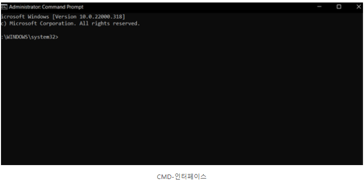
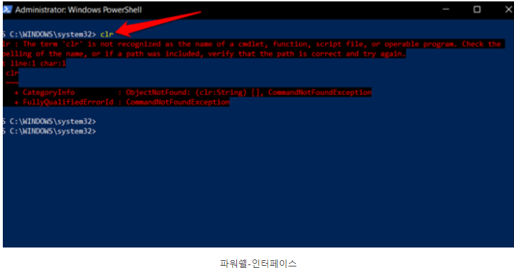

# 명령프롬프트 VS 파워쉘 VS 윈도우 터미널

- 윈도우 OS와 함께 제공되는 가장 오래된 앱 및 명령줄 도구 중 하나인 CMD는 이제 세 가지 도구가 제공된다. CMD, 2006년에 출시된 파워쉘, 2019년에 10~11용으로 출시된 윈도우 터미널이다.

### 명령 프롬프트

- 명령 프롬프트는 윈도우 95~98에서 Command.com으로 시작되었다. MS-DOS로 기억하기도 한다.
- 인터넷 속도를 테스트하는 데 널리 사용되었다. 기본 파일 시스템과 상호 작용할 수 있으며 시스템 명령을 실행하여 몇 가지 일반적이거나 일반적이지 않은 오류를 해결할 수 있었다.

### 파워쉘

- cmd로 할 수 있는 모든 작업을 파워쉘로 할 수 있다. 파워쉘은 XP와 함께 출시되었다. 더욱 강력해졌으며 복잡한 명령을 실행하고, 관리 작업을 자동화 할 수 있었다.
- 윈도우 아키텍처의 핵심 구성 요소인 .NET Framework와 통합되는 C# 프로그래밍 언어를 실행할 수 있다.
    - Net Framework : 프로그램 개발 및 실행 환경을 의미한다.

### 윈도우 터미널

- 깃허브에서 사용할 수 있는 오픈 소스 프로젝트이다. 상위 두 개를 지원하는 것 외에도 Linux 또는 WSL용 Windows 하위 시스템도 지원한다. Linux OS에 국한된 BASH를 사용할 수 있다.

### 상호작용

- 명령 프롬프트는 웹 페이지와 GUI가 직관적이지 않고 기본적인 인터페이스를 가진다.

- 파워쉘은 결과에 특정 색상을 적용하여 출력을 더 쉽게 이해할 수 있도록 한 단계 더 나아졌다.
- 특정 텍스트는 노란색으로, 오류는 빨간색으로 강조되어 표시된다.

- 터미널은 탭을 통해 다른 프로젝트에서 작업하거나 동시 작업이 가능해졌다. 자신만의 색 구성표를 적용할 수도 있고, SSH 터널에 대해 다른 설정으로 프로필을 만들 수 있다.