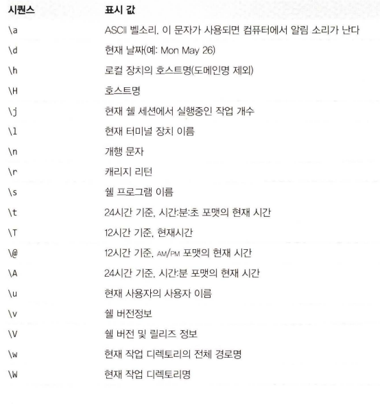

# 리눅스 커맨드라인 완벽입문

---

# 용어 정리

<aside>
💡 **커널이란?**
→ 하드웨어와 소프트웨어 간 인터페이스 역할을 하는 프로그램, 운영체제는 커널, 이를 지원하는 소프트웨어, 그리고 응용 프로그램으로 구성됨 

**쉘이란?
→** 운영체제의 커널과 사용자 간의 인터페이스 역할을 하는 프로그램
Mac, Linux의 경우 Bash, Window의 경우 CMD, PowerShell

**쉘 프롬프트란?**
→ 컴퓨터의 쉘 환경에서 사용자가 명령어를 입력할 수 있는 인터페이스

</aside>

# 프롬프트 해부하기

```powershell
[me@linuxbox ~]$
```

- 기본 프롬포트 모양은 위와 같음
- 사용자이름, 호스트명, 현재 작업 디렉토리를 표시함 어떻게 정의되었을까?
    - 프롬프트는 PS1(Prompt Strign1의 준말)이라고 하는 환경 변수에 의해 정의된다.
    - `echo PS1` 명령어를 통해 PS1 내용을 살펴보자
    
    ```powershell
    [me@linuxbox ~]$ echo $PS1 
    [ \ u@\h \W] \$
    ```
    
- 결과를 보면 PS1의 구성이 어떻게 되어있는지 확인할 수 있다. 따라서 우리는 아래 표를 통해 PS1를 커스텀할 수 있다.




---

# 다른 형태의 프롬프트 사용해보기

`me@linuxbox ~]$ psl_old="$PS1”`

- 위와같이 커스텀하기 전 기존 문자열을 백업해두자, 되돌릴 때는 아래와 같이 백업하면 된다.

`[me@linuxbox ~]$ PS1="$psl_old”`

### 빈 프롬프트 문자열

- 프롬프트 창에 아무것도 표시되지 않는다.

`[me@linuxbox ~]$ PSl=`

### 축소형 프롬프트

- 우리가 뭘 하고 있는지 정도는 확인할 수 있을 정도.
    - 이때 **따옴표 사이에 빈칸이 있음**에 주의해야함 달러 기호와 커서 사이의 공간이 됨

`PSl="\$ “`

### 알림 소리 추가 프롬프트

- 이젠 프롬프트 표시마다 알림 소리가 들릴 것이다. 오랜 시간 실행되는 명령어라면 완료되었을 때 활용할 수 있을 것이다.

$ `PS1="\a\$ “` 

### 호스트명과 현재 시간 정보 추가 프롬프트

```powershell
$ PSl="\A \h \$ "
17: 33 linuxbox $
```

⇒ 특정 작업 수행 시간을 알고 싶을 때 매우 유용함

### 원래 모양과 비슷한 형태로 다시 만들어보자

```powershell
17 :37 linuxbox $ PSl="<\u@\h \W>\$ "
<me@linuxbox ~> $ 
```

---

# 색상 추가

- 문자 색상은 표시될 문자열에 내장된 ANSI 이스케이프 코드를 터미널 에뮬레이터에 전송함으로써 제어됨
- 제어 코드는 화면에 “출력”되는 것이 아니라 하나의 명령어 터미널에 의해 해석됨
- \ 시퀀스는 비출력 문자를 나타나게 할 때 사용됨
- ANSI 이스케이프 코드는 8진법의 033으로 시작됨 그 뒤에 오는 것은 부가적인 문자 속성 및 명령
- 일반적인 검은색으로 텍스트 색상을 설정했다면 \033[0;30m이다.


### 자, 이제 프롬프트를 빨간색으로 바꾸는 코드

```powershell
<me@linuxbox ~>$ PS1="\[\033[0;31m\]<\u@\h \W>\$ "
<me@linuxbox ~>$
```

→ 색상이 바뀌게 되었으나 프롬프트 다음 입력 글자도 빨갛게 나온다. 이를 수정하기 위해선 다른 이스케이프 코드를 프롬프트 끝에 넣어서 이전 색상으로 표시되도록 해야함

```powershell
<me@linuxbox ~>$ PS1="\[\633[6;31m\ ]< \u@\h \W>\$\[\63 8m\ ]"
<me@linuxbox ~>$
```

→ Better

### 바탕색을 바꿀수도 있음


```powershell
<me@linuxbox ~>$ PS1="\[\033[0; 41m\]<\u@\h \W>\$\[\033[0m\] "

```

→ 굳 ~

# 커서 이동

- 이스케이프 코드는 커서 위치를 결정할 때도 사용됨
- 다른 위치, 정보를 표현하고자 할 때 주로 사용됨, 프롬프트가 표시될 떄 마다 화면 상단에 그 정보를 보여줌


### 화면 상단 빨간 줄의 시간 정보가 있는 프롬프트를 만들 수 있음,

`PS1="\[\033[s\033[0;0H\033[0; 4lm\033[K\033[1 ; 33m\t\033[0m\033[u\]<\u@\h \W>\$ “`


⇒ 코드 분석 내용

# 프롬프트 저장

- 위와 같은 코드를 매번 입력할 수는 없다. 저장하기 위해서는 이렇게 하면 된다.
- .bashrc 파일에 저장하여 사용하기 위해선 아래와 같이 하면 된다

```powershell
PS1="\[\033[s\033[0;0H\033[0;41m\033[K\033[1;33m\t\033[0m\033[u\]<\u@\h \W>\$ "
export PSl
```