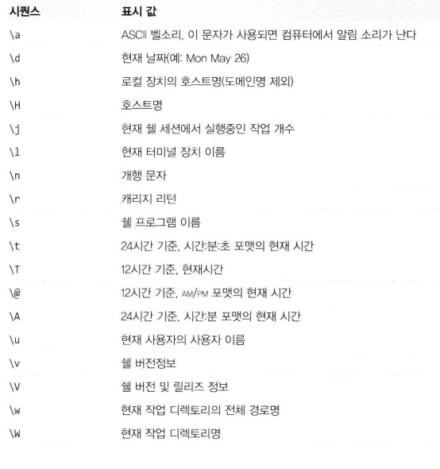

# 이것이 리눅스다. 02 CentOS

## 리눅스의 개요

- 리눅스 이전, 유닉스라는 운영체제가 널리 사용되어왔음, 현재까지도 가장 많이 사용되는 운영체제 중 하나, 상용 소프트웨어로 발전되었으며 현재는 무척 비싼 비용을 지불해야만 사용 가능함
- 이러한 유닉스를 대체할 수 있는 것이 리눅스(무료 유닉스라고 생각하면 좋음)
- 유닉스의 모든 기능과 역할을 하는데도 어떤 면에서는 유닉스보다 뛰어난 기능을 발휘함

## 리눅스의 탄생

- 리누스 토발스가 만든 커널(자동차의 엔진격)을 배포하였음
- 이 커널에다가 컴파일러, 셸, 기타 응용 프로그램들이 조합된 배포판을 리눅스라고 함
    - 그 배포판 중 하나가 바로 CentOS 리눅스
    
    
    

## GNU 프로젝트

- 리누스 토발스가 커널을 개발하기 전, 리처드 스톨먼이 GNU 프로젝트를 시작하였고 이 목표는 모두가 공유할 수 있는 소프트웨어를 만드는 것이었다.
- 이는 컴퓨터 프로그램의 복제, 변경, 소스 코드 사용 제한을 철폐하는 것이었다.

## 커널

- 커널에는 현재 제어하는 하드웨어 장치의 지원 여부 정보, 하드웨어 성능, 하드웨어를 제어하는 코드들이 들어 있음
- 지금도 현재 업그레이드 중
- 커널은 크게 안정 버전, 개발 버전으로 나뉘어 배포됨
    - 안정 버전은 이미 검증된 코드들로 구성되어 있어 안정적임
    - 개발 버전은 안정 버전 이전, 미리 추가된 기능을 접하고 싶을 경우에 사용 가능함
- 리눅스의 가장 큰 특징 중 하나는 배포판에 포함된 기본 커널을 사용자가 직접 최신 커널로 업그레이드할 수 있다는 점이다.

## CentOS 리눅스 배포판

⇒ 레드햇 리눅스와 Cent OS 리눅스

- 일반적인 사용자들은 리눅스 커널만으로 리눅스를 사용할 수 없다. 이런 이유 때문에 여러 회사나 단체에서 리눅스 커널에 다양한 응용프로그램을 추가헤 쉽게 설치할 수 있도록 만든 것이 리눅스 배포판이다. 수백 가지가 넘는 종류가 있다.
- 그중에서도 가장 유명한 배포판이 레드햇 리눅스이다. 이는 유료, 무료 모두 배포하였으나 Red Hat은 현재 유료 판매 배포판만을 의미하고 있다.
- 이것이 상용화되었더라도 GPL 라이선스를 따라야 한다. 즉 소스를 공개하여야 한다.
- 이를 활용해 컴파일하여 만든 것이 CentOS이고 CentOS와 RHEL는 완벽하게 동일한 것으로 보면 된다.