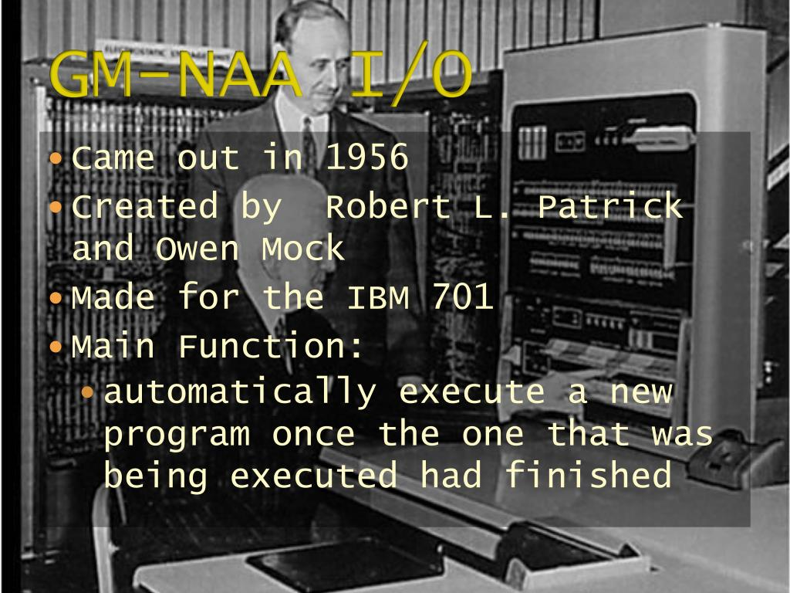

# 운영체제의 역사
---
## 1950년대: 최초의 운영체제와 Batch System
---

- 최초의 운영체제
>   최초의 운영체제 : GM-NAA I/O(1950년대) 
     
    미국의 General Motors(GM) 및 North American Aviation 기업이 공동으로 개발 
    IBM의 701 컴퓨터와 같은 시스템에서 사용될 목적으로 개발 
    입출력 장치와의 상호작용을 돕는 시스템 
    => 계산기에 불과했던 에니악의 한계를 넘어 사용자들이 다양한 프로그램을 작성하고 실행할 수 있도록 함 
    이 운영체제를 기반으로 발전된 다른 운영체제들이 등장

- 일괄 처리 시스템(Batch System)
>   Batch System : 초기 컴퓨터에서 가장 많이 사용된 운영 체제 
         
        컴퓨터 작업들 일괄처리, 대량 데이터 처리에 효과적 
        사용자 : 일련의 작업을 제출 => 하나의 배치(batch)로 묶어 컴퓨터에 전달 
        컴퓨터 : 순차적으로 작업 수행 => 결과 출력 

---
## 1960년대: IBM의 OS/360과 시분할 시스템
---

- 메인프레임
>   메인프레임 : 대용량 데이터를 처리하고 고성능 컴퓨팅에 사용되는 컴퓨터 시스템 
     
    초기 컴퓨터들의 중앙 처리 장치와 메인 메모리를 갖춘 "메인 프레임"이라 불리는 대형 캐비넷들을 지칭 
    주로 기업과 정부 기관에서 사용되었으며, 대규모 데이터 처리, 은행 업무, 항공 예약 시스템 등에 널리 사용 
    여러 개의 CPU와 메모리, 입출력 장치 및 디스크 드라이브로 구성 
    대량의 데이터를 처리에 용이 

- IBM의 OS/360
>   OS/360 : IBM, 1964, 메인프레임용 운영체제 
     
    최초의 현대적인 운영체제의 개념을 도입한 대규모 운영체제 
    기존 작업 방식 : 작업을 처리하기 위해 컴퓨터를 쪼개 작은 작업으로 나누어 일을 처리 
    시분할 시스템 : 하나의 시스템에서 여러 작업을 처리 
    이식성과 확장성을 강조 => UNIX에 큰 영향 

- 시분할 시스템
>   시분할 시스템 : 여러 사용자들이 한 대의 컴퓨터를 동시에 사용할 수 있게 하는 시스템 
     
    CPU를 시간단위로 분할하여 여러 프로세스를 동시에 실행하도록 함 
    컴퓨터 자원의 활용도를 높이고, 사용자 간의 대기 시간을 줄여줌  
    다중 사용자 환경 구현 : 여러 사용자가 동시에 시스템을 사용할 수 있는 환경 
    각 사용자에게 독립된 프로세스와 자원을 할당 => 서로 영향을 주지 않도록 해야 함  
    대화형 컴퓨팅 : 사용자의 입력에 대하여 컴퓨터에서 바로 결과를 출력 
     
    이후 리눅스, MS-DOS, 윈도우 등 다양한 컴퓨팅 환경의 기초가 됨  
    최초의 시분할 시스템 : MIT의 CTSS (Compatible Time-Sharing System, 1960년대 초)  
    MULTICS : (Multiplexed Information and Computing Service, AT&T 벨 연구소) 
     
    다중 사용자 환경에서 안정성, 보안성 등을 강화하기 위해 개발 
    => UNIX 운영체제의 개발에 큰 영향을 미침  
    시분할 시스템의 의의 : 개인용 컴퓨터와 서버 등 컴퓨터를 다양한 용도로 구분, 현재의 컴퓨팅 환경을 구축 

---
## 1970년대: UNIX의 등장
---

- UNIX의 등장
>   UNIX : 켄 톰슨과 데니스 리치가 개발(1969, 벨 연구소) 
     
    어셈블리 언어로 개발된 메인프레임용 운영체제 
    PDP-7 컴퓨터를 위해 개발 => 다양한 시스템으로 이식되어 대중화 
    이식성(portability) : 다양한 하드웨어와 소프트웨어 환경에서도 동작 
    다양한 분야에서 사용, 인터넷 등장으로 중요성 극대화  
    오픈소스 운동 기반 : 매우 높은 효율성과 매우 비싼 이용 비용으로 인해 다른 OS 출시의 효시가 되었고, 큰 영향을 주었음. 
     
    1983년 GNU 프로젝트 등이 대표 적이며, 특히 90년대에 출시된 LINUX는 가장 대표적인 오픈소스 운동의 결과물이라 할 수 있다.  

---
## 1980년대: 개인용 컴퓨터와 GUI
---
---
### 1980년대: 개인용 컴퓨터 보급, MS-DOS 운영체제 대중화
---
- MS-DOS
> MS-DOS 운영체제 : PC 시대의 개막, 1980년대  
      
    개인용 컴퓨터의 보급 : 대형 기업/연구기관 : 대형 메인프레임 컴퓨터/미니컴퓨터 => 개인/소규모 기업 : PC  
    MS-DOS 운영체제 : 개인용 컴퓨터를 위해 개발된 운영체제  
    주로 IBM PC 호환 컴퓨터에서 사용 
      
    CLI(명령줄 인터페이스, Command Line Interface) :  사용자가 직접 명령어를 입력해 컴퓨터를 제어하는 방식 

---
### 1984년: 매킨토시 운영체제 등장, GUI 환경 제공
---
- Macintosh
>   Macintosh 운영체제 : 1984, Apple  
      
    GUI(그래픽 사용자 인터페이스) : 텍스트 기반 인터페이스 -> 그래픽 기반 인터페이스  
    사용자들의 컴퓨터 접근성 키움 => 컴퓨터 사용자 인터페이스의 표준화  

---
# [2부에서 계속](2023-04-18-history-Of-OS2)
