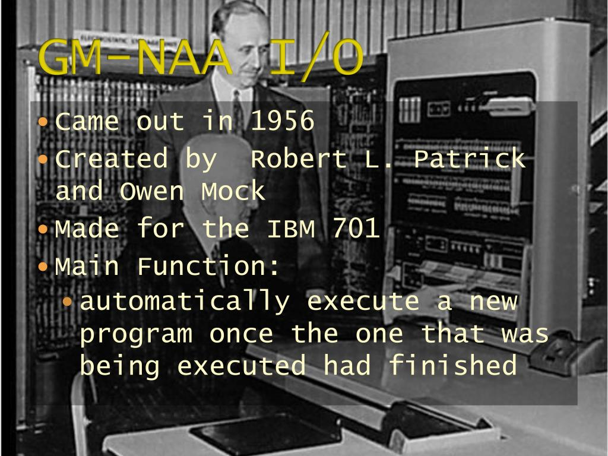
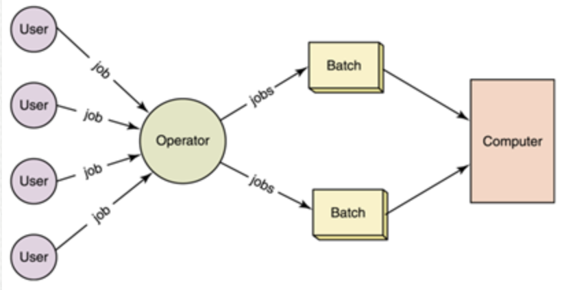

# 운영체제의 역사
---
## 1990년대: 윈도우 운영체제 대중화, 리눅스의 등장과 오픈소스 운동 활성화
---

- 윈도우 운영체제 대중화
>   1990년대 : 다양한 운영체제들이 경쟁하면서 대중화되는 시기 
    window : Windows 3.0, 3.1, 3.11 -> Windows 95, Windows 98 
     
    사용자 친화적인 쉬운 인터페이스와 그래픽 기능, 다양한 응용 프로그램들을 제공 
    개인용 컴퓨터의 보급 => 일반 사용자들의 컴퓨터 사용이 보편화 

- 오픈소스 운동이 활성화
>   GNU 운동 이후로도 오픈소스 운동 활성화 
    리눅스의 탄생 

- 리눅스(Linux)
>   리눅스 : 1991년에 리누스 토발즈가 개발 
     
    유닉스 운영체제와 유사한 기능 : 높은 안정성과 이식성 
    오픈소스로 제공되어 무료 -> UNIX의 강력한 대체제 
    출시 당시엔 개인용이 아닌 개발용 운영체제 
    리눅스 커널 개선 => 안정적이고 유연한 운영체제로 발전 : 오픈소스의 장점 
    1990년대 후반부터 오픈소스 운동의 중심적인 역할 -> 현재까지도 
    웹 서버, 데이터베이스 서버, 클라우드, IoT 디바이스, 모바일 등 다양한 분야에서 널리 사용  
    리눅스의 특징 : 안정성, 보안성, 이식성, 무료, 대중적 
    오픈소스의 장점 : 지속적인 업그레이드와 개선, 안정성, 유연성 증대, 편의를 위한 다양한 기능 발달 

---
## 2000년대 - 현재: 분산 컴퓨팅과 모바일
---
### 2000년대: 인터넷과 분산 컴퓨팅 기술 발전, 클라우드 컴퓨팅 등장
---

- 클라이언트-서버 모델과 분산 운영체제

>   클라이언트-서버 모델 : 컴퓨터 네트워크에서 중요한 개념 
     
    서버 컴퓨터에서 중앙 집중식으로 데이터와 리소스를 관리 
    클라이언트가 서버에 필요한 데이터와 리소스 요청 -> 서버가 처리해 클라이언트에 전달  
>   분산 운영체제 : 여러 개의 컴퓨터로 이루어진 분산 시스템에서 작동 
     
    분산 시스템의 여러 컴퓨터 간의 통신, 자원 공유, 작업 스케줄링 등을 관리 
    분산 컴퓨팅, 클라우드 컴퓨팅 등에서 사용 
    클라이언트-서버 모델과 유사한 개념을 포함  
    => 여러 개의 서버 컴퓨터로 분산되어 있는 데이터와 리소스를 클라이언트가 접근할 수 있도록 관리 

- 클라우드 컴퓨팅

>   클라우드 컴퓨팅 : 인터넷 => 여러 대의 컴퓨터를 하나로 연결, 자원 공유, 서비스 제공 
     
    => 기업/개인이 컴퓨터를 구축하거나 운영 X -> 서비스 제공 업체에 데이터나 애플리케이션 위탁 및 이용 
    기업/개인 : 컴퓨터 구축/운영 비용 절감, 자원을 필요한 만큼 쉽게 확장 
    클라우드 서비스 제공 업체 : 대규모 데이터 센터 운영 => 자원 효율적 관리, 안정적인 서비스 제공 
    클라우드 컴퓨팅의 활용 : 온라인 스토리지, 이메일 서비스, 소셜 미디어, 비디오 스트리밍, 인공지능 등 

- 가상화 운영체제

>   가상화 운영체제 : 가상 머신(VM)을 통해 여러 개의 운영체제를 하나의 호스트 시스템에서 동시에 실행 
     
    하나의 물리적인 서버에서 여러 개의 가상 서버를 운영 => 하드웨어 자원 효율성 증대 
    호스트 운영체제 위에서 동작, VM을 생성하여 여러 개의 가상 시스템을 실행 가능 
    각각 독립적인 운영체제, 호스트 운영체제와 별개 => 서로 영향 X, 독립적 
    가상화 운영체제의 활용 : 하나의 물리적인 서버에서 독립적인 여러 개의 서비스를 운영해야 하는 경우, 테스트 및 개발, 클라우드 서비스 

---
### 2007년 ~ 2010년대: 아이폰 출시, 모바일 운영체제 대중화
---

>   iOS : 2007년, 애플 아이폰용 모바일 운영체제 
     
    사용자 친화적 인터페이스, 다양한 애플리케이션 제공 => 모바일 기기의 대중화 
    안드로이드, 워크플레이스 등 후발 모바일 운영체제 출시 
    모바일 운영체제의 특징 : 터치스크린 인터페이스, 모바일 하드웨어와의 호환성, 배터리 수명, 데이터 보안 

>   안드로이드 운영체제 : 2010년대 스마트폰, 태블릿 등 모바일 기기 대중화 (갤럭스 S 시리즈) 
     
    모바일 운영체제, 애플리케이션 시장 성장 => 인공지능 기술과 시너지 -> 음성 인식, 이미지 인식, 자연어 처리 등 
    센서 반도체, 카메라 등 전자공학 산업과도 큰 시너지 