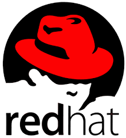

# 레드햇과 데비안 계열 리눅스의 차이
---
## 예시
---
### 레드햇 계열 리눅스
>   

    Red Hat Enterprise Linux (RHEL), CentOS, Fedora, Rocky 등
---
### 데비안 계열 리눅스

>   

    Debian, Ubuntu, Linux Mint 등
---
## 차이
---
### 패키지 관리

>   레드햇 계열 리눅스 : 

    RPM(Red Hat Package Manager) 패키지 관리 시스템 사용

>   데비안 계열 리눅스 : 

    Debian 패키지 관리 시스템을 사용합니다.

### 용도차이

>   #### 기업용 vs 개인용

    레드햇 계열 리눅스 : 

    기업용으로 설계, 더 많은 기업용 기능과 보안 기능 포함

    RHEL : 기업용 시스템에서 높은 안정성과 보안성을 요구하는 경우, 긴 지원 주기와 함께 제공되는 전문적인 기술 지원과 업그레이드, 패치 관리 등의 서비스가 필요한 경우에 적합

    기업용 애플리케이션 및 데이터베이스 등의 서버 어플리케이션을 실행하는데 적합

    ⇒ 기업용 서버 또는 엔터프라이즈 시스템에 적합

    데비안 계열 리눅스 :

    개인용일반 사용자를 대상, 더 많은 개발자 및 개발 도구 제공

    개발자, 컴퓨터 전문가 및 일반 사용자를 대상으로 개발

    데스크톱 운영 체제

    최신 버전의 소프트웨어 업데이트와 개발자 도구를 제공

    다양한 하드웨어에서 작동하는데 적합(이식성), 클라우드 컴퓨팅 및 컨테이너 환경에서 사용 편리

    ⇒ 개인용 데크톱이나 개발 환경

>   #### 정리

    위와 같은 차이로 인해 레드햇과 데비안은 서로 다른 용도와 사용자를 대상으로 함.

    기업용 시스템에서는 RHEL 사용, 개발 및 개인용 운영 체제에서는 우분투 사용

### 사용자 인터페이스

>   레드햇 계열 리눅스 : GNOME 데스크톱 환경 기본 사용

        예외) CentOS : KDE Plasma / Xfce 데스크톱 환경 선택 가능

>   데비안 계열 리눅스 : Unity / GNOME을 기본 사용, 다른 데스크톱 환경 선택 가능

### 지원 방식 및 라이센스:

>   레드햇 계열 리눅스 : 유료 버전(Red Hat Enterprise Linux(RHEL), 라이센스 있음)과 무료 버전(Fedora) 제공

>   데비안 계열 리눅스 : 거의 모두 무료, 오픈소스 기반

### 업데이트 주기:

>   레드햇 계열 리눅스 : LTS 버전 약 10년의 긴 지원 주기

>   데비안 계열 리눅스 : LTS 버전 5년, 비-LTS 버전 9개월의 짧은 지원 주기

### 파일 시스템:

>   레드햇 계열 리눅스 : ext4, XFS, Btrfs 등 다양한 파일 시스템 지원

>   데비안 계열 리눅스 : ext4 기본 사용

### 가상화:

>   레드햇 계열 리눅스 : KVM을 포함한 다양한 가상화 기술을 지원

>   데비안 계열 리눅스 : KVM/ LXD(Linux Container Hypervisor) 지원

### 명령어 상의 차이

#### 레드햇 계열 리눅스 RHEL vs 데비안 계열 리눅스 Ubuntu

>   ```bash
    1. 패키지 관리 명령어:
        - RHEL: yum
        - Ubuntu: apt-get 또는 apt
    2. 방화벽 설정 명령어:
        - RHEL: firewall-cmd
        - Ubuntu: ufw (Uncomplicated Firewall)
    3. 서비스 관리 명령어:
        - RHEL: systemctl
        - Ubuntu: systemctl 또는 service
    4. 사용자 및 그룹 관리 명령어:
        - RHEL: useradd, usermod, userdel, groupadd, groupmod, groupdel
        - Ubuntu: adduser, usermod, deluser, addgroup, groupmod, delgroup
    5. 파일 및 디렉토리 권한 관리 명령어:
        - RHEL: chmod, chown, chgrp
        - Ubuntu: chmod, chown, chgrp
    ```
