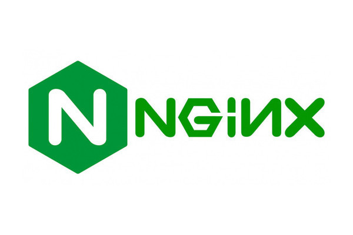

# NGINX란?

## **Nginx란?**

- 높은 성능과 안정성을 갖는 오픈소스 웹 서버 소프트웨어
- 초기에는 웹 서버로 사용되었으나, 지금은 프록시, 리버스 프록시, 메일 프록시, 캐시 서버, 로드 밸런서, HTTP 캐시 등 다양한 용도로 사용
- 비동기 이벤트 기반 구조로 I/O가 빠르고 가벼움
- 단일 프로세스와 단일 스레드로 작동하여 메모리 사용량이 적음
- Apache에 비해 사용이 간편함

## **Nginx의 장점**

- 높은 성능: 비동기 이벤트 기반 구조로 빠른 I/O 처리
- 확장성: 단일 프로세스와 단일 스레드로 메모리 사용량이 적음
- 안정성: Apache보다 안정적이고 메모리 누수가 적음
- 사용이 쉽고 간편함: 설정 파일이 간결하고, 빠르고 쉽게 배포 가능

## **Nginx의 용도**

- 웹 서버: Apache와 함께 가장 많이 사용
- 프록시 서버: 클라이언트와 서버 사이에서 대리로 요청하고 응답을 처리하여, 로드 밸런싱, 캐싱, 보안 등의 기능을 수행
- 리버스 프록시 서버: 서버가 클라이언트 대신 웹 서버로부터 요청을 받아 처리
- 로드 밸런서: 여러 대의 서버 사이에서 부하 분산
- 캐시 서버: 웹 서버의 부하를 줄이기 위해, 클라이언트로부터 요청된 데이터를 캐시하여 빠르게 처리
- HTTP 캐시: 클라이언트 요청을 처리할 때, 자주 사용하는 리소스를 캐시하여 처리 시간을 줄임

## **Apache와 Nginx 비교**

### 아키텍처

Apache : 멀티 프로세스, 멀티 스레드 아키텍처를 사용 

Nginx : 단일 스레드, 비동기 이벤트 기반 아키텍처를 사용

⇒ Nginx가 적은 메모리와 CPU를 사용하여 높은 성능을 제공, 더 많은 연결 처리

### 확장성

Apache : 높은 수준의 구성 가능성과 사용자 지정이 가능한 확장성을 제공

Nginx : 다양한 모듈을 사용하여 더 많은 기능을 제공, 확장성도 비슷

⇒ 많은 모듈을 사용하여 다양한 기능을 제공, 성능 면에서 Apache보다 우수

### 정적 파일 제공

Apache : 정적 파일 제공에 최적화된 서버로, 파일을 더욱 빠르게 제공

Nginx : 정적 파일 뿐 아니라 동적 콘텐츠에 더욱 최적화

### 리버스 프록시

Apache : mod_proxy 모듈을 사용

Nginx : 기본적으로 지원

⇒ 로드 밸런싱과 캐싱 기능을 더욱 용이하게 제공

### 보안

Nginx : 취약성이 덜한 소프트웨어

⇒ 단일 스레드 아키텍처와 보안 취약점에 대한 빠른 대응 능력

### 커뮤니티

Apache : 오랫동안 사용, 아직도 많은 사용자

Nginx : 최근 몇 년간 인기가 빠르게 상승, 성능 면에서 우수하여 인기

둘 다 대규모 커뮤니티와 지원을 보유, 다양한 자료와 문서를 찾기 쉬움

## **결론**

- Nginx는 높은 성능, 안정성, 확장성, 사용 편의성 등의 장점을 갖는 웹 서버 소프트웨어
- 다양한 용도로 사용되며, 웹 서버, 프록시 서버, 리버스 프록시 서버, 로드 밸런서, 캐시 서버, HTTP 캐시 등 다양한 기능을 수행할 수 있음
- Apache와 함께 가장 많이 사용되며, 쉽고 간편한 사용법으로 인기를 얻고 있음
- 최근에는 높은 성능과 보안성으로 apache의 파이를 차지하는 중