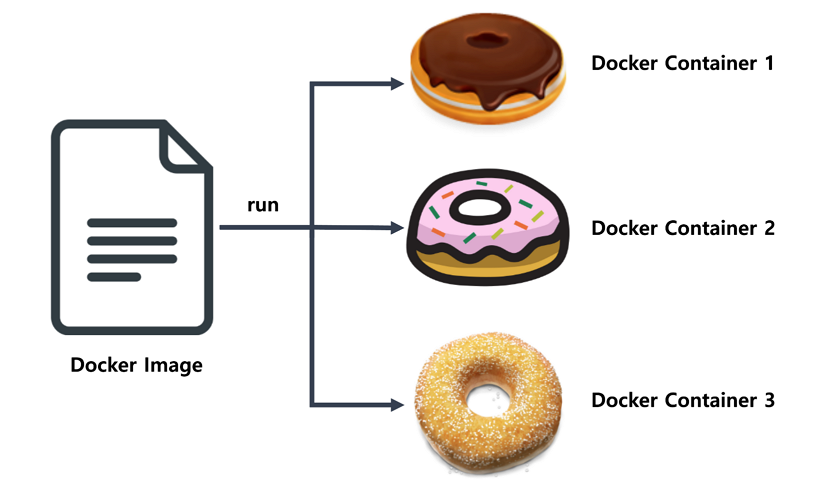
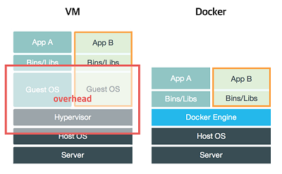
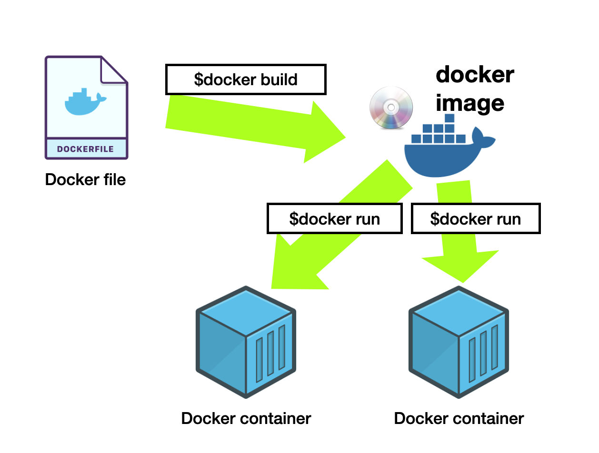

# 컨테이너와 도커 - 개념편

# **컨테이너와 도커 개념**

## **컨테이너의 개념**

- 소프트웨어를 패키징하고 배포하기 위한 기술
- 격리된 환경에서 어플리케이션 실행하는 기술
- 가상머신과는 다른 개념
- 호스트 운영체제 위에 어플리케이션 격리시켜 실행
- 리눅스 컨테이너/윈도우 컨테이너
- 도커 이미지를 실행하면 생성됨(리눅스 컨테이너)
- 한번 생성된 컨테이너는 이후 이미지의 영향을 받지 않음

## **컨테이너의 원리**

- 호스트 운영체제에서 격리된 환경을 만들어 실행
- 리눅스 커널 기술인 Cgroups, 네임스페이스 이용
- Cgroups : 프로세스 그룹에 대한 자원 할당 및 사용량 제한 기능을 제공
- 네임스페이스 : 프로세스가 시스템에서 사용하는 리소스를 격리

## **가상머신과의 비교**

- 게스트 운영체제 실행을 위한 가상화 기술
- 하이퍼바이저 이용 ⇒ 게스트 운영체제 위에 가상 하드웨어 생성
- 호스트 운영체제와 하드웨어 자원을 분리해 게스트 운영체제를 실행 ⇒ 무겁고 느림
- 컨테이너 : 호스트 운영체제와 자원을 공유 ⇒ 빠르고 가벼움
- 가상머신 : 환경설정이 까다롭고 환경이 서비스에 영향을 줌
- 컨테이너 : 환경설정이 쉽고 환경에 영향 받지 않음

# **도커와 이미지**

## **도커란**

- 컨테이너 기반의 가상화 플랫폼
- 리눅스 컨테이너 이용
- 어플리케이션 패키징 및 배포

## **도커 이미지란**

- 컨테이너 실행에 필요한 파일과 설정 값 포함하는 패키지
- 읽기 전용
- 컨테이너를 실행하기 위해 필요한 모든 정보를 가지고 있음
- 더 이상의 의존성(dependent) 파일을 컴파일 하거나 설치할 필요가 없음
- 이미지를 다운로드 받고(pull) 실행(run)하는것 만으로 하나의 컨테이너를 실행
- 컨테이너 = '이미지를 실행한 상태’
- Dockerfile 스크립트 파일로 정의
- 서버 증설 매우 용이 : 이미지 다운로드 ⇒ 컨테이너 생성 ⇒ 새로운 서버 추가

## ****레이저(Layer) 저장방식****

- 유니온 파일 시스템(Union File System)
- 여러개의 Layer를 하나의 파일시스템으로 만드는 방식
- 이미지 하나는 여러개의 immutable layer로 구성
    - 읽기 전용
    - 새로운 서비스 다운로드시 : 이미지 전체 다시 받거나 추가 X → 기존 이미지에 해당 서비스의 레이어만 추가
        
        ⇒ 깃허브의 pull과 유사함
        
    - 효율적으로 이미지 관리
- 컨테이너를 생성 시 R/W레이어 생성
    - 컨테이너 실행 중 생성하는 파일이나 변경사항 기록
    - 기존 이미지 레이어(immutable) : 영향 X

# [기초편에서 계속](2023-04-28Container-&-Docker-basic)