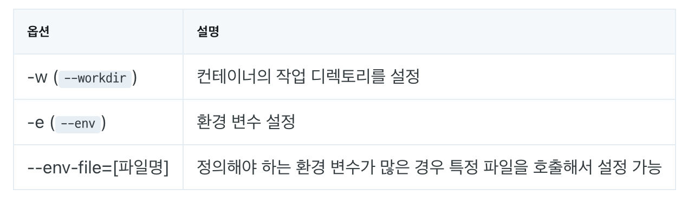

# 컨테이너와 도커 - 기본편

# ****기본적인 도커 명령어****

### **docker (container) create**

도커 이미지를 사용해서 컨테이너를 생성해 주는 명령어

- **`-name`** 옵션을 추가하여 컨테이너명 설정 가능

→ name 옵션을 쓰지 않으면 임의의 name이 부여

이름 변경 : `docker rename [현재 이름] [바꿀 이름]` 명령어를 사용합니다.

컨테이너 명을 변경하여도 컨테이너 ID는 변경되지 않음

로컬 리포지토리에 이미지가 없으면 기본으로 docker hub에서 이미지를 pull

pull한 이미지 재사용 가능

컨테이너 생성시 옵션 가능

| 옵션 | 설명 |
| --- | --- |
| -i (--interactive) | 표준 입력(STDIN)을 활성화함. 컨테이너와 attach 되어있지 않더라도 표준 입력을 유지함. |
| -t (--tty) | 컨테이너에 pseudo-terminal을 할당 |

### **docker ps**

실행(Up) 중인 컨테이너들의 목록을 확인

> [CONTAINER ID] :
> 
> - 컨테이너에 할당되는 고유한 컨테이너 ID
> - 전체 ID에서 12자리만 출력
> 
> ***[IMAGE] :***
> 
> - 컨테이너를 생성할 때 사용된 이미지
> 
> ***[COMMAND] :***
> 
> - 컨테이너가 시작될 때 실행될 명령어
> - `docker run` 이나 `docker create` 명령어의 맨 끝에 새로운 명령어를 입력해서 컨테이너를 생성할 때 대체 가능
> 
> ***[CREATED] :***
> 
> - 컨테이너 생성 후 경과 시간
> 
> ***[STATUS] :***
> 
> - 컨테이너의 상태
> - 실행 중(Up), 종료(Exited), 일시 중지(Pause)
> 
> ***[PORTS] :***
> 
> - 컨테이너가 개방한 포트와 호스트에 연결된 포트
> 
> ***[NAMES] :***
> 
> - 컨테이너 이름
- `a` (all) 옵션을 함께 써주면 실행 중이지 않은 컨테이너를 포함하여 전체 컨테이너 목록을 출력

### **docker start**

생성한 컨테이너 시작

### **docker stop**

실행중인 컨테이너 종료

### **docker run**

컨테이너를 생성하여 실행 → ***create + start***

옵션:

### **docker attach**

→ 컨테이너 내부에 접근하여 ***STDIN/STDOUT/STDERR***를 사용

→ 컨테이너 PID=1 표준 입출력을 이용

### **docker exec**

→ 동작 중인 컨테이너에서 새로운 프로세스를 실행

→ COMMAND 말고 별도의 명령어를 실행

웹서버 같은 경우는 COMMAND(PID=1)가 httpd로 정의되고, 쉘이 실행되지 않기 때문에 `docker attach`로 명령 입력이 불가능합니다.

때문에 쉘에 접근하기 위해서는 개별적으로 실행을 해줘야 합니다.

### **docker logs**

→ 컨테이너의 PID=1 프로세스의 STDIN/STDOUT/STDERR를 출력 가능

옵션

### **docker stats**

→ 동작 중인 컨테이너의 상태와 사용 중인 리소스의 양을 확인할 때 사용

→ 상태 확인이 끝나면 `Ctrl + C`를 눌러 명령을 종료

***[CONTAINER ID] :***

- 컨테이너 ID

***[NAME] :***

- 컨테이너 이름

***[CPU %] :***

- CPU 사용률

***[MEM USAGE / LIMIT] :***

- 메모리 사용량 / 컨테이너에서 사용할 수 있는 메모리 제한

***[MEM %] :***

- 메모리 사용률

***[NET I/O] :***

- 네트워크 I/O

***[BLOCK I/O] :***

- 블록 I/O

***[PIDS] :***

- 사용 중인 PID의 수(프로세스의 수)

### **docker top**

→ 동작 중인 컨테이너에서 실행되고 있는 프로세스를 확인할 때 사용

컨테이너 내부 격리 환경에서 각 프로세스는 PID 1번이지만, **전체 운영체제에서의 PID가 출력**

### **docker pause/unpause**

→ 컨테이너를 일시 중지하거나 일시 중지된 컨테이너를 재시작

### **docker rm**

→ 컨테이너를 삭제

### **docker container prune**

→ 종료(Exited) 된 컨테이너를 일괄적으로 삭제

### **docker cp**

→ 컨테이너와 호스트 간의 파일 복사

### **docker diff**

→ 컨테이너가 생성된 시점부터 변경된 이력을 확인

→ writable layer의 변경 여부를 확인
# [응용편에서 계속]