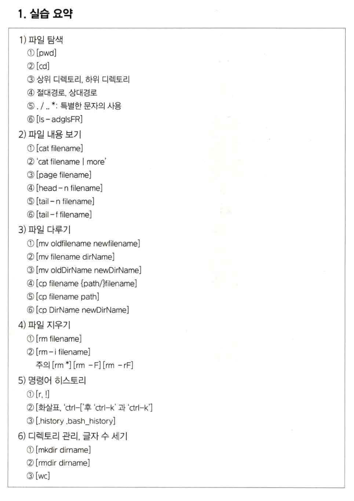
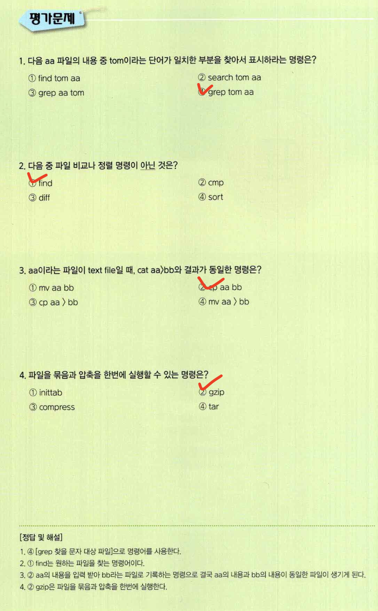

# 학교교재 1-2

# 파일과 디렉토리

## 파일과 디렉토리 다루기

파일, 디렉토리 관련 명령어

### 디렉토리, 절대/상대 경로

1. 디렉토리 위치 : 절대경로 / 상대경로
    
    윈도우의 최상위 경로 : 디바이스의 최상위 디렉토리  슬래시(\)
    
    유닉스/ 리눅스 최상위 경로:  역 슬래시 (‘/'), 루트(root) 
    
2.  절대경로
    
    루트(root) 디렉토리 ~ 현재 디렉토리 전체
    
    ex: /home/kopoctc/test/help.txt
    
3. 상대경로
- 명령어 쉘 상태 ~ 현재 디렉토리 : 현재 위치를 점으로 나타내서 표기
현재 위치는점을한개 ‘.’, 하위 디렉토리는점이 두개 ‘..’로표시
    
    ex: ./test/help.txt
    

### 파일 탐색

1. pwd(print name of current/workinh directory)
• 현재의 작업 디렉토리가 어디인지 출력
2. cd(change directory)
• 현재의 작업 디렉토리를 바꿈.
3. ls(list directory contents)
• 디렉토리에 파일 목록을보여줌.

### 파일 내용 보기

1. cat
•cat filename : filename이라는 파일의 내용을 한번에 출력
2. more
• |(파이프)를 같이 시용하여 화면 단위로 출력
• ex: "cat filename I more ·•
3. page
• page filename : filename의 파일을 화면 단위로 출력함
• 멈춰진 현재 화면에서 아무키나 누르면 다음 페이지가 보여짐 .
4. head
• 파일의 내용을 맨 앞을 기준으로 보여줌.
• head -n filename : filename의 파일을 처음 n줄을 표시
• 예 : head-10 abc.txt : abc.txt 파일을 처음부터 10줄로 보여줌.
5. tail
• 파일의 내용을 맨 뒤를 기준으로 보여줌.
• tail -n filename : filename의 파일을 뒤부터 n줄로 표시
• tail - f filename : 계속 작성 중인 파일의 마지막을 계속적으로 표시
• 시스템 관리 관련 로그 저장 파일 동을 실시간으로 감시할 때 많이 사용

### 파일 다루기

1.  mv
    
    파일을 이동(잘라내서 복사)하는 명령
    
    mv old_filename new_filename : old_file의 파일을 new_file로 이동함
    
    ⇒ 파일명을 바꾸는 명령이기도 함
    
    mv filename dirName : 파일을 해당 디렉토리로 보냄 
    
    뒤의 인자가 파일명이 아니라 디렉토리명인 경우 해당 디렉토리에 파일을 옮김
    
    mv oldDirName newDirName : 디렉토리명을 바꾸는 명령
    
2.  cp
파일을 복사(기존 파일은 남음)하는 명령
cp old_filename new_filename : old_file의 파일을 new_file로 복사함.
cp filename dirName: 파일을 해당 디렉토리로 복사
cp oldDirName newDirName: newDirname 디렉토리로 oldDirname  디렉토리 복사
    
    R 옵션은 하위 디렉토리까지 모두 복사하는 명령
    
3.  rm
파일 삭제 명령
    
    rm filename: 파일 삭제
    
    rm -i filename: 확인 후 삭제
    
    rm -r: 해당 위치의 파일 및 디렉토리 삭제
    
    rm -d: 빈 디렉토리 삭제
    
    rm -f: 강제 삭제
    (주의) [rm *] [rm -F] [rm -rF]
    
    rm *: 모든 파일 삭제
    
    rm -F: 확인 여부 무관 강제 삭제
    
    rm -rF: 파일 및 디렉토리 전체 강제 삭제
    

### 명령어히스토리

이전에 입력한 명령어를 다시 찾아 명령할 수 있는 기능

1. [r / !]
유닉스 계열(kohn shell) : ‘r’
    
    리눅스 계열(cshell) : ‘!' 
    
2. [화살표위, 아래]
    
    지금까지 사용한 명령어를 순차적으로 보여줌.
    
3. 명령어 히스토리 저장 파일
    
    기본 디렉토리 내 ‘.bash_history'(리눅스 bash) 혹은 \history'(일반적 유닉스)에 저장
    
    어떠한 시용자가 어떤 명령어로 시스템에 접근하였는지 근거 파일로 사용됨
    
    기업용 시스템에서는 해당 파일을 실시간으로 중앙통제장치로 전송, 보관
    
    ⇒ 불순한 의도의 접근을 감시하는 용도
    

### 디렉토리 관리

1. mkdir
    
    [mkdir dirname]: 새로운 디렉토리 생성
    
2. rmdir
[rmdir dirname]: 해당 디렉토리 삭제 → 파일이 있으면 삭제 불가
디렉토리에 파일이 있는 경우 : rm -rf 를 사용

### 파일의 문자수 세기

1. wc
파일 내부의 글자수 및 줄수를 보여줌.
[wc]: 출력되는 순서는 파일의 줄 수[newline], 단어 수[word], 글자 수[byte]로 보여줌.

## 요약

## 문제

## 파일 다루기

서버 시스템의 운영상황들이 실시간으로 기록되는 파일인 로그파일을 분석하기 위하여 파일을 여러 방면으로 다뤄야함.

### 파일 필터

1. grep
grep(Globally find Regular-Expression and Print) : 지정된 표현형식이 전체에 있는지 찾아서 프린트
grep patten filename : 주어진 패턴이 있는지 해당 지정된 파일이나 또는 확장 파일형식으로 검색
~ | grep patten: 상동, 더 많이 씀
    
    grep 주요옵션
    
    - w: 전체 단어가 일치되는 경우 출력
    n: 라인 넘버 출력
    v: 단어가 일치하지 않는 경우 출력
    I: 해당되는 파일명을 출력
2. 리다이렉션
    
    명령어의 결과를 다른 명령어의 입력으로 사용
    
    명령어의 결과를 파일에 기록
    
    1. 파이프(I)
        
        명령 1 I 명령 2: (파이프) 어떤 명령의 결과를 받아 다른 명령을 실행
        
    2. 리다이렉션, 꺽쇠(〉, >>)
        
        명령 > filename : 명령의 결과를 filename을 생성해서 기록
        
        명령 >> filename : 명령의 결과를 filename에 이어서 기록
        
        명령 < filename : 명령의 입력으로 filename을 사용
        

### 파일 비교, 정렬, 탐색

1. 비교
    1. cmp
        
        cmp file1 file2 : file1, file2을 비교
        쉘 스크립트 프로그래밍에 적합
        같으면 exitcode = 0을 반환 (쉘스크립트에서 사용)
        다르면 exitcode = 1을 반환 (일치하지 않는 첫째 byte 출력)
        
    2. diff
    diff file1 file2 : file1, file2의 차이
    두 파일 간 다른 부분을 각각 보여줌
        
        ⇒ 프로그램 작성 시 프로그램 소스를 비교하는데 편리
        
2. 정렬
    1. sort
        
        파일 내용을 정렬 조건에 따라 정렬
        정렬 기준인 필드를 선택하여 오름차순 / 내림차순으로 전체 줄을 순서대로 정렬
        필드 기준은 빈칸을 기준으로 수행함.
        sort abc.txt : abc.txt 파일을 오름치순으로 정렬함.
        sort - r abc.txt : abc.txt 파일을 내림치순으로 정렬함.
        sort -k2 abc.txt > result.txt : 2번째 필드를 기준으로 정렬
        
3. 탐색
    1. find
        
        원하는 조건의 파일의 위치를 찾아줌.
        사용법 : find dirname -option1...-optionN
        
        dirname은 주어진 디렉토리 및 이하 하위 디렉토리를 검색
        
        option을 지정하여 다양한 조건과 실행법을 지정할 수 있음
        
        주요조건
        
        - name : 파일 이름이나 패턴을 지정하여 찾음.
        
        - perm : 파일의 퍼미션(권한)이 일치하는 파일을 찾음.
        
        - type : 파일의 유형이 일치하는 파일을 찾음.
        
        하위 옵션
        
        - type b: 문자로만 구성된 파일 찾기
        
        - type d: 디렉토리 찾기
        
        - type f: 일반적인 파일 찾기
        
        - type I: 심볼릭 링크 찾기
        
        - user: 파일의 사용자(user)가 일치하는 파일을 찾음
        
        -group: 파일의 그룹(group)이 일치하는 파일을 찾음
        
        -atime +n/-n/n: 최근 n일 이전에 액세스된 파일을 찾아줌(accessed time).
        
        -mtime+n/-n/n: 최근n일이전에수정된파일을찾아줌(modifiedtime).
        
        • +n은 n일 또는 그보다 더 오래 전의 파일을, -n은 오늘부터 n일 전까지의 파일을, n은 정확히 n일 전에 액세스된 파일
        
        - print: 찾은 파일명을 출력 : 기본 수행
        
    
    ### 파일 보관, 압축
    
    1. tar
        
        파일을 묶고 푸는 기능(압축 기능 없음.)
        • 고전적으로 가장 많이 사용
        • 파일을 묶어서 테이프로 저장 등에 사용
        
        1. 파일을 묶을때
        사용법 
            
            tar -cvf tar FileName fileList
            • -c: fileList에 대한 tar 형식의 백업 파일을 생성
            . -v: 진행되는 상황을 설명
            
        2. 묶은 파일을 풀때
        사용법
            
            tar - rxru tar FileName fileList
            - r : tar 형식의 백업 파일 안에 어떤 것들이 들어 있는지 차례만 보임
            - x : 백업 파일로부터 파일을 추출 복귀(extract)
            - r : fileList를 기존의 백업 파일 뒤에 무조건 덧붙임(rear)
            - u : 기존의 백업 파일에 이미 포함되어 있는 fileList 중 수정된 파일들만 백업 파일 뒤에 덧붙임. 
            
            ⇒ 디렉토리가 있어도 recursive 하게 적용
            
        3. 기타 tar 이용
        서버의 테이프 디바이스에 저장 / 테이프 디바이스 읽기
            
            - tar -cvf tarfile/dev/rmt0, tar -xvf/dev/rmt0
            - 일반적으로 cd나 테이프 등 외장 저장매체는 /dev/cdO, /dev/rmtO 가상 파일형식
            
    2. compress/uncompress
        
        파일을 압축하고 해제하는 명령어
        
        압축 및 해제 기능
        
        파일을 압축(파일 크기를 줄임)하고 푸는 명령어
        
        압축하는 경우 : compress abc ⇒ abc 파일이 압축
        
        abc.z의 해당 이름의 .z의 확장자가 붙은 압축 파일이 생성
        
        압축을 푸는 경우 : uncompress abc.z ⇒ abc.z 파일이 압축해제
        
        abc로 복원된 파일이 생성
        파일을 묶어서 압축하는 기능: gzip, gunzip 명령어 ⇒ zip
        
        compress / uncompress는 유닉스. 리눅스 서버 환경에서 많이 사용
        
        Zip 보다 압축효율은 떨어짐
        설치 : apt-get install ncompress
        
    3. gzip/gunzip
        
        파일을 압축하고 해제하는 명령어
        
        압축 및 해제 기능
        
        많이 사용되는 파일을 압축(파일 크기를 줄임)하고 푸는 명령어
        
        압축하는 경우 : gzip abc ⇒ (압축) abc.gz
        압축 해제하는 경우 : gunzip abc.z ⇒ (복원) abc
        gunzip 명령은 gzip-d 명령과 동일
        
        gzip 명령어의 주요 옵션
        
        - d: 압축 해제
        - l : 현재 압축된 파일의 내용 보여줌
        - r: 현재 디렉토리부터 하위 디렉토리까지 전부 압축
        - t: 압축된 파일의 완전성을 검사
        - v: 압축 진행상황을 보여줌
        - 9: 최대한 압축
        
    
    ## 요약
    
    
    
    
    
    ## 문제
    
    