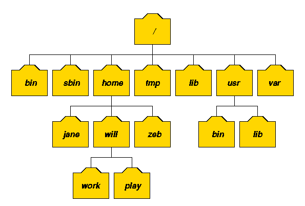
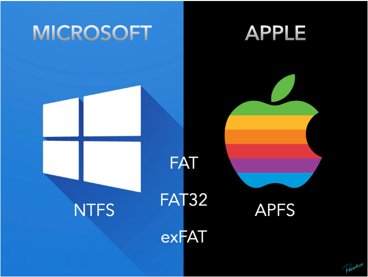
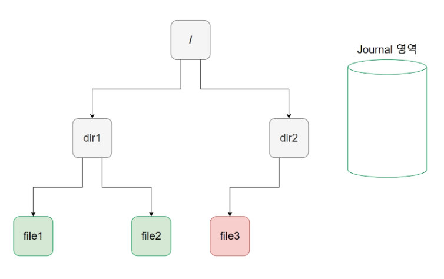

 

## 리눅스의 파일 시스템

  

 

- 리눅스 파일 시스템은 파일과 디렉토리를 저장하는 방식과 그 구조, 그리고 파일 시스템에 접근하는 방법 등을 정의한 것입니다.

- 리눅스 파일 시스템은 트리 구조로 이루어져 있으며, 최상위 디렉토리는 root 디렉토리(/)입니다. 이 디렉토리를 기준으로 모든 파일과 디렉토리가 계층적으로 구성되어 있습니다.

- 리눅스 파일 시스템은 다양한 파일 시스템을 지원하며, 각각의 파일 시스템은 특정한 목적에 맞게 설계되어 있습니다. 대표적인 파일 시스템으로는 ext4, XFS, NTFS, FAT 등이 있습니다.

- 리눅스 파일 시스템은 파일과 디렉토리를 다루는 데 많은 명령어와 도구를 제공합니다.

- 대표적인 명령어로는 ls, cd, mkdir, rm, cp, mv, chmod 등이 있으며, 이들 명령어를 통해 파일과 디렉토리를 생성, 삭제, 복사, 이동, 권한 설정 등을 할 수 있습니다.

- 리눅스 파일 시스템은 다중 사용자 환경에서 보안을 강화하기 위한 파일 권한 시스템을 제공합니다. 파일 권한은 파일의 소유자, 그룹, 기타 사용자에 대해 읽기, 쓰기, 실행 등의 권한을 설정하여 파일의 보안을 유지하는 데 중요한 요소입니다.

 

## 리눅스의 파일 시스템

 

1. ext4 (Fourth Extended File System)

- 리눅스에서 가장 많이 사용되는 파일 시스템 중 하나입니다.
- ext3 파일 시스템을 개선한 것으로, 파일 크기, 파일 시스템 크기, 파일 이름 길이 등의 한계를 극복하였습니다.
- 저널링(journaling) 기능을 지원하여, 시스템의 안정성과 복구성을 높입니다.

2. XFS (eXtended File System)

- SGI(Silicon Graphics Inc.)에서 개발한 파일 시스템으로, 대용량 파일 시스템을 지원합니다.
- 큰 파일을 빠르게 처리할 수 있으며, 병렬 입출력 기능을 제공하여 파일 처리 속도를 높입니다.
- 저널링 기능을 지원합니다.

3. NTFS (New Technology File System)

- 마이크로소프트에서 개발한 파일 시스템으로, 윈도우 운영체제에서 사용됩니다.
- 대용량 파일, 보안 기능, 복구 기능 등을 제공합니다.
- 저널링 기능을 지원합니다.

4. FAT (File Allocation Table)

- 파일 시스템 중 가장 오래된 것으로, MS-DOS와 윈도우 운영체제에서 사용됩니다.
- 파일의 크기와 시스템의 크기에 제한이 있으며, 보안 기능이 없습니다.
- 일부 저렴한 임베디드 시스템에서 사용됩니다.

각각의 파일 시스템은 특정한 용도에 맞게 설계되어 있으며, 사용하는 운영체제나 파일 시스템의 종류에 따라 선택하는 것이 좋습니다.

 

## 리눅스의 파일 시스템이 다양한 이유

 

> 리눅스 파일 시스템을 하나로 통일하면 좋지 않을까?

 

- 리눅스에서 파일 시스템의 종류가 다양한 이유는, 파일 시스템의 용도에 따라 다양한 성능과 안정성이 요구되기 때문입니다. 

- 예를 들어, 서버에서는 대용량 데이터의 안정적인 저장 및 처리가 필요하기 때문에, 안정성이 높은 파일 시스템인 ext4, XFS 등을 사용하는 것이 적절합니다.

- 반면에, 임베디드 시스템이나 가벼운 운영체제에서는 속도와 용량이 중요하므로, 빠른 속도와 작은 용량을 지원하는 파일 시스템인 JFFS2, UBIFS 등을 사용하는 것이 적절합니다.

- 따라서, 파일 시스템을 통일하는 것이 항상 좋은 것은 아니며, 용도에 따라 적절한 파일 시스템을 선택하는 것이 중요합니다.

- 또한, 리눅스는 개방형 운영체제로서 다양한 사용자들이 다양한 용도로 활용하기 때문에, 파일 시스템도 다양한 종류가 필요한 것입니다.

 

## ext 파일 시스템 (4가지)

 

1.  ext (ext1) : 초기에 사용되던 파일 시스템으로, 파일 이름 길이 등에 제한이 있었습니다.

2. ext2 : ext1을 개선한 파일 시스템으로, 파일 시스템 크기와 파일 크기 등에 대한 한계를 극복하였습니다.

3. ext3 : ext2를 개선한 파일 시스템으로, 저널링 기능을 추가하여 파일 시스템의 안정성을 높였습니다.

4. ext4 : ext3을 개선한 파일 시스템으로, 대용량 파일 처리, 파일 시스템 크기 등에 대한 한계를 극복하였으며, 메타데이터의 무결성을 보장하기 위한 체크섬 기능을 제공합니다.

- 이러한 ext 시리즈 파일 시스템은 리눅스에서 가장 널리 사용되는 파일 시스템 중 하나이며, 안정성과 성능 모두 우수합니다.

 

## 윈도우와 맥의 파일 시스템

 

- 윈도우와 맥의 파일 시스템이 다른 이유는, 두 운영체제가 서로 다른 구조를 가지고 있기 때문입니다.

- 윈도우 운영체제는 NTFS, FAT 파일 시스템을 주로 사용하며, NTFS는 윈도우 NT 운영체제에서 사용되는 파일 시스템으로, 대용량 파일, 보안 기능, 복구 기능 등을 제공합니다. FAT는 가장 오래된 파일 시스템 중 하나로, 파일의 크기와 시스템의 크기에 제한이 있으며, 보안 기능이 없습니다. 

- 맥에서는 기본적으로 HFS+ 파일 시스템을 사용합니다. 그러나 최근에는 APFS (Apple File System)로 전환되었습니다. APFS는 기존 HFS+ 파일 시스템의 한계를 극복하기 위해 개발된 파일 시스템으로, 더 나은 성능, 안정성, 보안, 압축 등의 기능을 제공합니다. APFS는 맥 OS에서 기본 파일 시스템으로 사용되며, 모바일 기기인 아이폰, 아이패드에서도 사용됩니다.

- 이러한 파일 시스템의 차이는 운영체제의 구조와 필요에 따라 달라지며, 각 운영체제는 해당 파일 시스템을 최적화하여 사용합니다.

 

## Microsoft와 Apple에서 공통으로 사용하는 파일 시스템은?

 

 

- FAT, FAT32, exFAT은 Microsoft와 Apple에서 모두 사용 가능한 파일 시스템입니다.

- 이러한 파일 시스템은 다양한 운영체제에서 사용 가능하며, 이식성이 높다는 장점이 있습니다.

- 그러나 FAT, FAT32, exFAT은 저널링 기능이 없기 때문에, 파일 시스템이 손상될 경우 데이터 복구가 어려울 수 있습니다.

- 따라서, 파일 시스템을 선택할 때는 용도와 안정성 등을 고려하여 선택하는 것이 좋습니다.

 

## 저널링 기능

 

 

- 저널링(Journaling)은 파일 시스템의 안정성을 높이기 위한 기능입니다. 파일 시스템에서 데이터를 저장할 때, 파일의 일부가 손상되어 데이터가 유실될 수 있습니다. 이러한 문제를 해결하기 위해, 저널링은 파일 시스템의 변경 내역을 로그 형태로 기록합니다. 따라서, 파일 시스템이 손상되었을 경우, 로그를 참고하여 손상된 데이터를 복구할 수 있습니다. 

- 저널링이 없는 파일 시스템은 파일 시스템이 손상되었을 경우 데이터를 복구하기 어렵습니다. 따라서, 저널링이 있는 파일 시스템은 안정성이 높고, 데이터 복구가 가능하다는 장점이 있습니다. 그러나 저널링 기능은 데이터를 기록하는데 추가적인 오버헤드를 초래할 수 있으므로, 파일 시스템을 선택할 때는 용도와 성능, 안정성 등을 고려하여 선택하는 것이 좋습니다.