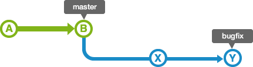
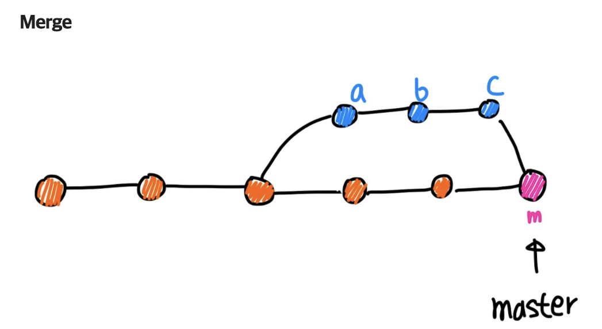
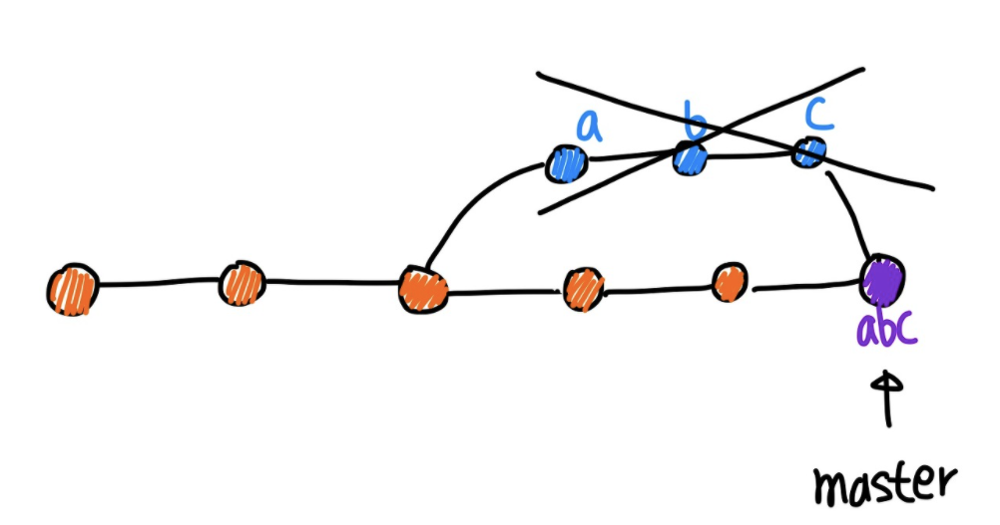
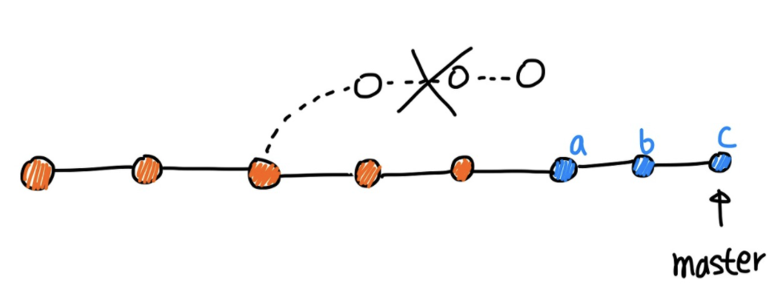

# Git Merge

 

merge의 종류는 다양하지만, 대표적으로 사용되는 4가지 merge에 대해 학습하겠습니다.

- Fast-forward Merge
- Merge commit
- Squash Merge
- Rebase Merge

 

---
 

## 1. Fast-forward Merge
 

- 이전 커밋이 현재 브랜치에 있는 경우, 이전 커밋의 변경사항을 현재 브랜치에 그대로 적용합니다. 이 경우 커밋 히스토리가 선형적으로 유지됩니다.

 

 

- 예를 들어, 아래 그림과 같이 'master' 브랜치에서 분기하는 'bugfix'라는 브랜치가 있다고 가정해 봅시다.

 

 

- 이 'bugfix' 브랜치를 'master' 브랜치로 병합할 때, 'master' 브랜치의 상태가 이전부터 변경되어 있지만 않으면 매우 쉽게 병합할 수 있습니다. 'bugfix' 브랜치의 이력은 'master' 브랜치의 이력을 모두 포함하고 있기 때문에, 'master' 브랜치는 단순히 이동하기만 해도 'bugfix' 브랜치의 내용을 적용할 수 있습니다. 또한 이 같은 병합은 'fast-forward(빨리 감기) 병합'이라고 부릅니다.

 

 

- 하지만 'bugfix' 브랜치를 분기한 이후에 'master' 브랜치에 여러 가지 변경 사항이 적용되는 경우도 있습니다. 이 경우에는 'master' 브랜치 내의 변경 내용과 'bugfix' 브랜치 내의 변경 내용을 하나로 통합할 필요가 있습니다.

  

## 2. Merge Commit

- 병합 커밋은 두 개 이상의 브랜치를 병합하여 하나의 새로운 커밋을 만드는 작업₩을 수행합니다.

- 이 경우, "m"은 "a", "b", "c" 브랜치를 병합하여 만든 새로운 커밋이며, "a", "b", "c"의 변경 내용이 "m"에 포함됩니다.

- 병합 커밋은 브랜치를 병합하는 과정에서 발생하는 커밋입니다. 두 개의 부모를 가지기 때문에 "m" 이전의 두 개의 브랜치에서 변경된 내용을 모두 포함하고 있으며, 이전 브랜치들의 변경 내용을 하나로 합쳤다는 것을 나타냅니다.

- m은 2개의 parents를 가지게 됩니다.

  

## 3. Squash Merge

 

- 머지할 브랜치에서 변경된 내용을 모두 하나의 커밋으로 압축합니다. 이 경우, 커밋 히스토리가 단순화됩니다.

- squash merge를 사용하면 commit a, b, c를 하나의 커밋으로 압축하여 새로운 commit인 abc를 만들고, master 브랜치에 추가할 수 있습니다. 이때 abc는 1개의 parent를 가집니다.

- squash merge는 주로 feature 브랜치의 변경사항을 깔끔하게 만들기 위해 사용됩니다. feature 브랜치에서 작업한 여러 개의 커밋을 하나의 커밋으로 합치면, master 브랜치의 커밋 히스토리가 단순화되어 가독성이 향상되고, 이후 유지보수 작업이 용이해집니다.

- squash merge는 "merge commit"과는 달리 커밋 히스토리를 단순화하기 때문에, 커밋 히스토리를 정확하게 추적하고자 할 때는 사용하지 않는 것이 좋습니다.

  

## Rebase Merge

 

- 현재 브랜치에서 작업한 내용을 다른 브랜치의 최신 변경사항에 반영하고 싶을 때 사용합니다. 이 경우, 현재 브랜치의 변경사항을 다른 브랜치의 최신 커밋 위에 다시 적용합니다.

- 모든 commit들이 합쳐지지 않고 각각 master 브랜치에 추가된다.

- 각 commit은 모두 하나의 parent를 가진다.

- Merge는 Merge commit 기록이 추가로 남게 되지만 Rebase의 경우에는 branch 병합 시 Merge commit 기록이 남지 않는다. 따라서 마치 하나의 브랜치에서 작업한 것처럼 보여진다.