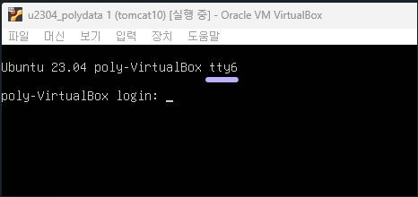
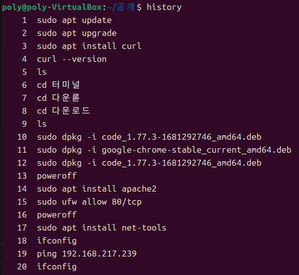
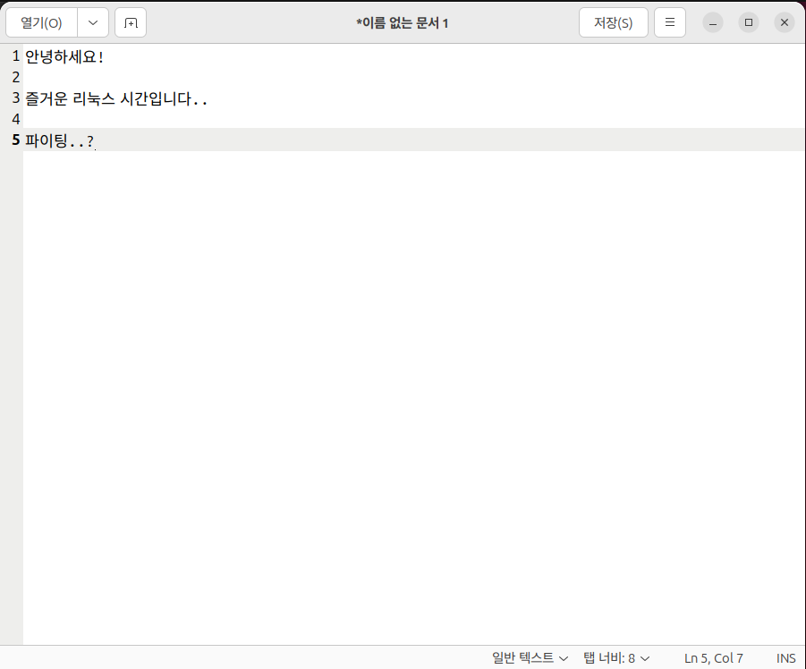

# 이것이 리눅스다

## 서버를 구축할 때 알아야 할 필수 개념과 명령어

 

> 리눅스 명령어는 옵션까지 모두 포함한다면 수천 개가 넘는다.  
이러한 명령어를 다외운다는 것은 거의 불가능하며, 그럴 필요도 없다.  
최소한 알아야 하는 개념과 기본 명령어를 알아보자!

 

### 시스템 종료 명령어

- poweroff
- halt -p
- init 0

 

### 일정 시간 후에 종료

- shutdown -P +10 : 10분 후에 종료(P: poweroff)
- shutdown -r 22:00 : 오후 10시에 재부팅(r: reboot)
- shutdown -c : 예약된 shutdown을 취소(c: cancel)
- shutdown -k +15 : 현재 접속한 사용자에게 15분 후에 종료된다는 메시지를 보내지만 실제로 종료는 안 됨

 

> `주의`  
대소문자 명확히 구분하기  
su - : root 권한 얻기  
`'#'` : root 사용자  
`'$'` : 일반 사용자

 

### 일정 시간 후에 종료

 

- shutdown -r now
- reboot
- init 6

 

### 로그아웃

 

- logout
- exit

 

### 가상 콘솔

 

- 가상 콘솔이란 '가상의 모니터'
- CentOS는 총 6개의 가상 콘솔 제공 (우분투도 6개)
- 즉, 컴퓨터 한 대에 모니터 6개 연결된 효과

- Ctrl + Alt + F1 ~ F6

- 가상 콘솔 6번째 모습
- `기본 콘솔은 2번째`

 

### 기타

 

- `init` 뒤에 붙는 숫자를 `런레벨`이라 함
- 폴더와 디렉토리는 동일한 용어
- 윈도우: 폴더
- 유닉스/리눅스: 디렉토리

 

### 자동 완성과 히스토리

 

- tab : 파일/폴더 이름의 일부만 입력하고 tab 하면 자동 완성됨
- 도스 키: 이전에 입력한 명령어를 `위아래 방향키`를 통해 나타냄

 

 

- history : 과거 입력한 명령어 조회 가능
- history -c : 기억되었던 명령 모두 삭제

 

- cd : 사용자 홈 디렉터리로 이동
- cd 디렉토리명 : 해당 디렉토리로 이동
- cat 파일명 : 파일 내용 확인

 

## 에디터 사용

 

### 1. gedit

 

 

-  `gedit` Windows의 메모장처럼 X 윈도에서 제공되는 편리한 에디터

- sudo apt install gedit
- gedit

 

### 2. vi

 

 

- vi 파일명 - 파일명으로 파일 생성
- vi 입력 시 파일명을 입력 안 하면, `:wq 파일명` 으로 저장 가능
- I/A : 끼워 넣기  // 입력 모드
- :q : 종료(Quit)
- :wq : 저장(Write0 & 종료(Quit)
- :%s/기존문자열/새문자열 : 문자열 치환

 

### 리눅스 기본 명령어

 

> ls

 

- ls: 현재 디렉터리의 파일 목록
- ls /etc/sysconfig : /etc/sysconfig 디렉터리의 목록
- ls -a : 현재 디렉터리의 목록(숨김 파일 포함)
- ls -l : 현재 디렉터리의 목록을 자세히 보여줌
- ls *.cfg : 확장자가 cfg인 목록을 보여줌
- ls -l /etc/sysconfig/a* : /etc/sysconfig 디렉터리에 있는 목록 중 앞 글자가 'a'인 것의 목록을 자세히 보여줌

 

> ## cd

 

- cd : 현재 사용자의 홈 디렉터리로 이동, 만약 사용자가 root면 '/root' 디렉터리로 이동.
- cd ~centos : centos 사용자의 홈 디렉터리로 이동
- cd .. : 바로 상위의 디렉터리로 이동
- cd /etc/sysconfig : /etc/sysconfig 디렉터리로 이동(절대 경로)
- cd ../etc/sysconfig : 상대 경로로 이동. 현재 디렉터리의 상위('..')로 이동한 후, 다시 /etc/sysconfig로 이동

 

> ## pwd

 

- ## pwd : 현재 디렉터리의 전체 경로

 

> ## rm

 

- rm 파일명 : 해당 파일을 삭제
- rm -i 파일명 : 삭제 시 정말 삭제할지 확인하는 메시지가 나옴
- rm -f 파일명 : 삭제 시 확인하지 안혹 바로 삭제(f는 Force의 약자)

 

- rm -r 디렉터리명 : 해당 디렉토리 삭제
- rm -rf 디렉터리명 : 해당 디렉터리와 그 아래에 있는 하위 디렉터리를 강제로 전부 삭제

 

> ## cp

 

- cp aaa.txt bbb.txt : aaa.txt를 bbb.txt라는 이름으로 바꿔서복사
- cp -r aaa bbb : 디렉터리 복사

 

> ## touch

 

- touch  abc.txt : 파일이 없을 경우엔 abc.txt라는 빈 파일을 생성하고, abc.txt가 있을 경우엔 파일의 최종 수정 시간을 현재 시각으로 변경

 

> ## mv

 

- `mv abc.txt /etc/sysconfig/` : abc.txt을 /etc/sysconfig/ 디렉터리로 이동
- `mv aaa bbb ccc ddd` : aaa, bbb, ccc 파일을 '/ddd' 디렉터리로 이동
- `mv abc.txt www.txt` : abc.txt의 이름을 www.txt로 변경해서 이동

 

> ## mkdir

 

- `mkdir abc` : 현재 디렉터리 아래에 '/abc'라는 디렉터리 생성
- `mkdir -p /def/fgh` : '/def/fgh' 디렉터리를 생성하는데, 만약 '/fgh'의 부모 디렉터리인 '/def' 디렉터리가 없다면 자동으로 생성 (p는 Parents의 약자)

 

> ## rmdir

 

- `rmdir abc` : '/abc' 디렉터리를 삭제

 

> ## cat

 

- `cat a.txt b.txt` : a.txt와 b.txt를 연결해서 파일의 내용을 화면에 보여줌

 

> ## head, tail

 

- `head anaconda-ks.cfg` : 해당 파일의 앞 10행을 화면에 출력
- `head -3 anaconda-ks.cfg` : 앞 3행만 화면에 출력
- `tail -5 anaconda-ks.cfg` : 마지막 5행만 화면에 출력

 

> ## clear

 

- `clear` : 현재 사용 중인 터미널 화면을 깨끗하게 지워준다.

