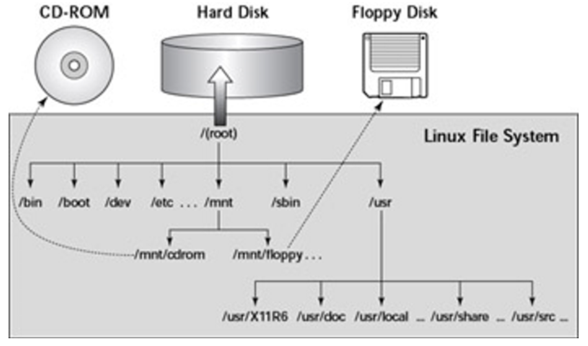
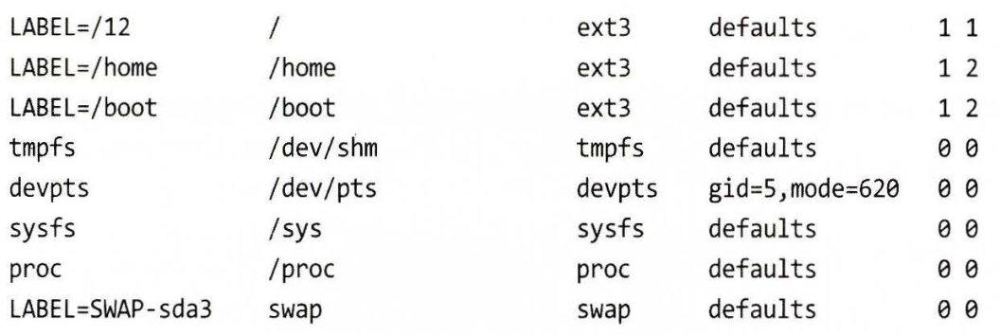
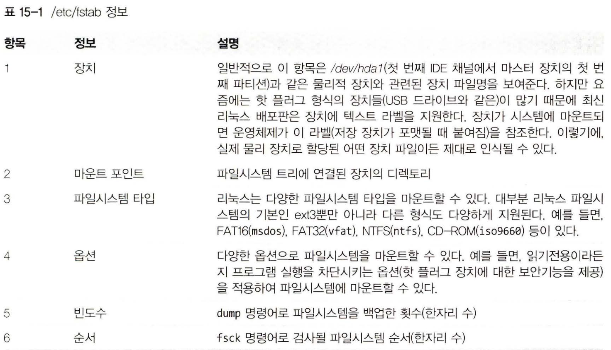
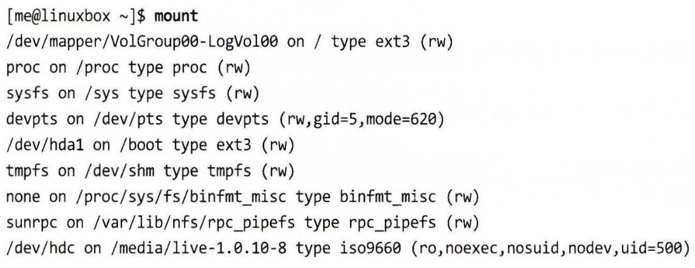

# 리눅스 커맨드라인 완벽 입문

 

## 15. 저장 장치

 

이전에서는 파일 수준에서 자료를 관리하는 법에 대해 배웠다면,
이번 장에서는 `장치 수준`에서 자료를 살펴보려한다.

 

> 몇 가지 중요한 개념과 저장 장치를 관리할 떄 사용하는 명령어를 알아보자!

 

- mount : 파일시스템 마운트하기
- umount : 파일시스템 마운트 해제하기
- fdisk : 표 방식으로 파티션 설정하기
- fsck : 파일시스템 검사 및 복구하기
- fdformat : 플로피 디스크 포맷하기
- mkfs : 파일시스템 생성하기
- dd : 블록 기반 자료를 장치에 직접 쓰기
- genisoimge (mkisof) : ISO 9660 이미지 파일 생성하기
- wodim (cdrecord) - 광학 저장 장치에 자료 쓰기
- m5sum : MD5 체크섬 계산하기

 

### 저장 장치 마운트하기와 해제하기

 

- 저장 장치 관리에 있어 첫 번째로 해야 할 작업은 파일시스템 트리에 장치를 연결하는 것

- 이러한 과정을 `마운트`라 한다.
- 즉 `장착한다`라고 하는데 <u>장치가 운영체제와 연결되는 과정</u>

- 마운트(Mount)란, 파일 시스템을 운영 체제에 연결하여 사용할 수 있도록 하는 작업

- 즉, 디스크나 파티션과 같은 블록 장치를 운영 체제의 디렉토리 구조에 연결하여 파일을 읽고 쓸 수 있게 만드는 것

- 리눅스에서는 디스크나 파티션 뿐만 아니라, CD, DVD, USB 드라이브, 네트워크 드라이브 등 다양한 장치들도 마운트해서 사용 가능

 

### 마운트에 대한 쉬운 이해

 

- USB 혹은 외장하드를 꼽으면 내컴퓨터 폴더에 USB/외장하드 파일이 뜨면서 자동으로 연결됨

- 이렇게 디스크와 같은 물리적인 장치를 특정 위치 즉 디렉토리에 연결시켜주는 것을 마운트라 함

- 우리가 몰랐던 이유는 윈도우가 자동으로 해주기 때문.

- 이를 PnP라 함

 

#### PnP란?

 

- Plug and play (플러그 앤 플레이)
- 디바이스를 꼽기만 하면 알아서 설정하고 플레이 됨

- 하지만 리눅스의 경우 특히 서버 환경에서는 PnP 기능이 작동하지 않고 직접 연결을 해줘야 함

- 관리자가 직접 특정 디렉터리에 붙이는 작업을 수행해야 함 -> 마운트

 

> 보조기억장치(HDD, FDD, CD_ROM 등)나 파일 시스템이 다른 디스크를 /의 하위 디렉터리로 연결하여 사용 가능하게 해주는 명령어  
mount

 

### 파일 시스템 구조 이해

 

- 리눅스를 더 잘 이해하기 위해서는 리눅스의 파일 시스템 구조에 대해서 알아야 함.
- 리눅스는 Unix 시스템으로 윈도우와는 다르게 하나의 디렉터리로부터 뻗어지는 single directory tree 구조를 갖고 있음

- 접근 가능한 모든 저장공간의 뿌리가 결국 하나의 디렉터리랑 연결

- 참고로 윈도우의 경우 드라이브당 각 하나의 디렉터리 트리 구조를 갖음
- (D:드라이브, E:드라이브, C:드라이브 이렇게 분리된 것처럼)
- 그래서 리눅스는 마운팅하면 저런 형식의 파일 경로를 갖지 않고
- 예를 들어 '/media/cdrom' 이런식으로 /의 하위 경로를 갖습니다.

 

 

### 부팅 시에 마운트된 장치 목록 표시

 

- etc/fsab 파일은 부팅 시에 마운트된 장치(일반적으로 하드 디스크 파티션) 목록을 표시한다.

 

 

- /etc/fstab 파일
- 대부분의 파일 시스템들은 가상 장치 (이번 주제에 해당 되지 않음)
- 관심 있게 봐야 할 부분은 처음 세 줄

 

 

### 마운트된 파일시스템 목록 보기

 

- mount : 현재 마운트된 모든 파일시스템 목록 보여줌

 

---

 

## 마운트 해보기

 

 

- CD-ROM을 삽입하면 맨 마지막 줄처럼 자동 마운트
- 현재 시스템의 /dev/hdx 장치가 /media/live-1.0.10-8에 마운트 되었고 그 타입은 iso9660(CD-ROM 형식)이라는 내용

- 우리가 관심 있는 것은 장치의 이름임 (/dev/hdc)
- 이제 마운트를 해제하고 파일 시스템상의 다른 위치를 찾아 다시 마운트 진행

 

## 마운트 코드

 

- su -
- umount dev/hdc  # 마운트 해제
- mkdir /mnt/cdrom  # 마운트 포인트 생성
- mount /dev/cdrom /mnt/cdrom   # 마운트 설정

 

- 마운트 포인트: 파일 시스템을 사용할 때 해당 파일 시스템이 컴퓨터의 디렉토리 구조 내에서 어디에 위치할 것인지 지정하는 디렉토리.

 

## 마운트를 해제하고 다시 설정하는 이유

 

- CD-ROM과 같은 미디어가 처음 마운트될 때, 일반적으로 시스템이 자동으로 마운트를 수행됨
- 그러나 이렇게 자동 마운트된 디바이스를 사용하면 다음과 같은 문제가 발생 가능

1. 시스템이 자동으로 마운트된 마운트 포인트는 읽기 전용으로 마운트됩니다.  
 이것은 대부분의 경우에는 문제가 되지 않겠지만, 데이터를 기록하거나 디스크에 쓰기를 수행해야 하는 경우에는 문제가 됩니다.

2. 자동 마운트된 마운트 포인트는 언제든지 시스템에 의해 변경될 수 있습니다. <br.
 다른 프로세스나 시스템에서 같은 마운트 포인트를 사용하려고 하면 예기치 않은 결과가 발생할 수 있습니다.

그래서 처음 CD-ROM을 사용하기 전에, 마운트를 해제하고, 새로운 마운트 포인트를 설정함으로써, 더 안전하고 정확한 사용을 할 수 있습니다. 마운트를 해제하고, /mnt/cdrom과 같은 새로운 디렉토리를 만드는 것은, 다른 시스템이나 프로세스가 마운트 포인트를 변경할 수 없도록 하고, 사용자가 마운트 옵션을 지정하여 디스크에 쓰기를 수행할 수 있도록 하는 것입니다.

 

---

 

## 파티션 나누기

 

- fdisk - 기본, 이전에 많이 사용
- parted, gdisk, sfdisk, cfdisk - 새로운 파티션 유틸리티

 

### fdisk

 

- fdisk는 Linux 시스템에서 디스크 파티션을 관리하는 유틸리티입니다.
- 이를 사용하여 디스크를 파티션으로 나눌 수 있으며, 파티션을 수정하거나 삭제하고 새로운 파티션을 생성할 수 있습니다.

 

### fdisk 주요 명령어

 

- p: 파티션 테이블을 출력합니다.
- n: 새로운 파티션을 생성합니다.
- d: 파티션을 삭제합니다.
- w: 파티션 테이블을 저장하고 종료합니다.