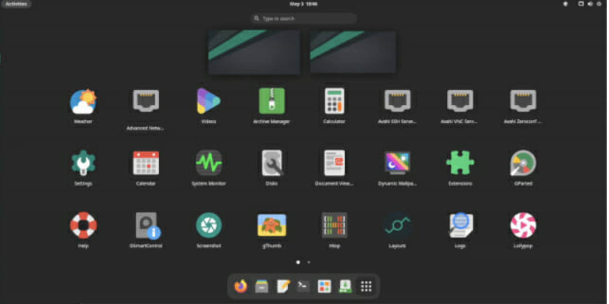

# 개발자를 위한 리눅스 배포판 5선

- 리눅스 데스크톱을 개발 환경으로 사용하는 개발자가 늘고 있다.
- 이에 미국 지디넷은 최근 프로그래밍하기 좋은 리눅스 배포판을 선정해 소개했다.
- 오픈소스 소프트웨어 전문기자 스티븐 보간니콜스는 프로그래밍에 좋은 데스크톱용 리눅스로 페도라, 아치리눅스, 젠투리눅스, 칼리리눅스, 시스템레스큐 등을 꼽았다.
- 스티븐 보간니콜스는 29년간 리눅스를 사용해온 경험을 바탕으로 배포판을 선정했다고 밝혔다. 그는 "만약 당신이 안드로이드 폰이나 크롬북으로 이 기사를 읽고 있다면 당신은 리눅스를 쓰고 있는 것"이라며 "최대한 활용하려면 전문지식이 필요한 리눅스 배포판이 있다"고 설명했다.

## 1. **페도라: 프로그래밍을 위한 최고의 리눅스 배포판**

- 페도라(Fedora)는 개발자 포털과 툴, 최신 리눅스 커널, 통합개발환경(IDE) 등을 제공한다.
- 레드햇의 커뮤니티 리눅스 배포판인 페도라는 전반적으로 가장 높이 평가받는 데스크톱용 리눅스다.
- 가장 최신 버전의 리눅스커널을 채택하는 등 오픈소스 구성 요소를 최신으로 구성한다.
- 페도라가 개발자에게 좋은 선택인 가장 큰 이유는 '리누스 토발즈가 사용하는 리눅스'란 것으로 설명가능하다.
- 리누스 토발즈는 그의 주력 데스크톱으로 페도라를 쓰고 있다.

페도라 워크스테이션

- 페도라는 설치와 설정이 매우 쉽다.
- 전문가가 아니어도 리눅스를 시작하고 실행할 수 있다.
- 페도라의 개발자 포털은 커맨드라인, 데스크톱, 모바일 및 웹 앱 개발 등에 대한 전용 가이드를 제공한다.
- 페도라 개발자 포털은 아두이노, 라즈베리파이 같은 하드웨어 개발을 위한 가이드도 포함한다.
- 자바, C/C++, PHP 등을 위한 IDE로 이클립스를 이용할 수 있다.
- 재현가능하고 이식가능한 컨테이너나 가상머신(VM) 기반의 개발환경을 생성하는 베이그런트 같은 개발도구도 제공된다.
- 데비안 및 우분투 제품군의 프로그램을 써야 하는게 아니라면 페도라는 개발용 리눅스로 첫번째 선택이다.
- 단점이라면 새로운 버전으로 업데이트하는게 어렵다는 점이다.
- 최첨단이므로 소프트웨어 하위호환성에서 문제를 겪을 수 있다.

## 2. **아치 리눅스**·**만자로 리눅스: 절대적 제어권을 원한다면**

- 아치 리눅스(Arch Linux)는 여러 커널을 동시에 지원하고, GNOME, KDE 플라스마, XFCE 같은 GUI를 사용할 수 있다.
- 리눅스 데스크톱이 작동하도록 설정하고, 원하는 대로 정확하게 표시되게 하고 싶다면 아치 리눅스가 좋은 선택이다.
- 아치 리눅스는 모든 것을 제어할 수 있다.
- 아치 리눅스의 슬로건은 '단순함을 유지하라'다.
- 문제는 시작하는 사용자에게 너무 단순하다는 것이다.
- 아치 리눅스는 처음에 커맨드 셸만 보여준다.
- 전체 데스크톱 환경을 어떻게 쓸 것인지는 전적으로 사용자의 선택과 최적화에 달렸다.
- 땀과 노력으로 정확한 요구사항과 그에 맞는 환경을 얻을 수 있다.
- 이 과정이 쉽지 않지만, 아치위키 문서 사이트의 도움을 받을 수 있다.
- 험난하지만 이 과정만 마치면 고유의 데스크톱을 갖게 될 것이다.

만자로 리눅스 GNOME 환경

- 아치리눅스의 작업이 너무 많게 느껴진다면 만자로(Manjaro) 리눅스를 사용하는 것도 가능하다.
- 이 배포판은 아치리눅스를 기반으로 쉬운 사용을 목표로 만들어지고 있다.
- 공식 데스크톱 환경으로 GNOME, KDE, XFCE 등을 제공한다.
- 만자로 리눅스는 리눅스커널을 전환하기 쉬운 배포판이기도 하다.
- 여러 커널을 동시에 지원하므려, 시스템 재부팅 후 부팅 메뉴에서 커널을 선택하면, 새 커널을 이용한 바탕화면으로 간다.
- 이런 일이 많은 개발자에게 필요하지 않을 수도 있다.
- 그러나 여러 리눅스커널을 테스트하려는 개발자라면 만자로 리눅스가 괜찮은 선택이다.
- 단점이라면, 사용자가 직접 정의해야 하는 게 너무 많아서 가볍게 접근하기엔 시작단계부터 압도당할 수 있다.

## 3. **젠투·사바욘 리눅스: 최고의 소스코드 기반 옵션**

젠투 리눅스

- 젠투(Gentoo) 리눅스는 소스코드 기반 배포판이다.
- 젠투는 설치 프로그램을 제공하지 않는다.
- 젠투의 개발자는 "당신이 설치 프로그램"이라고 말한다.
- 원하는 모든 것을 사용자 마음대로 정할 수 있다는 의미다.
- 일단 젠투 핸드북을 이용하자.
- 젠투 전문 사용자가 아니라면 핸드북을 다른 컴퓨터에서 계속 실행해보길 제안한다.
- 젠투를 시작하고 나면, 포티지 패키지 시스템도 배워야 한다.
- 레드햇의 RPM, 데비안의 APT 같은 바이너리 소프트웨어 패키징 시스템이 젠투에 없다.
- 포티지는 소스코드 기반이다.
- 예를 들어 포티지에 프로그램을 설치하고 싶다면, 컴퓨터에서 애플리케이션의 소스코드를 컴파일해야 한다. USE 플래그 사용자 정의를 사용해 소스를 편집하는 것도 가능하다.

- 아치와 만자로의 관계처럼 젠투도 사바욘(Sabayon) 리눅스란 선택지를 택할 수 있다.
- 사바욘 리눅스는 쉽게 젠투 리눅스의 프로그램을 쓸 수 있게 한다.
- 사바욘은 젠투에서 사용자 스스로 해야 하는 여러 의사결정을 대신해준다.
- 젠투만큼 방대한 제어권한을 주진 않아도 많은 제어를 직접 할 수 있다.
- 사바욘은 향후 모카치노OS(MocaccinoOS)로 이름을 바꾼다.
- 새로운 컨테이너 기반 패키징 시스템인 'Luet'을 사용한다.
- 모카치노OS는 아직 베타 단계로 숙련된 개발자만 쓸 것을 권한다.

### 4. **칼리 리눅스: 보안 전문가와 해커를 위한 배포판**

- 칼리 리눅스(Kali Linux)는 해킹을 위해 설계됐다.
- 데비안을 기반으로 간편한 설정과 설치가 장점이다
- 칼리 리눅스는 여러 해킹 도구를 포함하고 있어 침투 테스트나 해킹에 초점을 맞춰 설계됐다.
- 라미 말렉 주연의 미국 드라마 '미스터로봇' 덕분에 칼리리눅스는 해킹 배포판으로 유명세를 탔다.
- 칼리 리눅스는 보안회사인 오펜시브시큐리티의 개발자들이 만들었다.
- Knoppix 기반 디지털 포렌식 및 침투 테스트 패포판 백트랙과 역사적 맥락을 같이 한다.

칼리 리눅스 데스크톱 GNOME 환경

- 칼리 리눅스의 설치와 설정은 데비안 배포판만큼 쉽다.
- 기본 소프트웨어 패키지는 다른 과정으로 설치하게 된다.
- 가령 기본 오피스 제품군인 리브레오피스나, 이메일 클라이언트인 썬더버드 같은 소프트웨어를 기본제공하지 않는다.
- 대신 보안 문제로 웹사이트를 공격하는 OWASP ZAP 같은 보안 프로그램, SQL인젝션 취약점의 탐지 및 악용을 자동화하는 SQLMAP, 암호 크래커인 THC히드라 등을 기본 제공한다.
- 칼리 리눅스를 쓴다고 바로 해커나 보안 전문가가 될 수는 없다.
- 기본적인 컴퓨터 지식과 코딩 능력, 보안 지식을 갖춰야 한다. 칼리는 시작에 필요한 도구와 전문가 요구사항만 제공할 뿐이다.

### 5. **시스템레스큐: 죽은 PC를 되살리는데 필요한 배포판**

- 시스템레스큐(systemRescue)는 USB드라이브나 DVD드라이브, 또는 CD 드라이브에서 부팅할 수 있다.
- GNU Parted, ddrescue, rsync 등을 포함한다. 오래된 컴퓨터 재부팅에 유용하다.
- 시스템레스큐는 컴퓨터 수리를 위한 리눅스 배포판이다.
- 시스템레스큐CD라고도 불리며 구식 컴퓨터 수리를 위해 설계됐다.
- 영구적으로 사용하는 OS는 아니지만, 윈도 설치에 실패하고 하드디스크가 손상됐을 때 필요하다.
- USB드라이브 같은 외부저장매체에서 부팅해 죽어버린 컴퓨터를 탐핵하고 되살릴 수 있다.
- 사용하기에 쉽지는 않다. 칼리 리눅스처럼 필요한 작업을 완료하는데 필요한 도구를 제공한다.
- 디스크 파티션 및 파일시스템을 조작하는 GNU Parted 같은 프로그램을 포함한다.
- 손상된 저장 장치에서 블록 수준의 데이터를 복사해 작동하는 데이터 복구 도구 'ddrescue', 로컬 네트워크를 통해 고장난 드라이브의 데이터를 다른 컴퓨터로 복제하는 'rsync' 등을 제공한다.