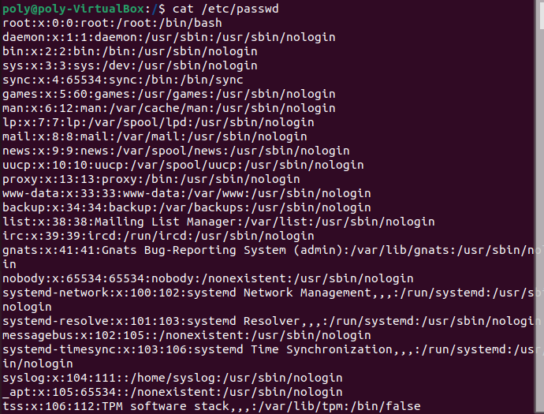

# 리눅스 계정


## 사용자 분류


1. `루트 계정` : 모든 권한을 가진 특별한 사용자
2. `시스템 계정` : 리눅스 설치시 기본으로 생성되는 계정
3. `사용자 계정` : 실제 리눅스 사용자를 위한 계정


- 리눅스에서는 사용자를 root(관리자)와 일반사용자로 구분한다.

- 리눅스는 다중 사용자 시스템이므로 사용자를 구별하고 사용자에게 적절한 자원을 할당해주는 방법이 필요하다.

- 각각 계정은 흔히 사용하는 ID가 아니라 번호로 부여하는 UID(User Identity)로 관리한다. <br>

> `Tip` <br>
UID가 0번인 사용자는 슈퍼유저로 인식해서 관리자계정이 된다. <br>
일반사용자 계정의 UID 범위는 /etc/login.defs 에 정의되어 있다.


<br>

## 계정별 설명

<br>

`root (Super User)계정`은 UID값이 0으로 지정된 관리자계정이다.

여기서는 다른 계정을 생성하거나 권한을 부여하고 비밀번호를 바꿀 수 있다. 즉 모든 권한을 가진 계정이다. 만약 다른계정에 UID값을 0으로 변경한다면 관리자와 마찬가지로 모든 권한을 가질 수 있다. 

 
 <br>
 
 `일반사용자(Normal user)`는 관리자에게 권한을 부여받아 사용한다.

리눅스에서 파일을 생성 시 소유주의 권한을 가지는데 만약 일반유저라면 root 권한을 가진 파일을 실행하거나 볼 수 없다. 따라서 root가 파일의 권한을 부여해야만 일반관리자가 해당 파일을 열어볼 수 있다.

<br>

root와 일반사용자를 제외한 계정으로는 `시스템계정`이 있다.

<br>

리눅스 시스템에는 기본적으로 다양한 시스템 계정이 있습니다. 이러한 시스템 계정은 시스템의 정상적인 운영 및 관리를 위해 사용됩니다.

<br>

필요에 의해 자동으로 생성되는 시스템계정은 <u>bin, daemon, adm, lp,sync, shutdown, halt, mail 등</u> 여러가지가 있으며 일반적으로 로그인은 불가능하다.

<br>

`/etc/passwd` 파일에서 `uid`가 `1~499` 갖는 계정을 살펴봄.
<br>

`레드햇 계열`은 100~499 데비안 계열은 100~999 범위
<br>

`시스템 계정`은 보통 0~99의 범위를 가짐.

``` bash
cat /etc/passwd
```

<br>




<br>

## 계정 확인 명령어

<br>

``` bash
# 현재 사용자의 UID, GID, 그룹정보를 확인하는 명령어
id
```

<br>


<br>

`UID(User ID)` : 사용자 식별 번호
 - 슈퍼유저의 UID = 0
 - /etc/passwd 에서 확인 가능
 - 1 ~ 499 시스템을 제어하는 계정 -> 로그인 되지 않도록 생성하는 것이 원칙.
 - 500 ~ 60000 까지 일반 계정

`GID(Group ID)` : 그룹 식별 번호
 - 슈퍼유저의 GID = 0
 - /etc/passwd 와 /etc/group 에서 확인 가능
 - 리눅스는 그룹을 통해서 사용자를 묶을수있다.

<br>

### 그룹 (Group)

- 모든 계정은 `그룹이라는 소속`을 설정할 수 있으며,  `최소 하나의 그룹`에 속한다.
- 계정 생성 시 `기본적으로 계정명과 같은 이름의 그룹이 함께 생성`되어 해당 그룹에 속하게 된다.
- 사용자 계정은 `여러 개의 그룹(주 그룹, 보조 그룹)에 소속`될 수 있다.
- 그룹을 이용하면 여러 사용자에게 동일하게 적용할 `시스템 리소스 사용      제한이나 권한 설정들을 일괄 적용`할 수 있는 장점이 있다.

<br>

---

<br>

## root가 특별한 이유

<br>

- root는 UNIX 혹은 그 이전 운영체제부터 사용되던 단어로 `root directory (/)` 에서 기인.
- root는 `superuser` 즉, `모든 권한을 가지고 있는 유저`를 일컫는 말.
- root 계정은 시스템의 <u>모든 자원, 프로그램, 파일에 대해서 모두 접근</u>이 가능하다.

<br>

- Linux에서는 root 계정에 대해서 `UID를 0`으로 설정한다. <br>
(root라는 사용자의 이름이 root를 특별한 계정으로 만드는 것이 아니라, `root에 부여되어 있는 0이라는 UID가 root 계정이 superuser의 역할`을 하도록 한다.

- 즉 `UID가 0`인 유저는 `root와 동등한 권한`을 갖는다!

<br>
<br>

## root를 안전하게 이용하기

<br>

- root 계정은 항상 비밀번호를 가지고 있어야하며, `관리자 이외에 공유해서는 안된다!`

- 그래서 `시스템이 설치될 때 root의 비밀번호를 설정`하도록 한다.

- root가 `모든 권한`을 갖고 있기 때문에 강력한 힘만큼 `시스템에 위험`하다!

- 해커들은 `root 에 대한 권한을 얻고싶어`하기 때문에, root에 대해 직접 접근하도록하지 못하도록 하고, `sudo 명령어를 통해서 관리를 하도록 하는 것이 바람직`하다.

- `/etc/security/user` 파일을 수정을 통해서 `root 계정의 직접 접근을 막을 수 있다.`
- 또한 어떤 유저가 `su - , su, sudo` 명령어를 사용했는지 확인하기 위해서 `로그 파일에 이를 기록`하는 것이 좋다.