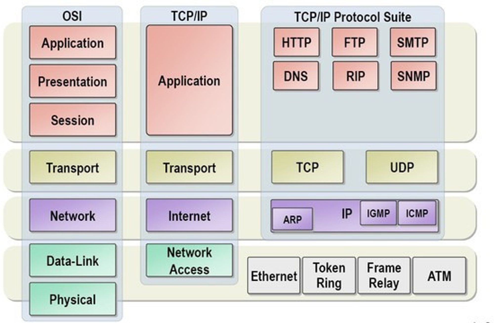
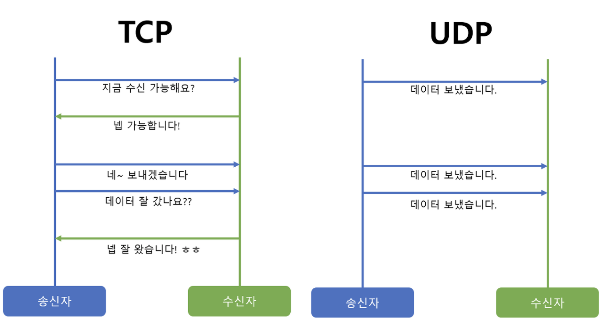
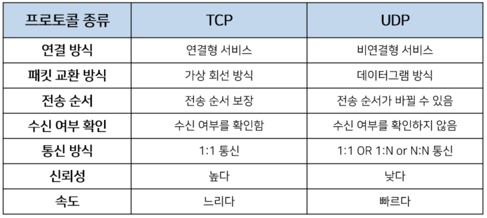
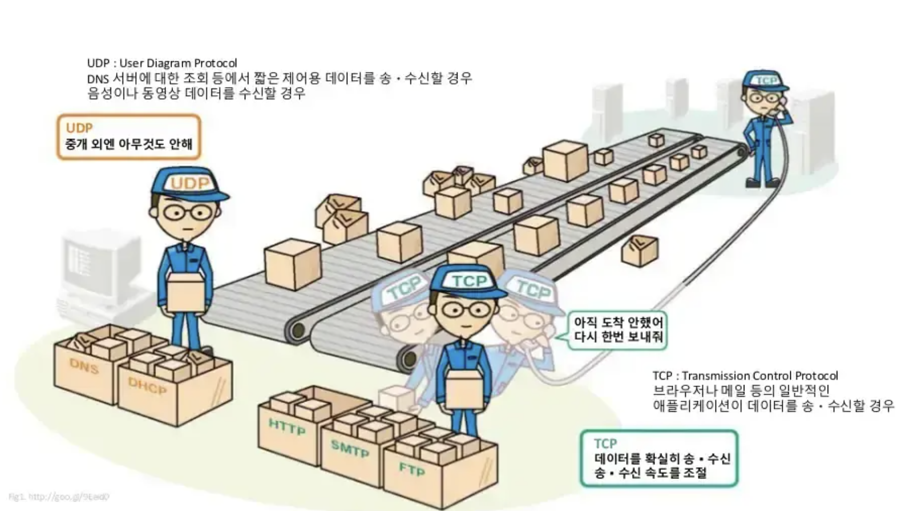

# TCP/UDP

- **OSI 7 계층 중 Layer 4: 전송계층에서 사용되는 프로토콜에 대한 내용**
- **전송계층은 프로토콜 내에서 송신자와 수신자를 연결하는 통신 서비스를 제공하는 계층**
- **IP에 의해 전달되는 패킷의 오류를 검사하고 재전송 요구 등의 제어를 담당**
- **이러한 전송계층에서 사용되는 프로토콜이 바로 TCP와 UDP.**

# **1. TCP(Transmission Control Protocol)**

---

- **TCP는 신뢰성 있는 데이터 전송을 지원하는 연결 지향형 프로토콜입니다.**
- **일반적으로 TCP와 IP가 함께 사용되는데, IP가 데이터의 전송을 처리한다면 TCP는 패킷 추적 및 관리를 하게 됩니다.**
- **연결 지향형인 TCP는 3-way handshaking이라는 과정을 통해 연결 후 통신을 시작하는데, 흐름 제어와 혼잡 제어를 지원하며 데이터의 순서를 보장합니다.**

### **흐름 제어: 보내는 측과 받는 측의 데이터 처리속도 차이를 조절해주는 것**

### **혼잡 제어: 네트워크 내의 패킷 수가 넘치게 증가하지 않도록 방지하는 것**

> Q) 흐름제어(Flow Control)와 혼잡제어(Congestion Control)이란? 흐름제어는 데이터를 송신하는 곳과 수신하는 곳의 데이터 처리 속도를 조절하여 수신자의 버퍼 오버플로우를 방지하는 것입니다. 예를 들어 송신하는 곳에서 감당이 안되게 데이터를 빠르게 많이 보내면 수신자에서 문제가 발생하기 때문입니다.혼잡제어는 네트워크 내의 패킷 수가 넘치게 증가하지 않도록 방지하는 것입니다. 만약 정보의 소통량이 과다하면패킷을 조금만 전송하여 혼잡 붕괴 현상이 일어나는 것을 막습니다.
> 

# **TCP 특징**

- 연결 지향 방식이다.
- 3-way handshaking과정을 통해 연결을 설정하고 4-way handshaking을 통해 해제한다.
- 흐름 제어 및 혼잡 제어.
- 높은 신뢰성을 보장한다.
- UDP보다 속도가 느리다.
- 서버와 클라이언트는 1대1로 연결된다.
- Streaming 서비스에 불리하다.(손실된 경우 재전송 요청을 하므로)

### 패킷이란?

> Q) 패킷(Packet)이란? 인터넷 내에서 데이터를 보내기 위한 경로배정(라우팅)을 효율적으로 하기 위해서 데이터를 여러 개의 조각들로 나누어 전송을 하는데 이때, 이 조각을 패킷이라고 합니다.
> 

> Q) TCP는 패킷을 어떻게 추적 및 관리하나요? 위에서 데이터는 패킷단위로 나누어 같은 목적지(IP계층)으로 전송된다고 설명하였습니다. 예를 들어 한줄로 서야하는 A,B,C라는 사람(패킷)들이 서울(발신지)에서 출발하여 부산(수신지)으로 간다고 합시다. 그런데 A,B,C가 순차적으로 가는 상황에서 B가 길을 잘못 들어서 분실되었다고 합시다. 하지만 목적지에서는 A,B,C가 모두 필요한지 모르고 A,C만 보고 다 왔다고 착각할 수 있습니다. 그렇기 때문에 A,,B,C라는 패킷에 1,2,3이라는 번호를 부여하여 패킷의 분실 확인과 같은 처리를 하여 목적지에서 재조립을 합니다. 이런 방식으로 TCP는 패킷을 추적하며, 나누어 보내진 데이터를 받고 조립을 할 수 있습니다.
> 

# **2. UDP(User Datagram Protocol)**

---

- **UDP는 비연결형 프로토콜로써, 인터넷상에서 서로 정보를 주고받을 때 정보를 보낸다는 신호나 받는다는 신호 절차를 거치지 않고 보내는 쪽에서 일방적으로 데이터를 전달하는 통신 프로토콜입니다.**
- 즉, 연결을 위해 할당되는 논리적인 경로가 없는데, 그렇기 때문에 각각의 패킷은 다른 경로로 전송되고, 각각의 패킷은 독립적인 관계를 지니게 되는데 이렇게 데이터를 서로 다른 경로로 독립적으로 처리하게 되고, 이러한 프로토콜을 UDP라고 합니다.
- **TCP와는 다르게 연결 설정이 없으며, 혼잡 제어를 하지 않기 때문에 TCP보다 전송 속도가 빠릅니다.**
- **그러나 데이터 전송에 대한 보장을 하지 않기 때문에 패킷 손실이 발생할 수 있습니다.**

# **UDP 특징**

- 비연결형 서비스로 데이터그램 방식을 제공한다
- 정보를 주고 받을 때 정보를 보내거나 받는다는 신호절차를 거치지 않는다.
- UDP헤더의 CheckSum 필드를 통해 최소한의 오류만 검출한다.
- 신뢰성이 낮다
- TCP보다 속도가 빠르다

- UDP는 비연결형 서비스이기 때문에, 연결을 설정하고 해제하는 과정이 존재하지 않습니다. 서로 다른 경로로 독립적으로 처리함에도 패킷에 순서를 부여하여 재조립을 하거나 흐름 제어 또는 혼잡 제어와 같은 기능도 처리하지 않기에 TCP보다 속도가 빠르며 네트워크 부하가 적다는 장점이 있지만 신뢰성있는 데이터의 전송을 보장하지는 못합니다.
- 그렇기 때문에 신뢰성보다는 연속성이 중요한 서비스 예를 들면 실시간 서비스(streaming)에 자주 사용됩니다.

# **UDP 서버의 특징**

- UDP에는 연결 자체가 없어서(connect 함수 불필요) 서버 소켓과 클라이언트 소켓의 구분이 없다.
- 소켓 대신 IP를 기반으로 데이터를 전송한다.
- 서버와 클라이언트는 1대1, 1대N, N대M 등으로 연결될 수 있다.
- 데이터그램(메세지) 단위로 전송되며 그 크기는 65535바이트로, 크기가 초과하면 잘라서 보낸다.
- 흐름제어(flow control)가 없어서 패킷이 제대로 전송되었는지, 오류가 없는지 확인할 수 없다.
- 파일 전송과 같은 신뢰성이 필요한 서비스보다 성능이 중요시 되는 경우에 사용된다.

# **3. TCP와 UDP의 비교**

---

## 그림으로 보는 TCP, UDP

- tcp는 3-way handshake 과정을 통해 커넥션을 맺음
- 그 후 데이터를 주고 받음
    
    → 연결형, 높은 신뢰성
    
- 종료 시에는 4-way handshake를 통해 close 진행

- UDP는 비연결형으로 일반적인 데이터 송수신 진행
    
    → 비연결형, 낮은 신뢰성