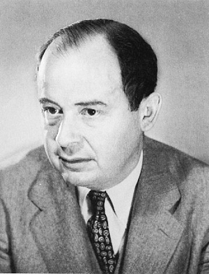
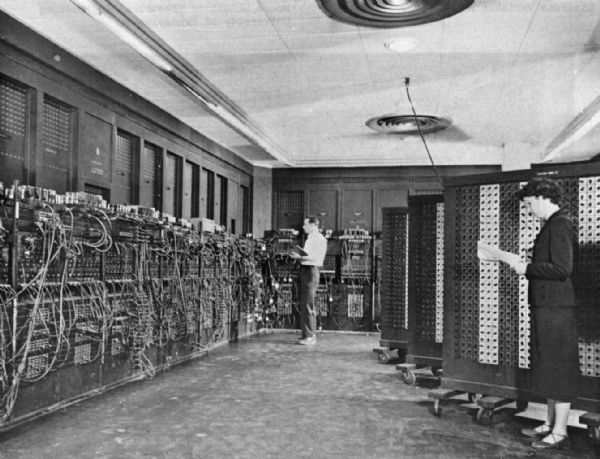
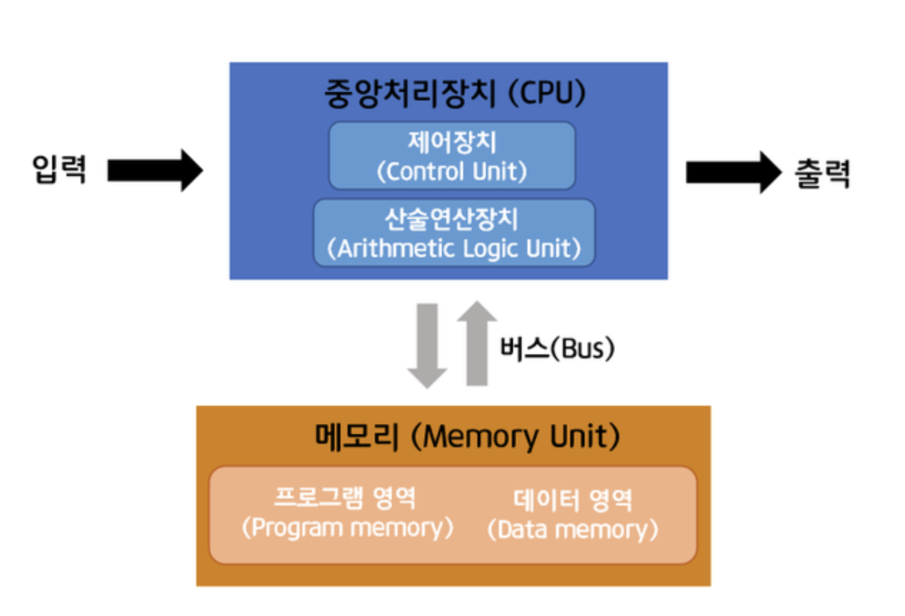

# 폰 노이만과 에니악

## 1. 폰 노이만
 

> 인류 역사상 손 꼽히는 천재

##### 존 폰 노이만 (John Von Neumann) (1903~1957)
 

- 존 폰 노이만(John von Neumann, 1903-1957)은 헝가리 출신의 미국의 수학자, 물리학자, 컴퓨터 과학자이며, `현대 컴퓨터 과학 분야의 창시자 중 한 사람`입니다.

- 노이만은 다양한 분야에서 활동하며, 특히 수학, 물리학, 컴퓨터 과학 등에서 업적을 남겼습니다. 그는 원자폭탄 개발 프로젝트에 참여하여 엄청난 과학적 업적을 이루었으며, 컴퓨터 과학 분야에서는 `폰 노이만 구조를 개발하여 현대 컴퓨터 구조의 기반을 다지는데 큰 역할을 했습니다.`

- 특이 그는 폰 노이만 아키텍처를 개발하여, `컴퓨터가 명령어를 메모리에 저장하고 실행할 수 있는 방법`을 제안했으며, 이것은 `현대 컴퓨터 구조의 기본`이 되었습니다.

- 이러한 공헌으로 인해 노이만은 `현대 컴퓨터 과학 분야에서 가장 중요한 인물 중 한 사람`으로 평가되고 있습니다.
   

## 2. 에니악 

> 세계 최초의 전자식 컴퓨터

##### 에니악
 

- 에니악은 미국 해군 연구소에서 `전투 및 발사체의 특성을 계산하기 위해 개발`되었습니다.

- 에니악(ENIAC)은 1945년에 개발된 `세계 최초의 전자식 컴퓨터`로, 미국의 펜실베이니아 대학교에서 개발되었습니다. `에니악은 폰 노이만 구조`를 기반으로 하며, 전구, 스위치, 커넥터 등을 사용하여 구성되었습니다.

- 에니악은 초기에는 `계산용`으로 개발되었으며, `총알 궤적 계산, 원자폭탄 설계, 날씨 예측` 등 다양한 분야에서 활용되었습니다. 에니악의 처리 속도는 초당 5,000개의 덧셈과 357개의 곱셈을 수행할 수 있었습니다.

- 하지만 에니악은 프로그램을 작성하고 변경하는 데에 많은 시간과 노력이 필요했습니다. 프로그램은 스위치와 케이블을 사용하여 직접 연결해야 했기 때문입니다.

- 이러한 문제점을 보완하기 위해, 이후에는 `프로그램이 저장된 메모리와 프로그램을 제어하는 명령어가 추가된 컴퓨터`가 개발되기 시작했습니다. 
 (하드웨어적에서 소프트웨어적으로 변화)
  

## 3. 폰 노이만 구조
> 프로그램과 데이터가 동일한 메모리 공간에 저장

##### 폰 노이만 구조

- 폰 노이만 구조(또는 폰 노이만 아키텍처)는 `컴퓨터의 기본 아키텍처` 중 하나로,

- `중앙 처리 장치(Central Processing Unit, CPU)와 메모리(Random Access Memory, RAM)` 등의 주요 구성 요소를 포함하는 `컴퓨터 시스템을 설계하는 방식`입니다.

- 이 구조는 `프로그램 코드와 데이터를 메모리에 저장`하고, 이를 처리하기 위해 `CPU가 순차적으로 명령어를 실행하는 방식`으로 작동합니다.

- 이를 위해 `CPU는 명령어를 읽어들여 처리`하고, 그 결과를 `메모리에 다시 저장`하는 방식을 취합니다.

- 이 구조의 가장 큰 장점은 `프로그램과 데이터가 동일한 메모리 공간에 저장`되어 있으므로, `데이터를 처리하기 위해 별도의 명령어가 필요하지 않다는 것`입니다.

- 이는 `프로그램을 효율적으로 실행`시키는 데 중요한 역할을 합니다.

- 또한 이 구조는 `여러 개의 프로그램을 동시에 실행할 수 있는 다중 프로그래밍 기능을 지원`하며, 이는 `현대 컴퓨터 시스템`에서 매우 중요한 기능입니다.

- 폰 노이만 구조는 대부분의 개인용 컴퓨터, 서버, 슈퍼컴퓨터 등에서 사용되며, 컴퓨터 과학의 발전에 큰 역할을 해왔습니다.

  

## 3. 폰 노이만 구조 예시 
 

- 예를 들어, 어떤 프로그램에서 두 수를 더하는 기능을 구현해야 한다고 가정해봅시다. 폰 노이만 구조에서는 이를 아래와 같이 구현할 수 있습니다.

1. 먼저, `메모리에 두 수를 저장`합니다.
2. 그 다음, `덧셈 명령어를 실행`하여 `메모리에서 저장된 두 수를 더합니다.`
3. 마지막으로, `더해진 결과값을 메모리에 저장`합니다.

- 이렇게 되면, 더하기 기능을 필요로 하는 다른 프로그램에서도 위와 같은 과정을 거치면 두 수를 더할 수 있습니다.

- `즉, 프로그램과 데이터를 메모리에 함께 저장`하여, 

- `필요한 데이터를 프로그램이 실행되는 동안에 메모리에서 바로 불러와서 처리`할 수 있다는 것이 폰 노이만 구조의 장점입니다.