## 이것이 우분투다 

> 우분투 실습환경 구축   

- 하드디스크의 파티션을 나눠서 윈도우와 리눅스를 멀티부팅
- VMware 툴 설치    

> 가상머신은 가상(가짜)으로 존재하는 컴퓨터로, 여래대의 PC를 사용해서 실무에서 사용하는 것고 동일한 네트워크 환경을 구축하는 것

 

**호스트 운영체제** : PC에 설치되어 있는 Window    
**게스트 운영체제** : 가상머신   
-> 기존에 설정한 IP주소를 이용해서 네트워크 카드를 통해 인터넷에 접속할 수 있음   
-> 가상머신에는 가상IP주소를 할당하고 가상 라우터를 통해서 5대의 가상머신을 하나의 네트워크로 묶음   

**<필요 사항>**
1. VMware Workstation 17 Player 설치(Virtualbox가 실습하기 좋음)
2. Microsoft 사의 Hyper- V. Oracle 사의 Virtual 
Box등도 있음 
3. Max인 사용자는 VMware Fusion 최신 버전을 사용해서 실습   
4. 최소 25GB~30GB정도의 여유공간이 필요
5. SSD를 권장 
6. 인텔 또는 AMD CPU가 64bit 및 가상화 기술을 지원
7. BIOS에서 가상화기술기능이 꺼져있기 때문에 BIOS로 들어가서 가상화 기술 부분을 켜주면 해결   

**<설치과정 캡처본>**   
-> 가상화는 공유되는게 많기 때문에 가상화 개수를 늘릴수있음
- 가상머신 생성
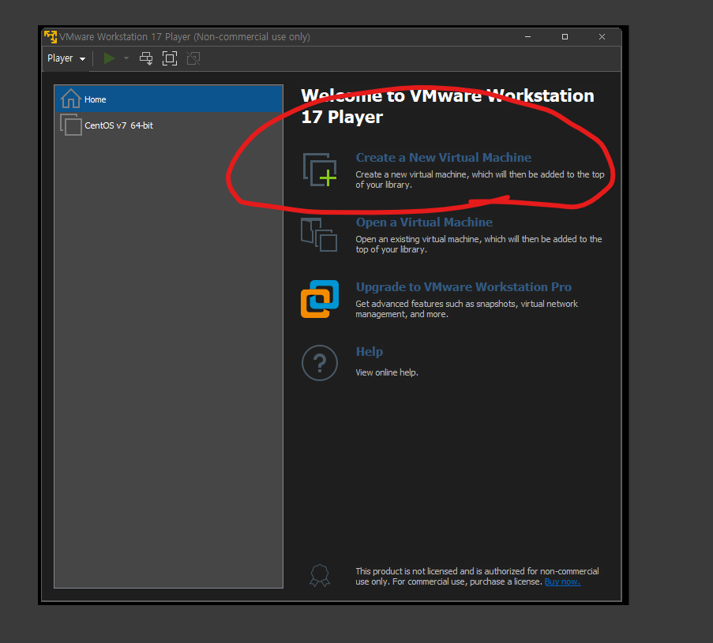
- iso파일 불러오기
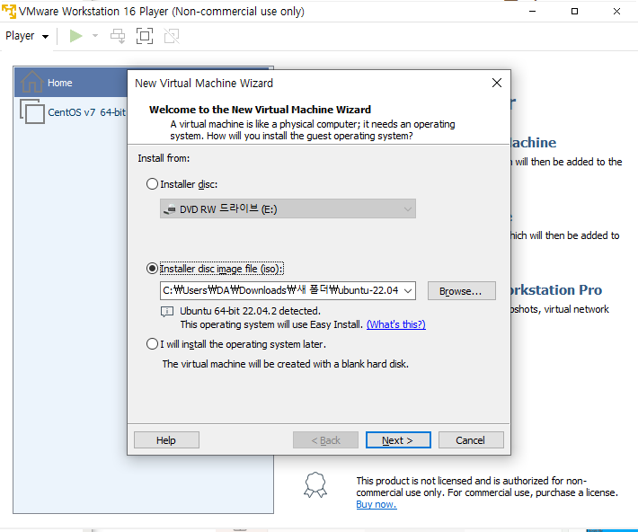
- 사용자설정
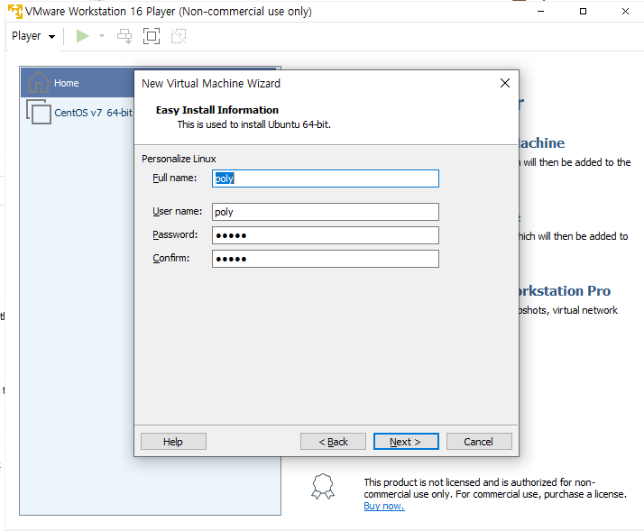
- 가상머신 이름 설정
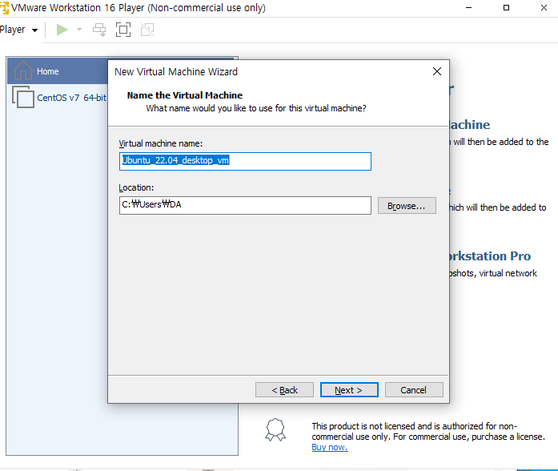
- 디스크 크기 설정
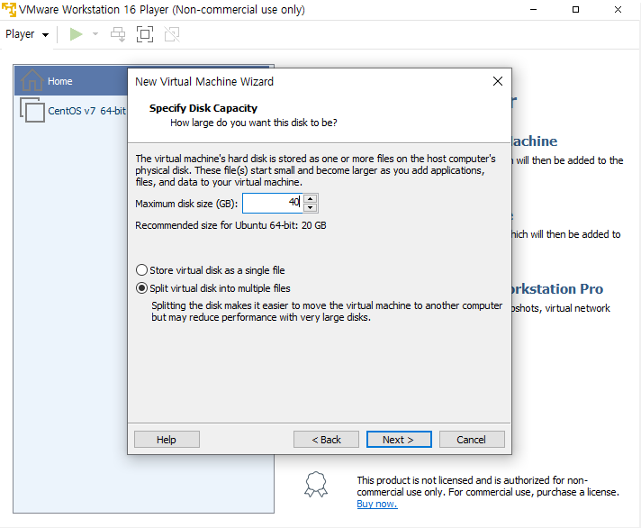
- 가상머신 설정 확인
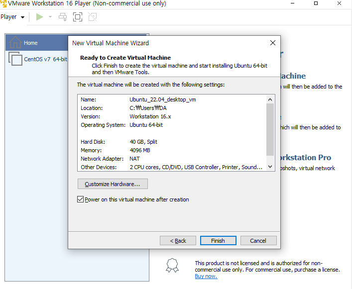
- 키보드 설정 > Continue 클릭
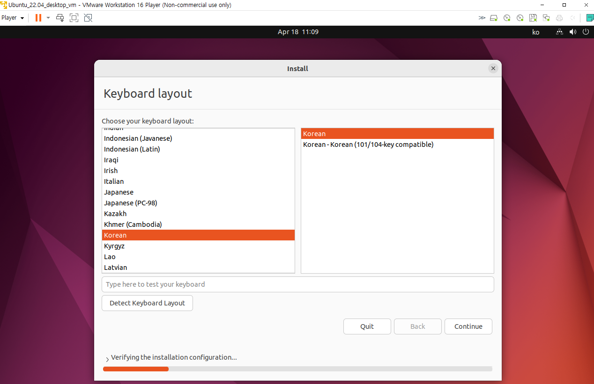
- Continue 클릭
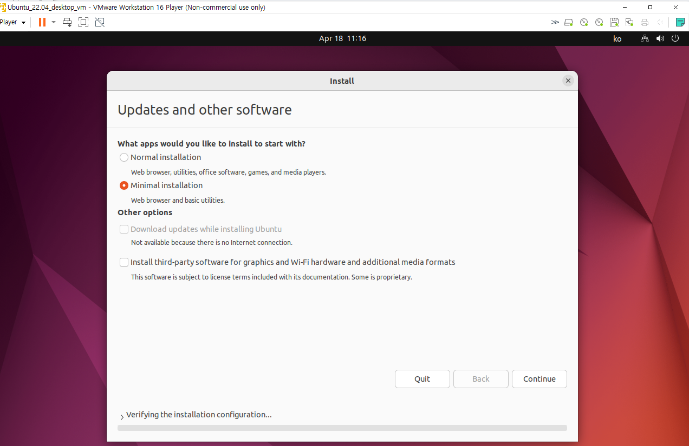
- Continue > Install Now 클릭
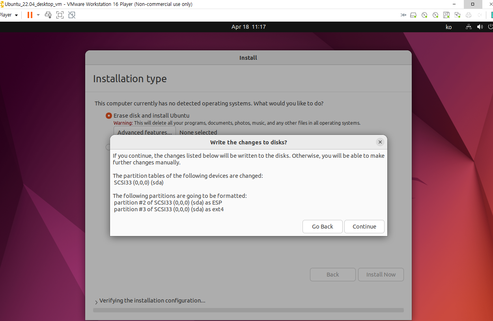
- Continue 클릭
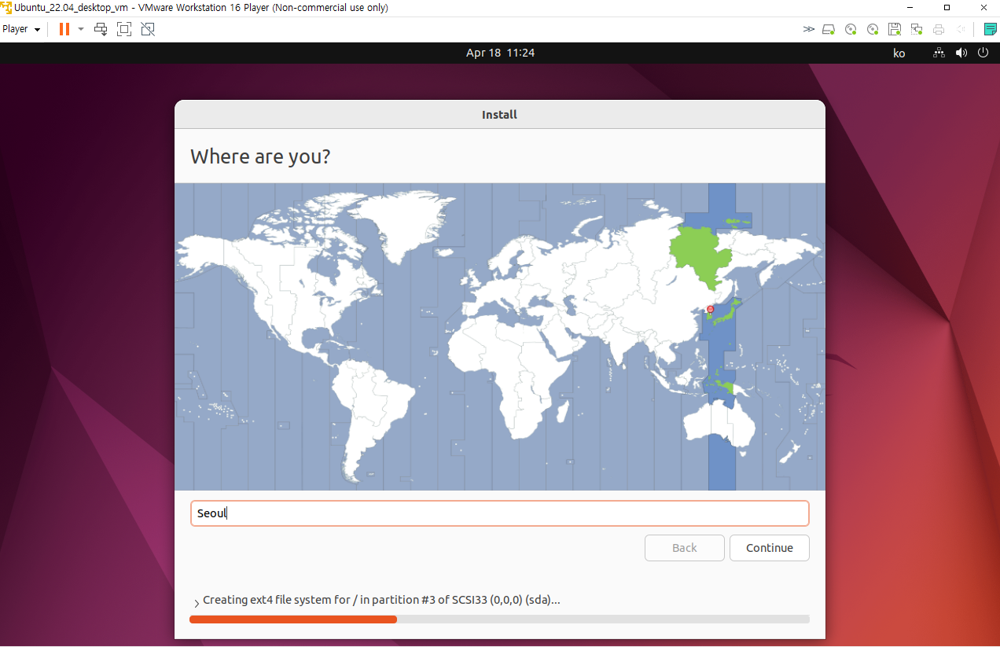
- 사용자 설정 > Continue 클릭
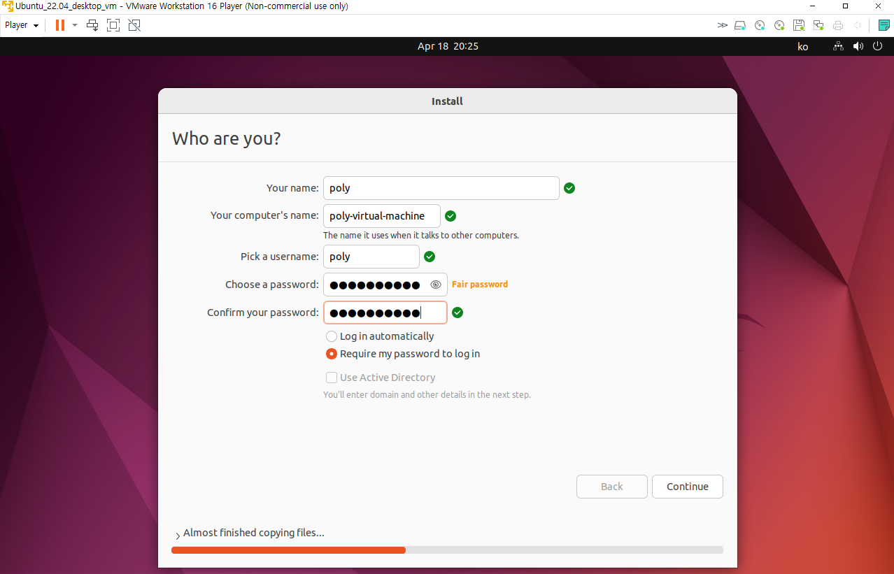
- 다운로드중
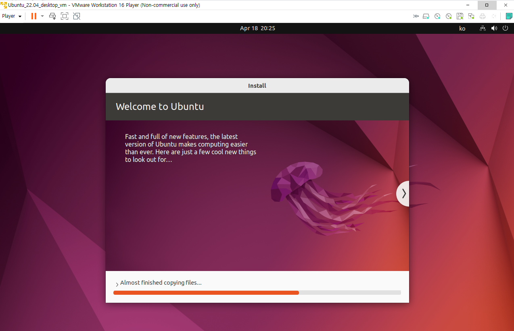
- 다시 실행
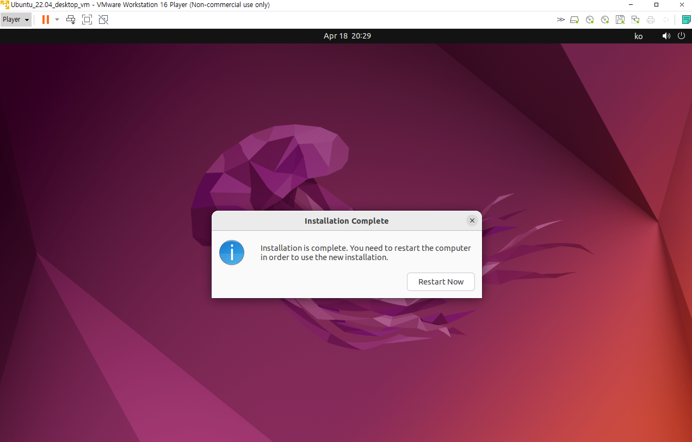
- 설정한 사용자로 로그인
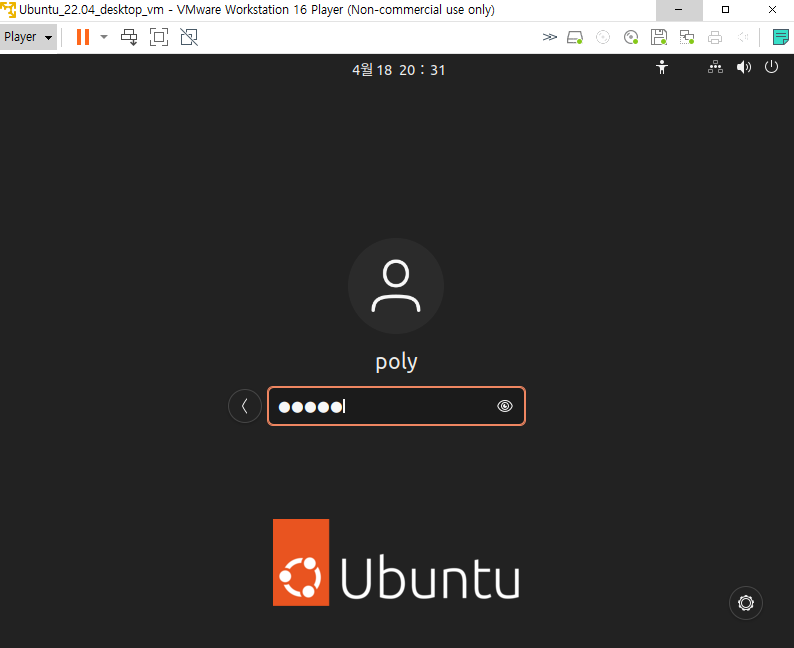
- 초기화면
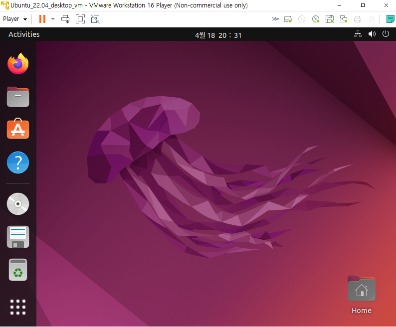
