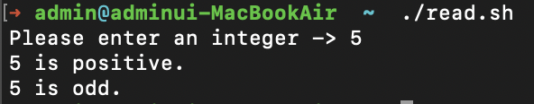
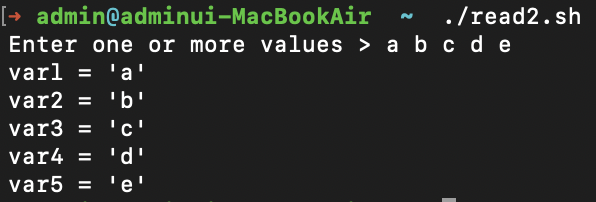
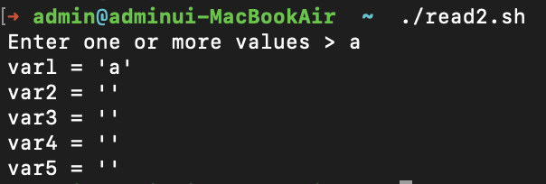
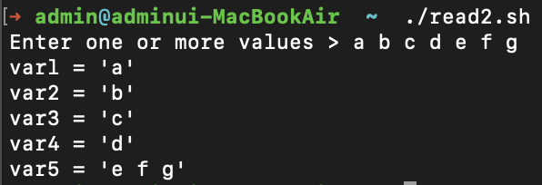
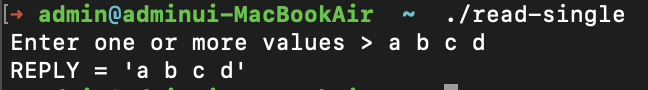
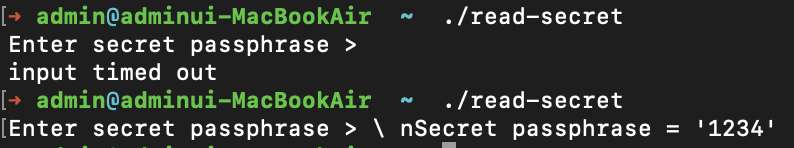
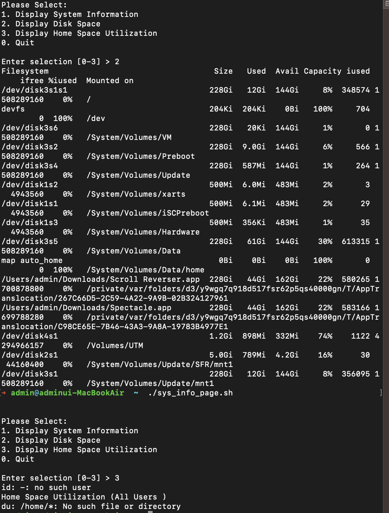
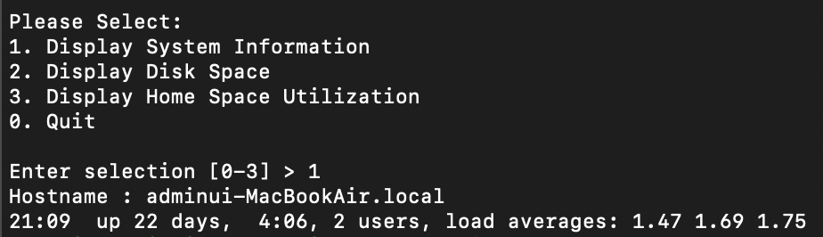

## 커맨드라인분석 28장<br/>
### - 키보드 입력 읽기
<hr/>

대화식모드는 사용자와 프로그램 사이에 상호작용하는 것을 한다. 일부 프로그램에서는 용자로부터 직접적인 입력을 허용하는 것이 효적일 수 있음.

### [read _ 표준 입력에서 값 읽어오기]
- read는 쉘의 내장 명령어로 표준 입ㄹㄱ으로 들어온 내용을 한 줄씩 읽어올 때 사용. 
- 이 명령어는 키보드 입력을 읽어올 때나 리다이렉션을 적용하여 파일의 데이터를 읽어올 때 사용
```bash
    read [-option] [variable...]
```

option위치에는 다음 표에 나와있는 옵션 중 하나 이상을 지정하고 variable에는 입력 값을 할당할 변수명을 하나 이상 입력. 변수명을 입력하지 않으면 쉘 변수 REPLY가 데이터를 갖게 됨

`-r` : 백슬래시는 이스케이프 문자 역할을 하지 않음. 백슬래시는 라인의 일부로 간주됨. 특히 백슬래시-새 라인 쌍은 사용할 수 없음.     
`-s` : 자동모도 - 단말기에서 입력이 들어오는 경우 문자는 반향 되지 않음.
`-t` : 시간 초과- 전체 입력 라인이 시간 초과 초 이내에 읽지 않으면 읽기가 시간 초과되고 반환되지 않음. 시간 초과는 분수가 있는 십진수일 수 
`-a` : 단어는 배열 변수 이름의 순차적 인덱스에 할당되며 0부터 시작함.
새 값이 할당되기 전에 이름이 설정 해제됨. 다른 이름  인수는 무시됨.
`-n` : 전체 입력 줄을 기다리지 않고 chars 문자를 읽은 후에 반환을 읽지만 chars 문자보다 적은 문자를 읽을 경우 구분 기호를 사용함.
`-p` : 프롬프트 - 입력을 읽기 전에 후속 줄 없이 표준 오류에 대한 프롬프트를 표시힘. 프롬프트는 입력이 에서 오는 경우에만 표시됨.

read명령은 표준 입력의 필드를 특정 변수에 할당
```bash
#!/bin/bash
# read-integer: evaluate the value of an integer.
echo -n "Please enter an integer -> "
read int
if [[ "$int" =~ ^-?[0-9]+$ ]]; then
        if [ $int -eq 0 ]; then
                echo "$int is zero. "
        else
                if [ $int -lt 0 ] ; then
                        echo "$int is negative ."
                else
                        echo "$int is positive. "
                fi
                if [ $((int % 2)) -eq 0 ]; then
                        echo "$int is even."
                else
                        echo "$int is odd."
                fi
        fi
else
        echo "Input value is not an integer." >&2
        exit 1
fi
```

read명령은 여러 변수에 값을 할당
```bash
#!/bin/bash
# read-multiple: read multiple values from keyboard
echo -n "Enter one or more values > "
read varl var2 var3 var4 var5
echo "varl = '$varl'"
echo "var2 = '$var2'"
echo "var3 = '$var3'"
echo "var4 = '$var4'"
echo "var5 = '$var5'"
```



- 나머지 변수들을 빈 값으로 채움
- 마지막 변수가 나머지 모든 값을 다 할당받음
- 쉘 변수인 REPLY에 모든 입력값이 할당

```bash
#!/bin/bash
#read-single: read multiple values into default variable
echo -n "Enter one or more values > "
read

echo "REPLY = '$REPLY'"
```


read명령어의 -p옵션으로 프롬프트 문자열을 생성할 수 있음
```bash
#!/bin/bash
# read-secret: input a secret passphrase
if read -t 10 -sp "Enter secret passphrase > " secret_pass; then
echo -e "\ nSecret passphrase = '$secret_pass'"
else
echo -e "\ninput timed out " >&2
exit 1
fi
```

- 사용자에게 비밀번호를 입력하라는 프롬프트를 띄우고ㅓ 10초 동안 입력을 기다림
- 그 시간동안 입력이 없으면 오류 메시지를 띄우고 종료
- -s옵션을 사용했기 때문에 비밀번호는 입력될 때마다 다시 표시되지 않음

### [IFS로 입력 필드 구분하기]
- 일반적으로 쉘은 read 에 공된 입력 내용을 단어로 나누는 작업을 수행함. 
- 지금까지 본 대로, 이는 입력 행에서 하나 상의 페이 로 분리된 각 단어 이 read 에 의해 별도의 에 할당된다는 것을 의미. 
- 이러한 방식은 IFS 입력 필드 구분자라고 하는 쉘 변수에 의해 설정 됨. 
- IFS 의 기본 값은 페이스, 탭, 개행 를 함하고 었고 각각 도의 항목으로 구분됨. 
- 입력 필드 구분자를 제어하기 IFS 의 값을 조절할 수 있음. 
- 예를 들어 /etc/passwd 파일은 필드 분자로 콜론 기호를 사용하여 데이터를 포함하고 있음. 
- IFS값을 세미콜론으로 변경함으로써. read 를 사용하여 /etc/passwd 내용을 입력받을 수 있고 성공적으로 각기 다른 변수에 각 항목들을 구분해낼 수 있음

```bash
#!/bin/bash
# read-ifs: read fields from a file
FILE=/etc/passwd
read -p "Enter a username > " user_name
file_info=$(grep "^$user_name : " $FILE)
if [ -n "$file_info" ]; then
        IFS=" : " read user pw uid gid name home shell «< "$file_info"
        echo "User = '$user'"
        echo "UID = '$uid'"
        echo "GID = '$gid'"
        echo "Full Name = '$name'"
        echo "Home Dir. = '$home'"
        echo "Shell = ' $shell'"
else
        echo "No such user '$user_name'" >&2
        exit 1
fi
```
- 이 스크립트는 사용자에게 시스템의 사용자 계정명을 입력하라는 메시지를 띄우고 /erc/passwd 파일에서 해당 사용자 정보를 찾아 각 필드들을 표시함. 
- grep 명령어의 결과 값을 file_info 라는 변수에 할당. 
- grep 에 사용한 정규 표현식을 통해 입력된 사용자명과 일치하는 용을 /etc/passwd 파일에서 찾게 될 것임.
- 변수 할당문, read 명령과 그 인자로 입력된 변수명 다소 낯선 리다이렉션 연산자임. 
- 쉘은 명령어가 처리되기 직전에 하나 이상의 변수 할당을 허용함. 여기서 이 할당은 뒤이어 나오는 명령어에 대한 환경을 변화시킴. 
- 이러한 변회는 일시적이고 명령어의 지속 시간 동안만 환경을 변경하는 것임. 
- 우리의 경우, IFS 을 콜론 문자로 변경했음. 우리는 또 다른 방식으로 다음과 같이 코딩할 수 있을 것임. 

```bash
OLD_IFS="$IFS "
IFS=" : "
read user pw uid gid name home shell «< "$file_info"
IF5= "$0LD_IFS "
```
- IFS 값을 저장하고 새로운 값을 할당하여 read 명령을 실행한 뒤 IFS 의 값을 원래 값으로 복구시 킬수 있음. 
- 분명한 것은 명령 전에 변수할당이 는 이 좀 더 간단한방법이라는 것임.
- `<<<` 연산자는 here 문자열임. `here` 문자열이란, here 문서와 같은 것으로 다만 이가 짧은 하나의 문자열로 구성됨. 
- 이 예제에서는 /etc/passwd 파일의 데이터 를 read명령의 표준 입력으로 전달하고 있음


- read명령어는 파이프라인과 함께 사용할 수 없음
```bash
echo "foo" | read
```
- 파이프라인은 서브쉘을 생성
- read명령은 서브쉘에서 실행됨
- 서브쉘은 부모 프로세스의 환경은 절대 변경하지 않음

### [입력 값 검증]
- 바로 입력 내용을 검증하는 것

'a' is not a floating point number.
'a ' is not an integer.
➜ admin@adminui-MacBookAir  ~  vim input.sh

```bash
#!/bin/bash
#read-validate: validate input
invalid_input ( ) {
echo "Invalid input '$REPLY'" >&2
exit 1
}
read -p "Enter a single item > "
# input is empty (invalid)
[[ -z $REPLY ]] && invalid_input
# input is multiple items (invalid)
(( $(echo $REPLY | wc -w) > 1 )) && invalid_input
# is input a valid filename?
if [[ $REPLY =~ ^[-[:alnum:]\._]+$ ]]; then
echo "'$REPLY' is a valid filename . "
if [ [ -e $REPLY ] ] ; then
echo "And file '$REPLY' exists."
else
echo "However, file '$REPLY' does not exist."
fi
# is input a floating point number?
if [[ $REPLY =~ ^-?[[:digit:]]*\.[[:digit:]]+$ ]]; then
echo "'$REPLY' is a floating point number."
else
echo "'$REPLY' is not a floating point number."
fi
# is input an integer?
if [[ $REPLY =~ ^-?[[:digit:]]+$ ]]; then
echo " ' $REPLY ' is an integer . "
else
echo "'$REPLY ' is not an integer."
fi
else
echo "The string ' $REPLY ' is not a valid filename . "
fi
```
- 앞의 스크립트는 사용자에게 항목을 입력하라는 프롬프트 메시지를 띄움. 
- 내용을 검증하기 해서 분석됨 쉘 함수, [[ ]], (( )), 어 연산자인 && 연산자와 if 그리고 적당량의 정규 표현식이 사용됨

### [메뉴]
대화 모드의 일반적인 형식은 메뉴 방식
```bash
#!/bin/bash
# read-menu: a menu driven system information program
clear
echo "
Please Select:
1. Display System Information
2. Display Disk Space
3. Display Home Space Utilization
0. Quit
"
read -p "Enter selection [0-3] > "
if [[ $REPLY =~ ^[0-3]$ ]]; then
if [[ $REPLY == 0 ]] ; then
echo "Program terminated."
exit
fi
if [[ $REPLY == 1 ]] ; then
echo "Hostname : $HOSTNAME"
uptime
exit
fi
if [[ $REPLY == 2 ]]; then
df -h
exit
fi
if [[ $REPLY == 3 ]] ; then
if [[ $(id - u) -eq 0 ]] ; then
echo "Home Space Utilization (All Users ) "
du -sh /home/*
else
echo "Home Space Utilization ($USER)"
du -sh $HOME
fi
exit
fi
else
echo "Invalid entry." >&2
exit 1
fi

```




- 첫 번째 부분은. 메뉴를 표시 하여 사용자의 응답을 입력하는 것. 
- 두 번째 부분은. 응답을 확인하고 선택된 행동을 수행. 이 스크립트의 exit명령은 특정 동작이 수행된 후 스크립트가 불필요한 코드를 실행하는 것을 방지하기 위한 것이다. 
- 일반적으로 프로그램에서 exit 지점이 여러 군데서 보인다면 좋은 방식이 아님

### 마무리
- 대화식 모드에 대해 사용자에게 프로그램상에서 키보드를 이용하여 입력을 허용한 것
- 지금까지 공부한 기능들을 활용해 유용한 프로그램들 중 특수한 계산 프로그램이나 불가사의해 보이는 커맨드라인 툴을 만들 수 있음