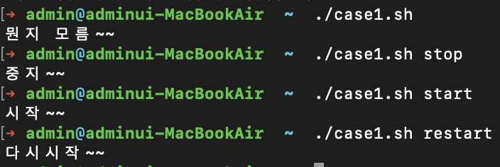
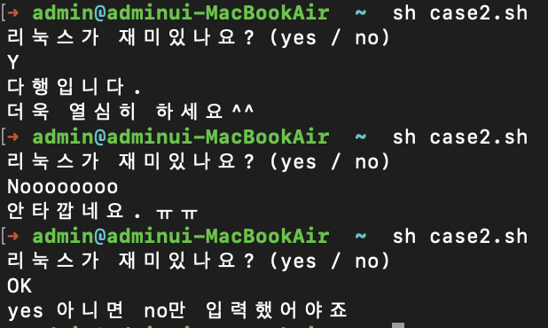
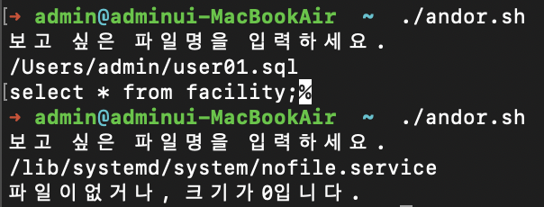
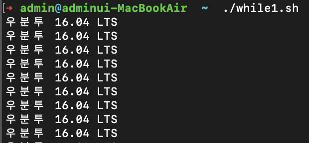
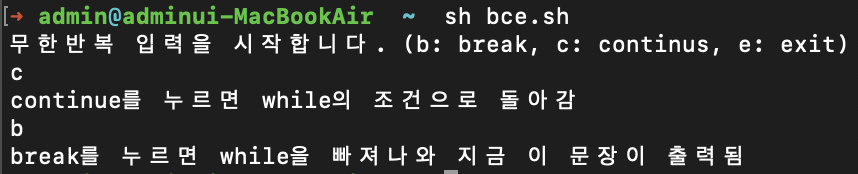
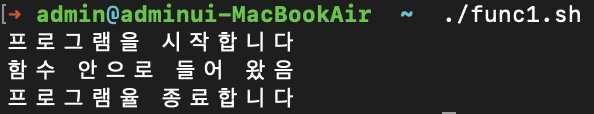
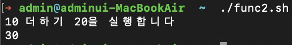
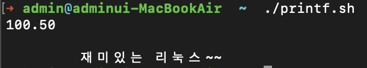

## 이것이 우분투다 7장 <br/>
<hr/>

# 쉘 스크립트 프로그래밍

## 쉘의 기본

셸은 사용자가 입력한 명령을 해석해 커널에게 전달하거나, 커널의 처리 결과를 사용자에게 전달하
는 역할을 한다.

### [우분투의 bash 셸]

우분투에서 기본적으로 사용하는 셸은 bash이다.

bash 셸의 특징

- Alias 기능
- History 기능 (방향키 위, 아래)
- 연산 기능
- Job Control 기능
- 자동이름 완성 기능(tab)
- 프롬프트 제어 기능
- 명령 편집 기능

### [셸의 명령문 처리 방법]

셸 명령문은 명령문과 함께 여러 가지 옵션이나 인자(Argument)를 사용할 수 있으며, 형식은 다음과 같다.

```
(프롬프트) 명령 [옵션..] [인자 ...]
```

- 예시

```
ls -l
rm -rf /mydir
find ./ -name "*.conf"
```

### [환경 변수]

 셀은 여러 가지 환경 변수 값을 갖는데, 설정된 환경 변수는 **echo $환경변수이름** 형식으로 명령을 실행하면 확인할 수 있다.


환경 변수 값을 변경하려면 형식

```
export 환경변수 = 값 
```

환경 변수는 printenv 명령을 실행하면 출력된다. (단, 일부 환경 변수는 printenv 명령을 실행해도 나타나지 않는다는 사실에 주의하자)

### [셸 스크립트 프로그래밍 실습]

리눅스의 셸 스크립트는 C 언어와 유사한 방법으로 프로그래밍 할 수 있다. 왜냐하면 리눅스의 대부
을 C 언어로 작성했기 때문이다.

셸 스크립트도 일반적인 프로그래밍 언어와 비슷하게 변수, 반복문, 제어문 등을 사용할 수 있다.

또한 별도로 컴파일하지 않고 텍스트 파일 형태로 셸에서 바로 실행할 수 있다. 그래서 셸 스크립트는 주로 vi 에디터나 gedit으로 작성하는 편이다

셸 스크립트를 공부하면 좋은 이유는 리눅스의 많은 부분이 셸 스크립트로 작성되었기 때문이다. 예
를 들어 GRUB 의 설정 파일인 /boot/grub/grub.cfg 파일도 셀 스크립트 문법을 사용한다 .

### [셸 스크립트작성과 실행]

vi [name.sh](http://name.sh) 명령이나 gedit name.sh 명령을 실행하여 셸 스크립트 작성

<aside>
💡 셸 스크립트 파일의 확장명을 지정하지 앟거나, 다른 것으로 지정해도 되지만, 사용자가 작성한 셸 스크립트 파일은 되도록 확장명을 sh로 지정하자

</aside>

- name.sh

```java
#!/bin/sh 
echo 사용자 이름: ” $USER 
echo "홈 디렉터리 : ” $HOME 
exit 0
```


소스 설명

- 1행 특별한 형대의 주석 (#!)으로 bash를 사용하겠다는 의미다. 첫 행에 꼭 써줘야 한다.
- 2행 echo 명령은 화면에 출력하는 명령이다. 먼저 “사용자 이름 : '’ 이라는 글자를 출력하고. 옆에는 $USER 는 환경 변수의 내용을 출력한다.
- 4행 종료 코드를 반환하게 해 준다. 만약 다른 스크립트에서 이 스크립트를 호출한 후 제대로 실행되었는지를 확인하려면 적절한 종료 코드를 반환하는 것이 중요하다.
즉, 이 행은 실제 스크립트 실행과 무관하지만, 셸 스크립트는 실행 중간에 문제가 생겨도 무조
건 성공했다는 메시지를 반환하기 때문에, 직접 마지막 행에서 성공인지 실패인지를 반환하는
것이 좋다. 0 은 성공을 의미한다.

### [sh 명령으로 실행]

sh 스크립트파일 명령으로 실행할 수 있다 . 셸 스크립트 파일의 속성을 변경할 필요가 없다는 장점이 있다.

```java
sh name.sh
```

### [‘실행 가능’ 속성으로 변경한 후 실행]

먼저 셸 스크립트 파일의 속성을 ‘실행 가능’ 으로 변경한 후 ./스크립트파일 명령을 실행한다

```java
chmod +x name.sh
./name.sh
```

**chmod +x 파일명** 명령은 현재 파일의 속성 에 ‘실행 가능' 속성을 추가하라는 의미다.

<aside>
💡 ./스크립트파일 멸영에서 ‘.’은 현재 디렉터리를 의미한다. 그러므로 현재 디렉터리의 스크립트 파일을 실행하라는 의미이다. 반드시 현재 디렉터리인 ‘./’를 입력하는 이유는 현재 디렉터리가 $PATH 환경변수에 설정되어 있지 않기 때문이다. 일반적으로 명령이나 스크립트 이름을 입력하면 셸은 $PATH 환경 변수에 설정된 디렉터리만 찾아본다

</aside>


지금부터는 별도로 언급하지 않아도 셸 스크립트 소스를 독자가 직접 입력하고 한 후, 실행해서
결과를 확인하면 된다.

<aside>
💡 지금 작성한 셸 스크립트는 root 사용자 권한으로 작성한 것이다. 이 셸 스크립트를 다른 사용자도 사용하게 하려면 /usr/local/bin/ 디렉터리에 복사하고 권한을 755로 변경하면 된다

</aside>

## 변수

변수는 필요한 값을 계속 변경해 저장한다는 개념이다. 셸 스크립트의 구조는 변경할 필요가 없는데
설정해야 하는 값이 상황에 따라 다르다면 변수에 필요한 값을 계속 바꿔가는 방법으로 프로그래밍
해 다양한 상황에 대처할 수 있다.

### [변수의 기본]

- 셸 스크립트에서는 변수를 사용하기 전에 미리 선언하지 않으며 , 처음 변수에 값이 할당되면 자동으로 변수가 생성된다.
- 변수에 넣는 모든 값은 문자열 String 로 취급한다. 측, 숫자를 넣어도 문자로 취급한다.
- 변수 이름은 대소문자를 구분한다. 즉 $aa 라는 변수 이름과 $AA라는 변수 이름은 다르다,
- 변수를 대입할 때 ‘= ' 좌우에는 공백이 없어야 한다.

예시

```bash
testval=Hello  #오류 = 앞 뒤에 공백이 있 
testval=Hello 
testval=Yes Sir  #오류 값의 공백은 " "로 묶어야 한다 
testval="Yes Sir" 
testval=7+5 #정상이지만 "7+5"라는 문자열로 인식한다
```

### [변수의 입력과 출력]

‘$’라는 문자가 들어간 글를 출력하려면 ‘ ’로 묶어주거나 앞에 ‘\’를 붙여야 한다. 또한, ” ”로 변수
를 묶어도 되고. 묶지 않아도 된다.

var1.sh

```bash
#! /bin/ sh 
myvar="Hi Woo" 
echo $myvar 
echo "$myvar" 
echo '$myvar' 
echo \$myvar 
echo 값 입력 : 
read myvar 
echo '$myvar' = $myvar 
exit 0
```

- 실행 결과


- 소스 설명
    - 3행: 'Hi Woo’ 라는 정상적인 값을 출력한다.
    - 4행: 3행과 동일한 효과댜
    - 5행: ‘$myvar’ 라는 글자를 출력한다.
    - 6행:  \$는 $를 글자로 취급하게 한다. 결국 5행과 동일한 효과다.
    - 8행: 변수 myvar에 키보드로 값(문자열)을 입력한다.

### [숫자 계산]

변수에 넣은 값은 모두 문자열로 취급한다고 했다. 만약 변수에 들어 있는 값에 +, —,*, */ 등의 연
산을 하려면 expr 키워드를 시용하면 된다.* 

- *단,수식과 함께 꼭 키보드 숫자 1 왼쪽에 있는 역따옴표(`)로 묶어줘야 한다.*
- *수식에 괄호를 사용하려면 그 앞에 꼭 역슬래시 (\)를 붙여줘야 한다.*
- *또 +,—,/ 와 달리 곱하기 (**) 기호도 예외적으로 앞에 역슬래시 ( \ )를 붙여줘야 한다.

numcalc.sh

```bash
#!/bin/sh
num1=100
num2=$num1+200 
echo  $num2
num3='expr $num1 + 200'
echo $num3 
num4= 'expr \( $num1 + 200 \) / 10 \* 2'
echo $num4
exit 0
```


**소스설명**

- 3행 : 문자열로 취급함 → 모두 붙여서 써야한다.
- 5행 : 숫자로 취급해서 계산함 → 각 단어마다 띄어쓰기를 해야 한다.
- 7행 : 괄호와 ‘*’ 앞에는 역슬래시(\)를 붙여준다

### [파라미터 변수]

파라미터 변수는 $0,$1,$2 등의 형태를 갖는다. 이는 실행하는 명령의 부분 하나하나를 변수로 지정한다는 의미이다.

예를 들어 apt-get -y install gftp 명령어를 실행한다고 가정하면, 파라미터 변수는 다음과 같이 지정할 수 있다.

| 명령 | apt-get | -y | install | gftp |
| --- | --- | --- | --- | --- |
| 파라미터 변수 | $0 | $1 | $2 | $3 |

즉, $0에는 apt-get이 , $1에는 -y를 저장한다. 또, 명령 전체의 파라미터 변수는 $*로 표현한다

- paravar.sh

```bash
#!/bin/sh
echo "실행파일 이름은 <$0>이다"
echo "첫번째 파라미터는 <$1> 이고, 두번째 파라미터는 <$2>다"
echo "전체 파라미터는 <$*>다"
exit 0
```


### [기본 if문]

- 기본 문법

```bash
if [ 조건 ]
then
	참일 경우 실행
fi
```

- 주의할 점: ‘[조건]’ 사이의 각 단어에는 모두 공백이 있어야 한다는 것이다.

if1.sh

```bash
#!/bin/sh
if [ "woo" = "woo" ]
then
	echo "참입니다"
fi
exit 0
```


- 소스 설명
    - 2행 ‘[ ]’ 사이에는 참과 거짓을 구분하는 조건식이 들어간다
    - ‘=’은 문자열이 같은지를 비교하며
    - ‘! =’ 은 문자열이 같지 않은지 비교한다
    - if1.sh에서는 조건식이 참이므로 4행을 실행한다. 또 ‘[ ] ‘ 대신 test라는 키워드를 사용할 수도 있다
    - 2행과 if test “woo”=”woo”는 동일한 구문이다.

### [if~else문]

참인 경우와 거짓인 경우를 구분해서 실행한다

- 기본 문법

```bash
if [조건]
then 
	참일 경우 실행
else
	거짓인 경우 실행
fi
```

- if2.sh

```bash
#!/bin/sh
if [ "woo" != "woo" ]
then
	echo "참입니다"
else
	echo "거짓입니다"
fi
exit 0
```


- if3.sh

```bash
#!/bin/sh
if [100 -eq 200]
then
	echo "100과 200은 같다"
else
	echo "100과 200은 다르다"
fi
exit 0
```


### [파일과 관련된 조건]


- if4.sh

```bash
#!/bin/sh
fname=/lib/systemd/system.cron.service
if [-f $fname ]
then
	head -5 $fname
else
	echo "cron 서버가 설치되지 않았습니다."
fi
exit 0
```


- 소스 설명
    - 2행 : fname 변수에 cron 서버 실행 파일인 /lib/systemd/system/cron.service 저장
    - 3행 : fname 변수에 저장된 /lib/systemd/system/cron.service 파일이 일반 파일이면 참이므로 5행을 실행, 그렇지 않으면 거짓이므로 7행을 실행
    - 5행 : fname에 들어 있는 파일의 앞 5줄을 출력


### [case~esac문]   
여러가지 경우의 수가 있다면 if문(2중분기)을 계속 중복해서 사용해야 하므로 구문이 복잡해짐. 이때 사용하는 것이 case문(다중 분기)이라 함.   

```bash
#! /bin/sh
case "$1" in
    start)
        echo "시작~~";;
    stop)
        echo "중지~~";;
    restart)
        echo "다시시작~~";;
    *)
        echo "뭔지 모름~~";;
esac
exit 0
```

[case1.sh 실행 결과]

소스설명
- 첫 번째 파라미터 변수(명령 실행 시 추가한 값)인 $1 값에 따라서 `start)`, `stop)`, `restart)`, `*)` 부분으로 분기 함    
- `start)`일 경우에 실행됨. 주의할 점은 뒤에 세미콜론을 2개(;;)붙여서 써야 함
- `*)` 는 그 이외의 것들이 해당됨
- `esac` : 11행 case문의종료를표시한다.

```bash
#!/bin/sh
echo "리눅스가 재미있나요? (yes / no)"
read answer
case $answer in
        yes | y | Y | Yes |YES)
                echo "다행입니다."
                echo "더욱 열심히 하세요^^";;
        [nN]*)
                echo "안타깝네요. ㅠㅠ";;
        *)
                echo "yes 아니면 no만 입력했어야죠"
                exit 1;;
esac
exit 0
```

[case2.sh 실행 결과]

소스설명
- answer 변수에 입력한 값을 받음.
- 입력된 값이 yes, y. Y, Yes. YES 중 하나면 6~7행을 실행함.
- 실행할 구문이 없으므로 뒤에 ;;를 붙임.
- [nN]*)는 앞에 n 또는 N이 들어가는 모든 단어를 다 인정해준다는 의미.
- 정상적인 종료가 아니므로 exit 1 로 종료


### [AND. OR 관계 연산자]
- 조건문에서는 and와 or의 의미를 갖는 관계 연산자를 사용할 수 있음. 
- and는 `—a` 또는 `&&`를 사용 하며, or은 `-o` 도는 `||`를 사용. 
- ―a나 ―o는 테스트문 안에서 사용할수 있는데, 이때 괄호 등의 특수 문자 앞에는 역슬래시 (\)를 붙여줘야 함.

```bash
#!/bin/sh
echo "보고 싶은 파일명을 입력하세요."
read fname
if [ -f $fname ] && [ -s $fname ] ; then
        head -5 $fname
else
        echo "파일이없거나, 크기가0입니다."
fi
exit 0
```

[andor.sh 실행 결과]   
소스설명 

입력한 파일 이름이 일반 파일(-f)이고, 크기가 O이 아니라면(―s) 5행을 실행함. then 구문은 다음 줄에 작성해도 되며, 세미콜론(;) 이후에 작성해도 됨. 세미콜론은 앞 뒤 구문을 행으로 분리해주는 기능임. 또, 이 구문은 if [ \(-f $fname \) -a \(-s $fname \) ] ; then과 동일함

### [for~in문]
- for~in문은 다음 형식을 보면 변수에 각각의 값을 넣은 후 do 안에 있는 ‘반복할 문장’을 실행함. 
- 값의 개수만큼 반복 실행하게 된다.

```bash
#!/bin/sh
hap=0
for i in 1 2 3 4 5 6 7 8 9 10
do
        hap=`expr $hap + $i`
done
        echo "1부터 10까지의 합: "$hap
exit 0
```
[forin1.sh]

소스설명
- 합계를 누적할 변수를 0으로 초기화
- i 변수에 1~10까지 반복해 넣으면서 5행을 10회 실행.
- 기존의 for문과 비슷하게 for((i=1;i<=1O;i++))로 변경해서 시용할수있음 
- hap에 1변수의 값을 누적한다(결국 1부터 10까지를 계속 더함).

7장 · 셸 스크립트 프로그래밍 437
```bash
#!/bin/sh
for fname in $(ls *.sh )
do
        echo "--------$fname-------"
        head -3 $fname
done
exit 0
```
[forin2.sh]

소스설명
- fname 변수에 Is •.sh 명령의 실행 결괴를 하나씩 넣어서 반복. 
- 파일 개수만 큼실 행을 반복.
- 파일이름을 출력함
- 파일의 앞 3줄을 출력함.

### [while문]
while문은 조건식이 찹인 동안에 계속 반복하는 특성을 갖음. 
```bash
#!/bin/sh
while [ 1 ]
do
        echo "우분투 16.04 LTS"
done
exit 0
```

[while1.sh 실행 결과]   

```bash
#!/bin/sh
hap=0
i=1
while [ $i -le 10 ]
do
        hap= `expr $hap + $i`
        i =`expr $i + 1`
done
echo "1부터 10까지의 합 : "$hap
exit 0
```
 이번에는 비밀번호를 입력받고, 비밀번호가 맞을 때까지 계속 입력받는 스크립트를 작성해보자

```bash
#!/bin /sh
echo "바밀번호를 입력하세요 "
read mypass
while [ $mypass != "1234" ] 
do  
    echo "틀렸음. 다시 입력하세요 "
    read  mypass
done
echo "통과~~"
exit 0
```

소스설명
- mypass 변수에 값을 입력받는다.
- mypass 변수의 값이 '1234가 아니면 "틀렸음. 다시입력하세요" 출력. 
- 맞으면 while문을 종료. 

### [until문]
- while문과 용도가 거의 같지만. un미문은 조건식이 참일 때까지 (= 거짓인 동안) 계속 반복.
- while2.sh를 동일한 용도로 until문으로 바꾸려면 4행을 디음과 같이 바꾸면 됨. 
`until [$i -gt 10 ]`

### [break. continue. exit. return]
break는 주로 반복문을 종료할 때 시용되며, continue는 반복문의 조건식으로 돌아가게 함. 또. exit는 해당 프로그램을 완전히 종료힘. return은 함수 안에서 사용될 수 있으며 함수를 호출한 곳으로 돌아가게 함.
```bash
#!/bin/sh
echo "무한반복 입력을 시작합니다. (b: break, c: continus, e: exit)"
while [ 1 ] ; do
        read input
        case $input in
                b|B)
                        break;;
                c|C)
                        echo "continue를 누르면 while의 조건으로 돌아감"
                        continue;;
                e|E)
                        echo "exit를 누르면 프로그램(힘수)를 완전히 종료함"
                        exit 1;;
        esac;
done
echo "break를 누르면 while을 빠져나와 지금 이 문장이 출력됨"
exit 0
```

- 무한반복됨. while [1] 또는 while[true]와 동일.
- 입력한값에 따라 분기한다.
- b 또는 B가 입력되면 break가 실행되어. while문을 종료 후 마지막 종료문 출력.
- c 또는 C가 입력되면 continue가 실행돼 3행 while문의 조건식인 [1]로 돌 아감(결국 무한 루프임).
- e 또는 E가 입력되면 exit가 실행돼 프로그램 자체를 종료. 
- 그러므로 마지막 출력문이 출력되지 않는다.

### [사용자정의함수]
시용자가 직접 함수를 작성하고 호출할 수 있음.    

함수이름 ( ) {      //함수를 정의   
    내용들...   
}   
함수이름            //함수를 호출   

```bash
#!/bin/sh
myFunction () {
        echo "함수 안으로 들어 왔음" 
        return
}
```

[func1 .sh 실행 결과]   

소스설명

- myFunction 함수를 정의. 단. 이 부분은 ()행에시 호출하기 전에는 실행되지 않음. 
- 여기서 return 문은 함수을 호출한 곳으로 돌아가게 하는데 지금예시에는 return문이 없어도 됨.

```bash
#!/bin/sh
hap () {
        `echo expr $1 + $2`
}
echo "10 더하기 20을 실행합니다"
hap 10 20
exit 0
```

[func2.sh 실행 결과]    
소스설명   
- 넘겨받은 파라미터 $1과 $2를 더한 값을 출력.
- 호출할 때 함수 이름에 넘겨줄 파라미터를 공백으로 분리해서 차례로 적어줌.

### [eval]
문자열을 명령문으로 인식하고 실행.
```bash
#!/bin/sh
str="ls -1 eval.sh" 
echo $str
eval $str
exit 0
```
[eval.sh]   
소스설명    
- str 변수의 값인 ‘Is —I eval.sh’라는 글자를 그대로 출력.
- str 변수의 값인 ‘ls —Ieval.sh'를 명령으로 인식하고 실행.
### [export]
외부 변수로 선언. 즉, 선언한 변수를 다른 프로그램에서도 시용할 수 있게 함.
```bash
#!/bin/sh 
echo $var1 
echo $var2 
exit 0
```
[eval1.sh]
```bash
#!/bin/sh
var1= "지역 변수"
export var2= "외부 변수" 
sh expl .sh
exit 0
```
[eval2.sh]

소스설명   
- var1과 var2 변수를 출력한다. var2는 exp2.sh에서 외부 변수로 선언
- varl에 값을 넣음. 일반 변수 (지역 변수)이므로 현재 프로그램인 exp2.sh에 서만 사용. 즉 exp1.sh의 var1과는 우연히 이름만 같을 뿐 다른 변수. 
- var2를 외부 변수로 선언하고 값을 넣음. 외부 프로그램(exp1.sh)에서도 사 용가능.
- exp1.sh를 실행.

### [printf]

```bash
#!/bin/sh 
var1=100.5
var2= "재미있는 리눅스~~"
printf "%5.2f \n\n \t %s \n" $var1 "$var2" 
exit
```


### [set과$(명령)]
리눅스 명령을 절과로 시용하려면 .$(명령)’ 형식을 시용해야 함, 또. 결괴를 파라미터로 시용하고자 할때는 set 명령과함께 시용.
```bash
#!/bin/sh
echo “오늘 날짜는 $(date)
set $(date)
echo "오늘은 $4 요일 입니다 " 
exit 0
```

[set.sh 실행결과]

- $(date)는 elate 명령을 실행한 결과를 보여줌.
- $(date)의 결과가 $1. $2. $3 ... 등의 파라미 터 변수에 저장됨. 
- 4번째 파라미터인 요일이 출력.


### [shift]
- 파라미터 변수름 왼쪽으로 한 단계씩 아래로 쉬프트(이동)시킴.
```bash
#!/bin/sh
myfunc () {
        str = ""
        while [ "$1" != " " ] ; do
                str = "$str  $1"
                shift
        done
        echo $str
}
myfunc AAA BBB CCC DDD EEE FFF GGG HHH III JJJ KKK
exit 0
```
- 결과를누적할 str 변수를 초기화.
- $1파라미터가 비어 있지 않은 동안에 반복 실행(처음 $1은 AAA고. 한 번 반복 실행하면 5. 6행에 의해 $1이 BBB가 됨).
- str 변수에 $1을 추가한다.
- 전체 파라미터를 왼쪽으로 쉬프트시킴. 즉. $2一$1.$5一$2.一$3....의 형테로 작업이 일어남
- w1ile문이 끝나면 누직한 str 변수를 출력.


 