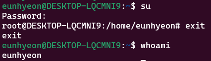
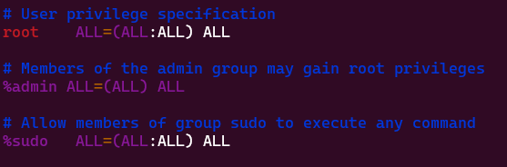

# __리눅스 - 우분투(Ubuntu)__
## __0418. su, sudo, apt명령어__ 
<hr/>

> 리눅스를 사용할 때 sudo apt-get 명령어를 많이 볼 수 있음   
> 의미를 알고 사용하면 좋을 거라 생각하여 조사하게 됨


- 리눅스에서 특정 명령을 실행하거나 파일 접근하기 위해서는 **루트(root)** 권한이 필요   
- 일반 사용자가 root권한을 사용하기 위해서는 `su`, `sudo`명령어를 사용 

`su`(Super user)명령어 : root 권한으로 다른 사용자로 변경하는 명령어

```linux
su          -- root 사용자로 변경 암호를 물어볼 때 root암호를 입력
exit
su user01   -- 다른 사용자로 변경 
logout
su - user01 -- 다른 사용자로 변경하면서 환경변수까지 적용
exit
whoami      -- 현재 사용자를 확인

```


`sudo`(superuser do)명령어 : 현재 계정에서 root 권한을 이용하여 명령어를 실행
 
```linux
apt-get update
sudo apt-get update
```
`sudo apt-get update` 
- sudo 다음에 실행할 명령을 입력하면 일반 사용자도 특정 명령어나 작업을 실행할 수 있음
- root 권한으로 명령어를 실행
- 실행하기 전 현재 사용자의 비밀번호를 물어봄 
 
```linux
sudo -i
sudo -s
```
- i,s옵션을 사용하여 sudo명령도 su처럼 root계정으로 전환이 가능
- s옵션은 현재 디렉토리를 유지
- i옵션은 /root 디렉토리로 이동

/etc/sudoers파일에 지정된 사용자면 sudo명령을 사용   

```vim
#User privilege specification   
root    ALL=(ALL:ALL) ALL   
user01  ALL=(ALL:ALL) ALL   
```

-> 이렇게 설정하면 user01도 sudo명령어를 사용할 수 있음


결론적으로, `su`는 다른 사용자로 변경하는데 사용되는 것이고, `sudo`는 일시적으로 root 권한으로 실행할 수 있게 하는 것입니다.


`apt-get`(Advanced Packaging Tool)는 우분투(Ubuntu)를 포함안 데비안(Debian)계열의 리눅스에서 쓰이는 패키지 관리 명령어 도구      
우분투에는 GUI로 되어 있는 시냅틱 꾸러미 관리자도 있기는 하지만 이런 저런 개발관련 패키지를 설치할 때는 커맨드기반인 apt-get이 더 편함   
   
- sudo apt 명령어는 root 권한이 필요한 패키지 설치, 업그레이드, 제거, 검색 등의 작업을 수행할 수 있도록 함
- 패키지 인덱스 인덱스 정보를 업데이트 
    - apt-get은 인덱스를 가지고 있는데 이 인덱스는 /etc/apt/sources.list에 있습니다. 
    - 이곳에 저장된 저장소에서 사용할 패키지의 정보를 얻습니다.   
       
```linux
sudo apt-get update     
```
- 최신정보를 가져와서 패키지 목록을 업데이트

```linux
sudo apt-get upgrade
sudo apt-get dist-upgrade
```
- 패키지 업데이트

```linux
sudo apt-get install <package-name>
```
- 패키지 지정된 패키지를 설치할 수 있음
```linux
sudo apt-get remvee <package-name>
```
- 패키지 제거
```linux
sudo apt-get --reinstall install <package-name>
```
패키지 재설치
```linux
sudo apt-get source <package-name>
```
- 패키지 소스코드 다운로드
```linux
sudo apt-cache  search 패키지이름
```
- 패키지 검색
```linux
sudo apt-cache show 패키지이름
```
- 패키지 정보보기

