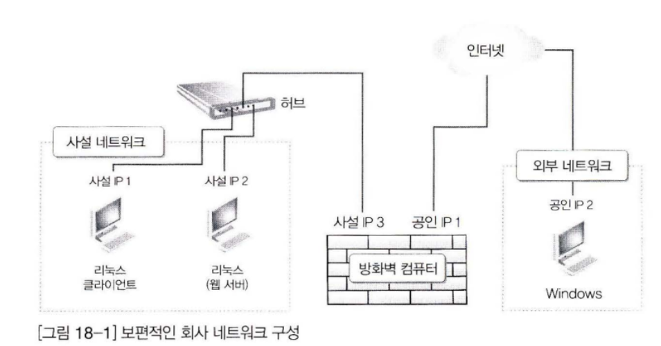

이것이 우분투 리눅스다 - 18.방화벽
======================

# 방화벽 컴퓨터를 만들자

## 보안을 위한 네트워크 설계

네트워크 보안은 외부의 악의적인 침입으로부터 내부의 컴퓨터들을 보호하는 것을 말한다.
가장 안전한 네트워크 설계는 내부의 네트워크와 외부를 완전히 차단해 내부에서 외부로 접속하지 못하도록 완전히 고립시키는 것이다. 하지만 이 방법은 몇 몇 특수 상황을 제외하곤 쓰이지 않는다.
그래서 내부의 사용자는 외부의 인터넷을 이용하면서 외부는 내부로 침입할 수 없게 하는 방법이 필요해졌다. 그 중 가정 보편적인 방식이 사설 IP를 이용하는 것이다.

방화벽이란 외부의 공개된 네트워크와 내부의 사설 네트워크 사이에서 외부와 내부에 전달되는 트래픽을 정책에 따라 허용 또는 거부하는 역할을 하는 컴퓨터나 장치를 말한다.

각 장치의 역할은 다음과 같다.

> ⓐ  `**사설 네트워크`** 는 회사의 내부라고 생각하면 된다. 〔그림 18 -1] 에는 2 대뿐이지만 실무에서는 더 많은 컴퓨터가 있을 것이다.  
ⓑ  **`외부 네트워크`**는 특정한 컴퓨터가 아닌 인터넷상의 모든 컴퓨터라고 생각하면 된다.  
ⓒ **`방화벽 컴퓨터`**는 2 개의 네트워크 카드(랜카드) 가 설치되어 있어야 한다. ［그림 18 -1]에 나와듯이 하나는 내부의 사설 네트워크에 연결될 네트워크 카드며, 다른 하나는 외부의 인터넷과 연결되어야 할 네트워크 가드다.  
ⓓ **`허 브`**는 내부의 여러 대 컴퓨터와 방화벽을 연결해줄 장치 댜 내부의 컴퓨터가 1 대뿐이라면 허브는 없어도 될 것이다. 실무에서는 주로 성능이 좋고 고가인 스위칭 허브를 많이 사용한다.
> 

작동 원리는 다음과 같다.

> ⓐ사설 네트워크 안의 컴퓨터들은 외부의 인터넷에 접속할 수 있어야 할 것이다.  
따라서 사설 네트워크 안 컴퓨터들의 네트워크 정보 중, 게이트웨이 주소는 방화벽 컴퓨터의 [사설 IP 3]으로 지정되어 있어야 한다. 그래야만 게이트워이를 통해서 외부의 인터넷에 접속할 수 있다.  
만약 리눅스 클라이언트가 방화벽 컴퓨터를 통해 외부 네트워크의 윈도우 컴퓨터에 접속을 했다면, 외부의 윈도우 컴퓨터 입장에서는 리눅스 클라이언트의 [사설 IP 1]에 접근했다는 사실을 알지 못하며, 단지 방화벽 컴퓨터의 [공인 IP 1]로 접속되었다는 사실만 알 수 있을 것이다. 결론적으로 사설 네트워크의 모든 컴퓨터가 외부 인터넷을 사용할 때는 방화벽의 [공인 IP 1]을 사용하게 된다. 이러한 것을 앞에서 얘기했던 **마스커레이딩**이라고 부른다.  
ⓑNAT의 기능
리눅스 클라이언트가 [사설 IP 1]로 방화벽의 [사설 IP 3]과 [공인 IP 1]을 통해 외부 서버로 접속하려면 패킷을 전송하게 된다. 그리고 이 외부 서버는 접속한 리눅스 클라이언트에게 응답 패킷을 전송해 주려고 할 때, 리눅스 클라이언트의 IP 주소를 [사설 IP 1]이 아닌 [공인 IP 1]로 알고 있어서 [공인 IP 1]로 패킷을 전송한다. 그러면 방화벽 컴퓨터는 해당 패킷을 [사설 IP 1]로 전송하게 된다. 이러한 것을 **`SNAT(Source NAT)`**이라고 부른다.
이는 마스커레이드와 거의 유사한 기능이며, 대개 사설 IP 주소를 동적으로 운영할 때는 마스커레이드를 사용하고, 사설 IP를 고정으로 운영할 때는 **`SNAT`**를 사용한다.  
ⓒ이번에는 외부에서 [사설 IP 2]를 이용하는 리눅스 웹 서버에 접속할 때를 생각해보자.   
일단은 방화벽의 [공인 IP 1]로 접속해야 하며 방화벽 컴퓨터가 이 패킷을 내부의 [사설 IP 2]에게 전송한다. 이러한 기능을 **`DNAT(Destination NAT]`**라고 부른다.  
이러한 기능들은 자동으로 사용할 수 있는 것이 아니라, 서버 관리자가 직접 설정해줘야 한다.  
이렇게 서버 관리자가 여러 가지 규칙을 지정해주는 것을 정책 수립이라고 한다. 즉, 방화벽 컴퓨터는 서버 관리자에 따라 아주 강력한 보안 정책을 유지할 수도 있고, 유연한 보안 정책을 갖게 될 수도 있고, 보안 정책이 아예 없는 것과 마찬가지일 수도 있다.  
실제로 아주 비싼 방화벽 장비를 설치한 곳에서도 내부와 외부의 모든 패킷을 허용해주는 규칙을 설정해서 방화벽이 없는 것과 마찬가지로 운영하는 경우도 존재한다.  
결론적으로 방화벽 컴퓨터의 운영은 정책을 어떻게 수립하느냐의 문제가 더 중요하다고 할 수 있다.
>