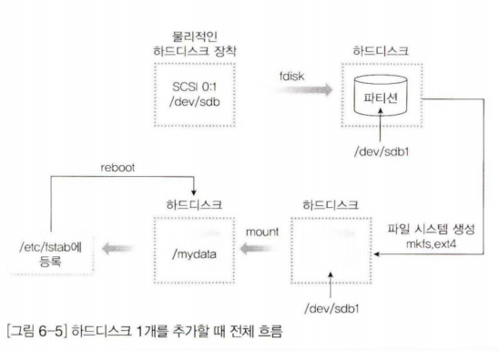
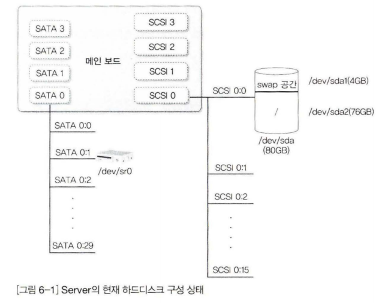
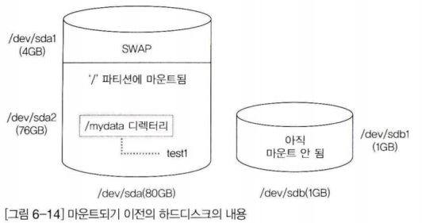
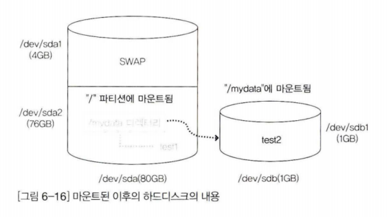

<<<<<<< HEAD
---
layout : home
---

하드디스크 관리와 사용자 별 공간 할당
======================

=======
>>>>>>> b244c11522191d64847e572b0a699b7256de8805
# 하드디스크 관리와 사용자 별 공간 할당

## SATA(Serical Advanced Technology Attachment)

SATA는 하드 디스크나 SSD 같은 저장장치와 가상머신 간의 통신을 위한 인터페이스이다. 이전에는 PATA라는 인터페이스가 있었는데, SATA는 더 높은 전송 속도와 적은 케이블 수 등의 장점을 가진다.

가상머신에서는 호스트 컴퓨터의 하드 디스크나 SSD를 가상의 SATA 컨트롤러를 통해 연결하여 사용하거나, 가상 하드 디스크나 가상 SSD를 만들어서 가상의 SATA 컨트롤러와 연결하여 사용할 수 있다. 

SATA 컨트롤러는 가상머신 소프트웨어에서 제공하며, 이를 통해 가상머신과 저장장치 간의 데이터 전송이 이루어진다.

## SCSI(Small Computer System Interface)

SCSI의 약자로, 컴퓨터와 주변장치 사이의 데이터 전송을 위한 표준 인터페이스이다.

가상머신에서는 호스트 컴퓨터에 연결된 SCSI 디스크를 가상의 SCSI 컨트롤러를 통해 가상머신과 연결하여 사용하거나, 가상 SCSI 컨트롤러와 가상 SCSI 디스크를 만들어서 가상머신과 연결하여 사용할 수 있다. 

가상 SCSI 컨트롤러는 가상머신 소프트웨어에서 제공하며, 이를 통해 가상머신과 주변장치 간의 데이터 전송이 이루어진다.

SCSI는 여러 개의 디바이스를 연결하여 사용할 수 있고, 더 많은 데이터 전송 속도와 더 많은 주변장치를 지원하기 때문에 서버나 데이터 센터 등에서 주로 사용된다.

### SATA / SCSI 차이점

가상 머신(Virtual Machine, VM)에서 **SATA와 SCSI의 차이는 주로 가상 저장소(Virtual Storage)와 연결 방식**이 있다.

SATA는 하드 디스크 드라이브 및 광학 디스크 드라이브 등의 일반적인 저장 장치에 사용되는 인터페이스로, 대부분의 가상 머신에서 기본적으로 지원된다. 

**SATA는 비교적 저렴하고 간편한 구성, 유연성 및 안정성을 제공한다.** 

또한 SATA 컨트롤러는 일반적으로 가상 머신의 하드웨어에 내장되어 있으므로 추가 구성이 필요하지 않다. 

이러한 이유로 **SATA는 일반적으로 작은 규모의 VM에서 사용**됩니다.

반면 **SCSI는 일반적으로 고성능 및 대용량 저장 장치에 사용되는 인터페이스이**다. 

SCSI는 여러 가상 머신에서 동시에 공유할 수 있는 공유 스토리지 및 클러스터링 환경과 같이 높은 성능과 안정성이 필요한 시나리오에서 유용하다. 

또한 SCSI는 가상 머신에서 더 많은 하드웨어 리소스를 요구하므로 추가 구성이 필요하다.

**결론적으로, SATA는 비교적 작은 규모의 VM에서 사용되며, 간단하고 저렴한 구성이 가능하다.** 

**SCSI는 대형 VM 또는 높은 성능이 필요한 시나리오에서 사용되며, 고성능 및 안정성을 제공**한다. 

그러나 **SCSI는 구성이 더 복잡하고 비용이 더 많이 듭니다.**

### VM에서 하드디스크 용량 확장 시 선호

VM에서 하드디스크 용량을 확장할 때는 주로 SCSI를 사용하는 것이 좋다.

이유는 **SCSI 인터페이스가 SATA보다 높은 처리량과 더 높은 IOPS(I/O per second)를 제공하기 때문**

따라서 **대용량 하드디스크를 사용하거나 고성능을 요구하는 애플리케이션을 실행할 때 SCSI가 더 적합**하다.

## 파티션(Partition)

가상 머신에서 파티션은 하나의 물리적 디스크를 분할하여 각각의 파티션에서 운영 체제나 데이터를 독립적으로 관리하는 것이다. 

즉, 하나의 가상 하드 디스크를 여러 개의 파티션으로 나누어 각각의 파티션에서는 서로 다른 운영 체제나 데이터를 구성할 수 있다. 

또한, 각 파티션에서는 서로 다른 용도의 데이터를 관리하거나 각 사용자 별로 독립적인 공간을 할당할 수 있다. 

이를 통해, 하나의 가상 머신에서 여러 가지 용도의 작업을 수행할 수 있게 된다.

## 마운트(Mount)

마운트란 컴퓨터의 파일 시스템에서 하드 디스크나 외장 디스크 같은 저장 장치를 사용하기 위해 해당 장치를 시스템 내의 디렉토리 구조에 연결한다는 의미이다.

예를 들어, 운영 체제에서 하드 디스크의 파티션을 마운트하면 해당 파티션의 파일들에 대한 접근이 가능해진다.

 마운트된 디스크나 파티션은 특정 디렉토리에 연결되어 있으며, 해당 디렉토리 내의 파일들은 마치 일반적인 디렉토리에 있는 파일처럼 다룰 수 있다.

즉, "파티션에 마운트된다"는 말은 해당 파티션의 데이터를 사용하기 위해 시스템에서 해당 디스크를 인식하고, 해당 디렉토리에 연결한다는 의미이다.

## 파티션 및 사용자 별 공간 할당의 목적

VM(Virtual Machine)에서 파티션을 나누고 사용자 별 공간을 할당하는 이유는 보안 및 관리 편의성 때문이다.

파티션을 나누면 사용자 간에 파일 또는 데이터가 분리되어 저장되므로, 다른 사용자가 개인 정보나 데이터에 액세스하는 것을 방지할 수 있다. 

또한, 사용자 별로 할당된 공간을 통해 사용자가 저장한 데이터를 쉽게 관리할 수 있으며, 필요에 따라 각 사용자의 공간을 조정하여 유연하게 용량을 관리할 수 있다.