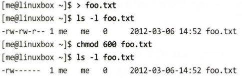

<<<<<<< HEAD
---
layout : home
---

퍼미션
======================

=======
>>>>>>> b244c11522191d64847e572b0a699b7256de8805
# 퍼미션

```bash
id -- 사용자 ID 정보를 표시한다.
chmod -- 파일 모드를 변경한다.
umask -- 기본 파일 퍼미션을 설정한다.
su -- 다른 사용자로 쉘을 실행한다.
sudo -- 다른 사용자로 명령어를 실행한다.
chown -- 파일 소유자를 변경한다.
chgrp -- 파일 그룹 소유자를 변경한다.
passwd -- 사용자 비밀번호를 변경한다.
```

## 소유자, 그룹 멤버, 기타 사용자

유닉스 보안 모델에서 사용자는 파일과 디렉토리를 소유할 수 있다.

사용자가 파일 또는 디렉토리를 소유할 때, 그 사용자는 소유물의 접근을 제어한다.

또한 사용자들은 한 명 이상으로 구성된 그룹에 속할 수 있다.

같은 그룹 사용자들은 그 소유자에 의해 파일과 디렉토리에 접근 권한을 얻는다.

그룹에 접근을 허용하는 것 이외에도, 소유자는 모든 사용자(유닉스 용어로는 world)에게 접근 권한 일부를 줄 수 있다.

자신의 사용자 ID 정보를 확인하기 위해서는 id 명령어를 사용한다.

## 읽기, 쓰기, 실행


## chmod - 파일 모드 변경

파일 또는 디렉토리의 모드 변경을 하기 위해서는 chmod 명령어를 사용한다.

그 모드의 변경은 오직 파일 소유자나 슈퍼유저만이 가능하다.

chmod는 모드 변경을 표현하는 두 방법(8진수의 숫자로 표현하는 법, 문자로 표현하는 법)을 제공한다.

### 8진법의 숫자로 표현하는 법




### 문자로 표현하는 법

아무런 문자를 지정해주지 않으면, 자연스럽게 all로 추정하고 그 명령은 퍼미션이 추가된 a+가 된다.


## umask - 기본 권한 설정

umask 명령어는 파일이 생성될 때 주어진 기본 퍼미션을 제어한다.

파일 모드 속성에서 제거할 비트 마스크를 표현하기 위해 8진 표기법을 사용한다.


현재 마스크 값을 8진 표현인 0002(또 다른 일반적 기본값은 0022)로 반환했다.

소유자와 그룹 모두 읽기와 쓰기 권한을 가지고 있는 것이 확인 가능하지만

나머지 모든 사용자들은 오직 읽기 권한만을 가지고 있다.

기타 사용자는 마스크의 값 때문에 쓰기 권한을 가지고 있지 않다.

새로운 마스크 값을 설정해보자.


마스크를 0000(사실상 끔)로 설정했을 때, 그 파일은 기타 사용자도 쓰기 가능해졌다.

## 사용자 ID 변경

다양한 상황에서 다른 사용자의 ID를 사용하는 방법은 아래 3가지가 있다.

- 로그아웃 후 다른 사용자로 로그인하기
- su 명령어 사용하기
- sudo 명령어 사용하기

### su - 다른 사용자 ID와 그룹 ID로 쉘 실행

슈퍼 유저로 쉘을 시작하기 위해서는 아래와 같은 방법을 통하면 된다.

```bash
su -
```

모든 명령 작업을 마치면 exit로 이전 쉘로 돌아간다.

```bash
exit
```

아래와 같은 방법을 통하면 단일 명령어 수행이 가능하다.

```bash
su -c 'command'
```

### sudo - 다른 사용자로 명령어 실행

sudo 명령어는 대부분 su와 비슷하지만 중요한 추가 기능이 있다.

관리자는 매우 통제된 방법 하에서 일반 사용자가 다른 사용자(대개 슈퍼유저)로 명령을 실행할 수 있게끔 sudo를 설정할 수 있다.

특히, 사용자는 하나 이상의 지정된 명령어로 제한되고 나머지는 불가하다. 또 다른 중요한 차이점은 sudo는 슈퍼 유저의 비밀번호를 요구하지 않는다는 저이다.

sudo 사용을 입증하기 위해서 사용자는 단지 자신의 비밀번호를 입력한다.

```bash
sudo 명령어
password : 입력
```

## chown - 파일 소유자와 그룹 변경

chown 명령어는 파일 또는 디렉토리의 소유자와 그룹 소유자를 변경하는 데 사용된다.

이 명령어를 사용하려면 슈퍼유저 권한이 필요하다.

```bash
chown [owner][:[group]] file...
```


## chgrp - 그룹 소유권 변경

유닉스의 예전 버전에서는 chown 명령어가 그룹 소유권이 아닌 파일 소유권만 변경할 수 있었다.

그래서 그룹 소유권을 변경하기 위한 명령어가 chgrp이다.

명령어는 `chown`와 동일한 방식으로 동작한다.

## 사용자 비밀번호 변경

비밀번호 설정 혹은 변경을 위해서는 passwd 명령어를 사용한다.

문법은 다음과 같다.

```bash
passwd [user]
```

passwd 명령어는 강력한 비밀번호의 사용을 강요한다.

이는 비밀번호가 너무 짧거나 이전 비밀번호와 유사하거나, 사전 단어 또는 쉽게 유추할 수 있는 것이라면 설정이 거부될 수 있다는 뜻이다.

