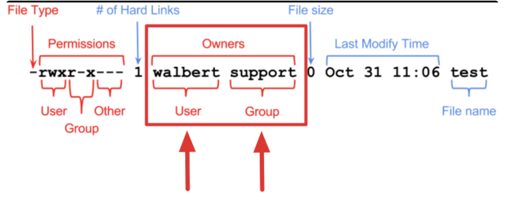
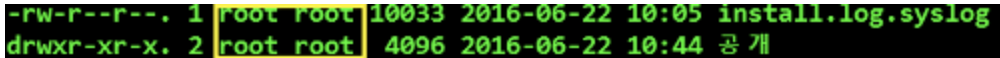

## 소유권(ownership)
- 각 파일이나 디렉터리를 소유할 사용자나 그룹을 지정.
- 파일 소유권을 영어로 file ownership 이라고 하는데 chown은 change ownership을 축약한 단어로 해석하면 된다.
- ls -al 명령어를 실행했을 때 표시된 이 부분을 보고 리눅스에서는 소유권(Permission)이라고 부른다.

### -> 앞 부분의 root가 소유자, 뒤의 root가 소유그룹이다.

## chown - 사용자 및 그룹 소유권 변경
- chown [options] owner:[group] files

### test.txt 파일을 소유자를 root로
- $ chown root test.txt

### 사용자는 myuser 그룹은 mygroup으로 파일 소유자 변경
- $ sudo chown myuser:mygroup myfile.txt

### myfiles 디렉터리 이하 모든 파일 및 디렉터리에 대하여 사용자는 myuser, 그룹은 mygroup으로 소유자 변경
- $ sudo chown -R myuser:mygroup myfiles

## chown -r[소유자:그룹명][파일 or 디렉토리명]
- R 옵션을 사용할 경우 하위 디렉토리나 파일도 함께 한꺼번에 변경이 됩니다.

### /home/user1 디렉토리 내의 모든 파일과 디렉토리의 소유자를 user2로, 그룹을 group2로 변경
- $ chown -r user2:group2 /home/user1

## chgrp - 파일이나 디렉터리의 그룹 소유권만 변경

### 본인이 소유한파일에 대해 자신의 그룹내 소유권 변경
- $ chgrp [options] group file

### test.txt 파일의 소유그룹을 hansgroup로
- $ chgrp hansgroup test.txt

### 디렉터리 이하 모든 파일과 디렉터리에 대해 그룹을 colors로 변경 
- $ chgrp -R colors color_files
