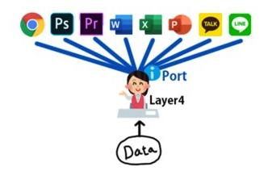
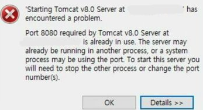
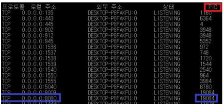
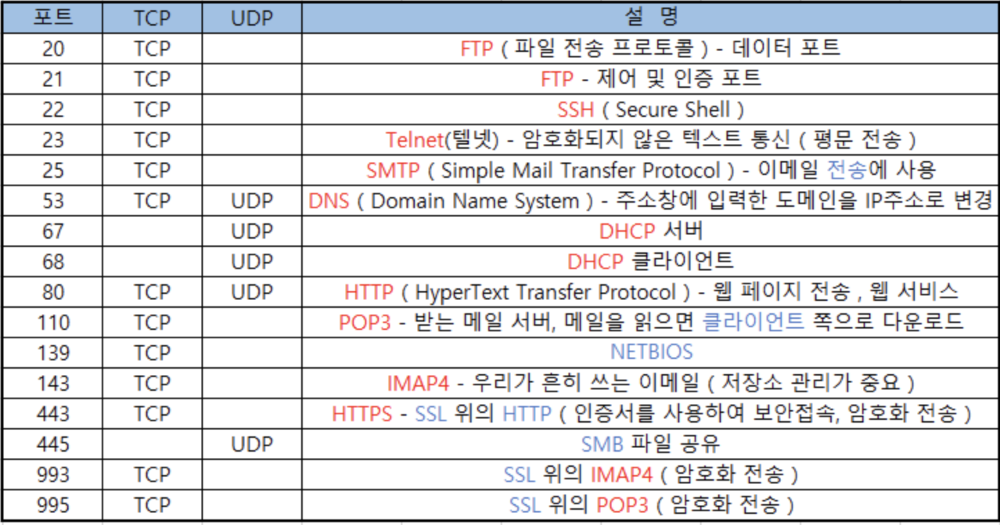

## Port

- 포트(port)란 네트워크 통신에서 특정 프로그램이나 서비스에 접근하기 위한 열린 문입니다.​

- 인터넷 상에서 컴퓨터나 기기를 식별하는 게 IP이면, 컴퓨터에 실행중인 프로그램을 식별하는 것은 Port 번호이다.​
​
- 포트번호는 0~65535번 까지 사용할 수 있으며 이론적으로는 65535번까지 사용 가능하다.​

- 따라서 이 범위 내의 포트번호를 사용할 때는 충돌을 피하기 위해 사용하고자 하는 포트번호가 이미 예약되어 있는지 확인해야 합니다.

### 포트번호 충돌
- netstat –ano : 현재 열린 포트와 해당 포트를 사용하는 프로세스의 정보를 보여준다.​
- PID : 운영체제에서 프로세스에 할당된 고유한 식별자​

### Well-known-port(잘 알려진 포트)
- 인터넷 프로토콜 스위트(IPv4 및 IPv6)에서 사용되는 포트 번호 중 하나입니다. 
- 이러한 포트 번호는 0에서 1023까지의 범위에서 할당됩니다.
- 이러한 포트는 특정 서비스에 예약되어 있으며, 예를 들어 포트 80은 HTTP(Web) 서비스에 할당되어 있습니다.
- 따라서 이러한 포트를 사용하는 애플리케이션은 이러한 서비스에 특정 포트를 사용해야 합니다.
- 일반적으로, 이러한 포트는 관리자 또는 시스템 관리자가 사용하는 포트이며, 시스템의 일반 사용자가 사용할 수 없습니다.
