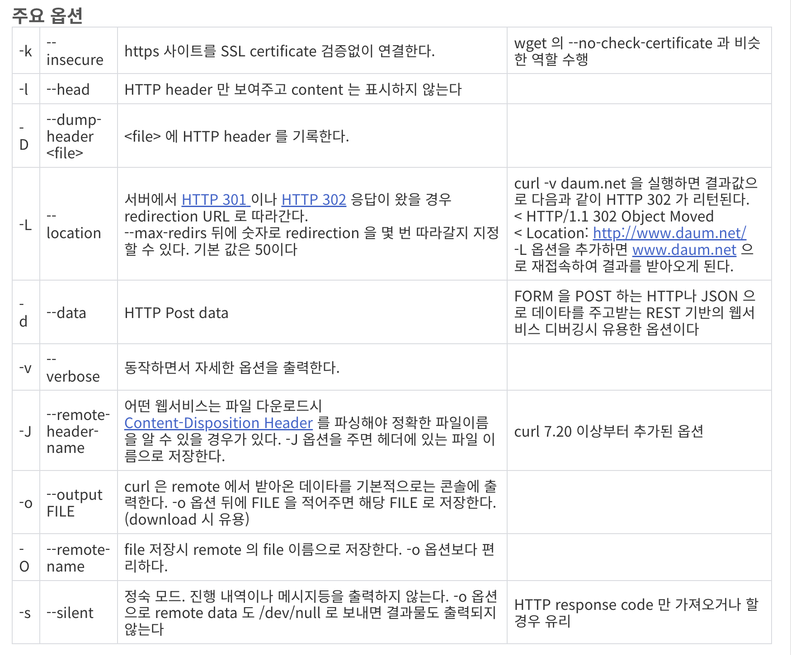

## curl 명령어란?

- 리눅스에서 curl 이라는 http 메시지를 쉘상에서 요청하여 결과를 확인하는 명령어 이며, curl 명령어는 http를 이용하여 경로의 데이터를 가져온다.
- curl은 인터넷 프로토콜을 통해 데이터를 전송하기 위한 명령줄 도구이며, URL을 통해 다양한 프로토콜 (HTTP, FTP, SMTP 등)을 지원합니다. 
- curl은 데이터를 받아들이고 보내는데 사용할 수 있는 다양한 옵션을 제공합니다.
- curl을 사용하면 URL로부터 데이터를 다운로드하거나, 서버에 데이터를 업로드하거나, 특정 웹 사이트에 로그인하는 등 다양한 작업을 수행할 수 있습니다.

## curl 명령어 사용법

### URL로부터 데이터 다운로드
#### $ curl https://www.google.com
- 위의 명령어를 실행하면 https://www.google.com에서 HTML 문서를 다운로드 받아 출력하게 됩니다.

### 파일로 데이터 다운로드
#### $ curl -o data.txt https://www.google.com
- 위의 명령어를 실행하면 https://www.google.com에서 HTML 문서를 다운로드 받아, 현재 디렉토리에 data.txt라는 파일 이름으로 저장합니다.

### POST 요청 보내기
#### $ curl -X POST -d "username=example&password=1234" https://www.example.com/login
- 위의 명령어를 실행하면 https://www.example.com/login에 username과 password 값을 담아 POST 요청을 보내게 됩니다.

### HTTP 요청 헤더 지정하기
#### $ curl -H "Accept: application/json" https://www.example.com/api
- 위의 명령어를 실행하면 https://www.example.com/api에 GET 요청을 보내며, Accept 헤더에 application/json 값을 지정합니다.

### FTP로 파일 다운로드
#### $ curl -u ftpuser:ftppassword -o file.txt ftp://ftp.example.com/file.txt
- 위의 명령어를 실행하면 ftp://ftp.example.com/file.txt에서 file.txt 파일을 다운로드 받아 현재 디렉토리에 저장합니다.

