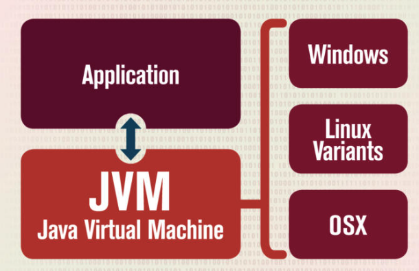
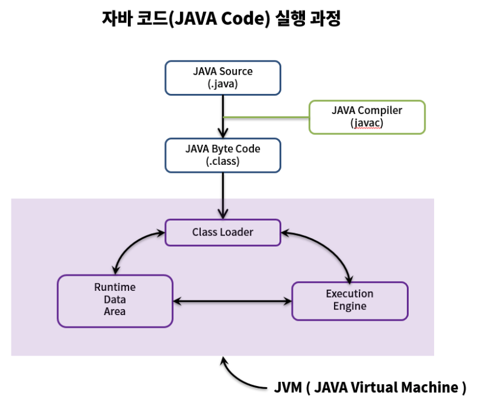
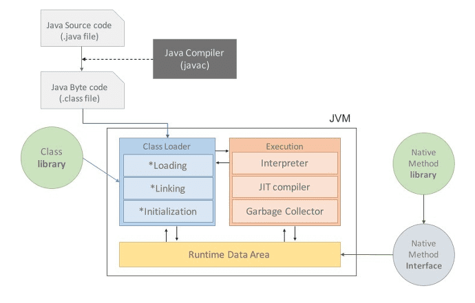
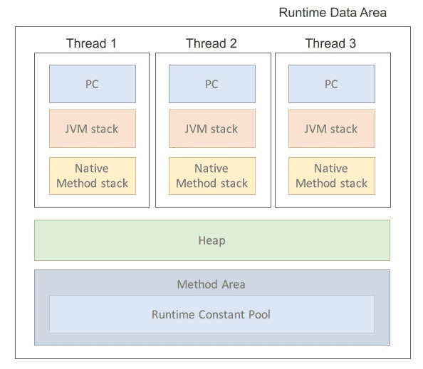
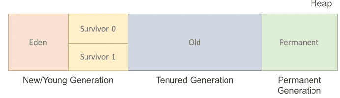

# Java Virtual Machine
- 직역하면 '자바를 실행하기 위한 가상 기계(컴퓨터)'라고 할 수 있다.
- Java의 특징 중 Java는 OS에 종속적이지 않다는 특징을 가지고 있다.
- OS에 종속받지 않고 실행되기 위해선 OS 위에서 JAVA를 실행시킬 무언가가 필요하다.
- 그게 바로 JVM 이며 OS에 종속받지 않고 CPU가 java를 인식, 실행할 수 있게 하는 가상 컴퓨터이다.

## JVM 동작
- 자바 프로그래밍 언어로 작성된 소스 코드는 우선 자바 컴파일러(javac)에 의해 컴파일되어 바이트코드 파일(.class)로 변환됩니다. 
- 이 바이트코드 파일은 JVM이 실행할 수 있는 형태의 중간 코드입니다.
- JVM은 이 바이트코드 파일을 로드하여 실행합니다. 
- 바이트코드는 JVM 내부에서 해석되어 실행됩니다. 
- JVM은 바이트코드를 명령어 단위로 해석하고 실행합니다. 
- 이를 통해 자바 프로그램은 운영 체제나 하드웨어와 관계없이 일관된 방식으로 동작할 수 있습니다.

## JVM 구성

### 1.Class Loader(클래스 로더)
- JVM내로 클래스파일(.class)를 로드하고, 링크를 통해 배치하는 작업을 수행하는 모듈이다. 
- Runtime 시점에 클래스를 로딩하게 해 주며 클래스의 인스턴스를 생성하면 클래스 로더를 통해 메모리에 로드하게 된다.

### 2. Execution Engine(실행 엔진)
- 로드된 클래스의 바이트코드를 실행하는 런타임 모듈이 바로 실행 엔진이다. 
- 클래스 로더를 통해 JVM내의 Runtime Data Areas에 배치된 바이트코드는 실행 엔진에 의해 실행되며, 실행 엔진은 자바 바이트 코드를 명령어 단위로 읽어서 실행한다. 
- 여기서 Interpreter(인터프리터) 방식과 JIT compiler 방식을 사용하게 된다.

### 3. Interpreter(인터프리터)
- 인터프리터는 프로그래밍 언어의 소스 코드를 바로 실행하는 프로그램을 말한다. 
- 원시 코드를 기계어로 번역하는 컴파일러와 대비된다. 
- 자바는 인터프리터 방식을 사용하여 자바 바이트 코드를 명령어 단위로 읽어서 실행한다. 
- 하지만 한 줄씩 수행하기 때문에 수행 속도가 느리다는 단점이 있다.

### 4. JIT Compiler (Just In Time Compiler)
- 인터프리터 방식의 단점을 보완하기 위해 JIT 컴파일러가 도입되었다. 
- JIT 컴파일러는 바이트코드를 컴파일하여 native code(네이티브 코드)로 변환하여 사용한다. 
- 즉 한 번 컴파일된 코드는 빠르게 수행하게 되어 수행 속도가 빠르게 된다. 
- 하지만 컴파일하는 과정에 비용이 들기 때문에  한 번만 수행할 코드라면 컴파일하지 않고 인터프리팅 하는 것이 유리하다. 
- 따라서 JVM은 인터프리터 방식을 사용하다가 일정한 기준이 넘어가면 JIT 컴파일러를 사용하는 혼합 방식을 사용한다. 

### 5. Garbage Collector(가비지 컬렉터)
- 가비지 컬렉터는 유효하지 않은 메모리인 가비지(Garbage)를 정리해주는 역할을 한다

### 6. Runtime Data Area
- Runtime Data Area는 JVM이 프로그램을 수행하기 위해 OS로부터 별도로 할당받은 메모리 공간을 말한다. 

#### 1) PC Register
- JVM의 PC Register는 CPU 내의 기억장치인 레지스터와 다르게 작동한다. 
- PC Register는 각 쓰레드 별로 하나씩 존재하며 현재 수행 중인 JVM Instruction의 주소를 가지게 된다. 
- 즉, 스레드가 어떤 명령을 실행할지 기록하는 부분이라고 할 수 있다. 

 

#### 2) JVM Stack
- 메소드(method)가 호출될 때 메서드와 메서드의 정보는 JVM Stack에 쌓이게 된다. 
- 즉, 메서드의 매개변수(parameter), 지역 변수(local variable), return 주소, 임시 변수 등의 정보를 기록하는 스택이다. 
- 각 스레드 별로 생성되기 때문에 다른 스레드는 접근할 수 없다. 
- 메서드 호출이 종료되면 스택에서 정보들이 제거된다. 

 
#### 3) Native Method Stack
- 자바 외의 언어로 작성된 네이티브 코드들을 위한 스택이다. 
- Java Native Interface를 통해 호출되는 C/C++ 등의 코드를 수행한다. 

 
#### 4) Method Area
- 모든 쓰레드가 공유하는 메모리 영역으로 클래스, 인터페이스, 메서드, 필드, Static 변수 등의 바이트 코드를 보관한다. 
- Method Area에는 Runtime Constant Pool이라는 별도의 관리 영역도 존재한다. 
- 이는 상수 자료형을 저장하고 참조하여 중복을 막는 역할을 수행한다. 

 
#### 5) Heap
- Runtime 시점에 동적으로 할당하여 사용하는 영역이다. 
- 클래스를 이용해 인스턴스를 생성하면 Heap에 저장된다. 
- 즉, new연산자를 이용해 생성된 객체를 저장하는 영역이다. 
- Heap은 크게 New/Young 영역, Old 영역, Permanent Generation 3 영역으로 나뉜다. 
- 참고로 java8 이후에는 Permanent 영역이 Metaspace 영역으로 바뀌었다.
