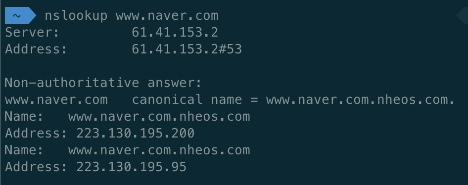
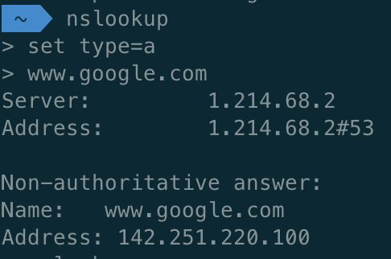

---
<<<<<<< HEAD
layout: nslookup 명령어
=======
layout: home
>>>>>>> 466cf81a4ab365c93ff1e9ddf22e8d2131b07898
---

# nslookup
- nslookup은 DNS 서버에 도메인이나 ip 주소를 질의를 해서 DNS 서버에 있는 정보를 응답받을 때 사용하는 명령어입니다.
- nslookup 명령어를 사용하면 웹사이트의 IP 주소를 확인 하거나 특정 호스트나 도메인에 속한 메일 서버, 웹 서버, 네임 서버 등의 정보를 확인할 수 있습니다

## nslookup 명령어 설치
- 만약 nslookup 명령어가 없다면 설치해야 한다.

### CentOS
- $ sudo yum install bind-utils

### Ubuntu
- $ sudo apt-get install dnsutils

## nslookup 명령어 사용법

### 도메인의 IP 주소 알아오기
- 가장 간단한 사용방법은 nslookup 명령어의 인자로 도메인 이름을 입력하는 것이다.

### nslookup RR(Resource Record) type 종류
- A > IP 주소를 알고 싶을 때
<<<<<<< HEAD
- PRT > 특정 IP주소가 도메인과 일치하는지 알고 싶을 때
=======
- PTR > 특정 IP주소가 도메인과 일치하는지 알고 싶을 때
>>>>>>> 466cf81a4ab365c93ff1e9ddf22e8d2131b07898
- CNAME > 도메인과 별도로 별칭이 있는지 (원래 이름)
- MX > 도메인으로 메일이 갈 때, 어떤 메일 서버가 수신하는지 
- NS > 해당 도메인을 관리하는 도메인 서버가 누구인지
- SOA > 도메인 존에 관련된 정보가 무엇인지
- TXT > 기본 도메인 정보 외, 기타 정보는 무엇인지

