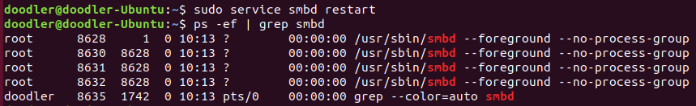

# 삼바(SAMBA)란?
- 윈도우, 리눅스 끼리 파일을 서로 옮길 경우 번거롭다
- 보통은 서버를 열어두고 FileZila와 같은 파일공유 툴을 이용하여 옮긴다.
- 하지만 매번 프로그램을 실행해서 열어줘야되고, 무엇보다 폴더 시스템이 윈도우에 비해 너무 불편하다.
- 하지만 익숙한 윈도우 폴더에서 바로바로 파일을 리눅스로 옮길 수 있는 방법이 있는데 이번에 소개할 삼바가 바로 그것이다.

- 삼바(Samba)는 마이크로소프트와 인텔에서 개발한 SMB(Server Message Block) 네트워크 프로토콜을 이용해 윈도우와 유닉스계열의 운영체제나 다른 시스템 간의 자원을 공유할 수 있도록 만든 프로그램이다.

#### SMB
- Server Message Block, 마이크로소프트사와 인텔이 윈도우 시스템이 다른 시스템의 디스크나 프린터와 같은 자원을 공유할 수 있도록 하기 위해 개발된 프로토콜

- 리눅스에 삼바를 설치하게 되면 리눅스가 서버, 윈도우가 클라이언트가 되는 것이다. (반대도 가능하다)

- 삼바는 SMB 프로토콜을 이용해서 작동하기 때문에 해당 프로토콜이 설치된 시스템만 사용할 수 있다.

### 그럼 삼바를 사용하면 다 될까?
- 삼바가 확실히 편리하긴 하지만단점으로는, 보안이 중요한 회사에서는 잘 사용되지 않는 편이다.
- 예를들어 보안이 중요한 금융업계같은 경우, 공유폴더를 사용하지 않도록 지정되어 있기 때문이다.
- 이때는 번거롭더라도 sftp를 통해 공유해야 한다.

## 삼바(SAMBA) 설치 & 설정

- 삼바는 설치한다고 바로 사용가능 하지 않고 설정을 해줘야 한다.
- 순서는 아래와 같다

### 1. Samba 설치

### 2. 계정 등록
- 설치를 완료했으면, 이제 samba 서버로 접속 할 계정을 등록

### 3. 공유 디렉토리 생성
- 윈도우에서 리눅스로 접근할 수 있는 즉, 삼바로 공유될 디렉토리를 하나 생성해준다.

### 4. 삼바 환경 설정
- 이제 삼바의 환경설정을 통해 어떤 폴더를 공유하고 싶은지, 사용자를 일일이 추가해서 접근 공간을 다르게 해줄건지, 아님 특정 IP대역을 다 허용할건지, 파일을 읽을수만 있게할건지 등을 설정해줘야 한다.
- 삼바 환경 설정 파일 위치 : /etc/samba/smb.conf 

- 위의 설정 파일을 오픈하면 기본적으로 [global], [printers], [home] 3가지 구역이 존재한다.

- 각 구역을 필요에 따라 설정해줘야 한다.

##### [global] : 삼바 서버 전체의 환경설정
##### [homes] : 각 사용자가 서버의 홈디렉토리로 접근할 때 권한
##### [printers] : 프린터 관련 권한

- 맨 하단으로 커서를 이동하고 새로운 섹션을 추가해 아래의 내용을 입력해준다.

### 5. 삼바 데몬 smbd 재시작

### 6. Windows에서 Samba 연결

- 네트워크 드라이브를 연결했으면 자격 증명을 입력하라고 뜨는데, 위에서 삼바 계정 등록 했었던 계정 아이디와 암호를 적어주면 된다.

