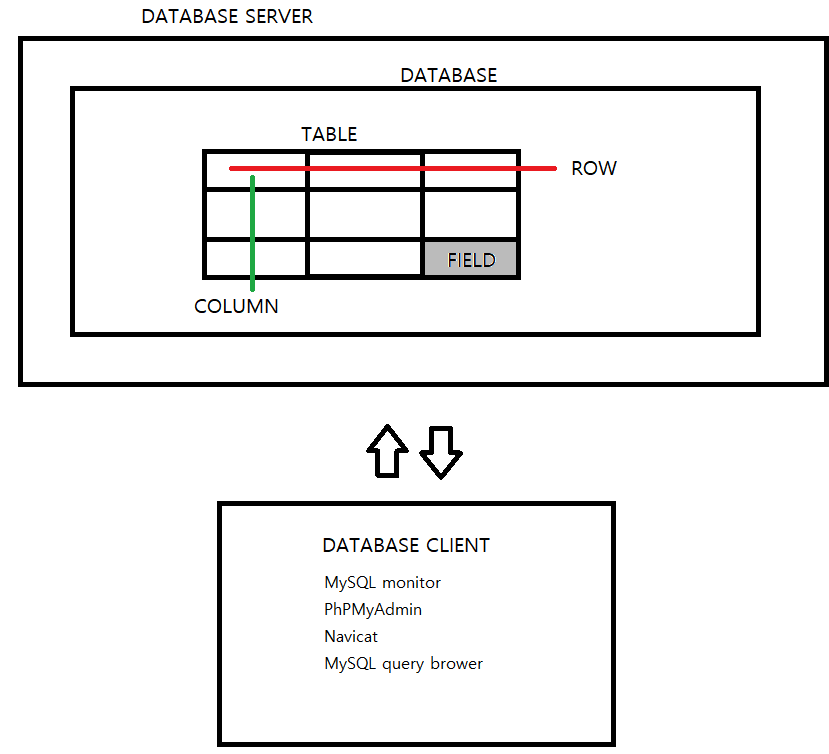
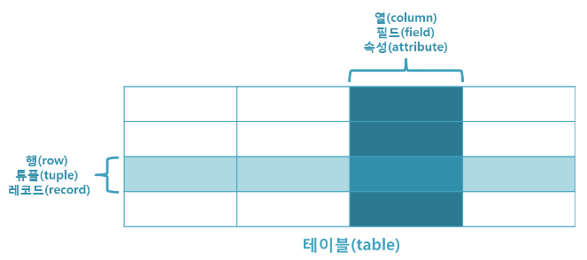
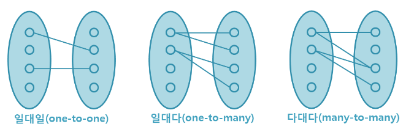

# MySQL
 
- MySQL은 가장 널리 사용되고 있는 관계형 데이터베이스 관리 시스템이다. (RDBMS)
- ySQL은 오픈소스이며, 다중 사용자와 다중 스레드를 지원한다
- C, Cpp, JAVA, PHP 등 여러 프로그래밍 언어를 위한 다양한 API를 제공한다.
- MySQL은 윈도우, 리눅스 등 다양한 운영체제에서 사용가능하며 Apache, PHP 와 함께 웹 개발에 자주 사용된다. 
- APM의 M MySQL or (MariaDB) 등 Apache, PHP와 호환성이 좋기에 사용한다
- MySQL은 오픈 소스 라이선스를 따르지만, 상업적 이용시 상업라이센스를 필히 구매하여야 한다. 

## DataBase(데이터베이스)
- 데이터베이스란?
- 데이터의 저장소 또는 통합하여 관리되는 데이터의 집합체를 의미한다.
- 중복 데이터 제거, 자료 구조화, 효율적 처리를 통해 관리된다.
- 응용프로그램과 다른 별도의 미들웨어에 의해 관리된다.
- 데이터베이스를 관리하는 이러한 미들웨어를 데이터베이스 관리시스템 (DBMS: Database Management System)라 한다.

## 데이터베이스의 특징
- 사용자의 쿼리(질의)에 대해 즉각적 처리와 응답이 이루어짐
- 생성, 수정, 삭제를 통해 항상 최신 데이터 유지
- 사용자가 원하는 데이터를 동시에 공유 가능
- 사용자가 원하는 데이터를 주소가 아닌 내용에 따라 참조
- 응용프로그램과 데이터베이스는 독립되어 있으므로, 데이터의 논리적 구조와 응용프로그램은 별개로 동작함.
 

## 관계형 데이터베이스(relational database)란?
- 관계형 데이터베이스는 현재 가장 많이 사용되고 있는 데이터베이스의 한 종류입니다.
- 관계형 데이터베이스란 테이블(table)로 이루어져 있으며, 이 테이블은 키(key)와 값(value)의 관계를 나타냅니다.
- 이처럼 데이터의 종속성을 관계(relationship)로 표현하는 것이 관계형 데이터베이스의 특징입니다.
 

## 관계형 데이터베이스의 특징
- 데이터의 분류, 정렬, 탐색 속도가 빠릅니다.
- 오랫동안 사용된 만큼 신뢰성이 높고, 어떤 상황에서도 데이터의 무결성을 보장해 줍니다.
- 기존에 작성된 스키마를 수정하기가 어렵습니다.
- 데이터베이스의 부하를 분석하는 것이 어렵습니다.

## 관계형 데이터베이스 용어
### 1.열(column)
- 각각의 열은 유일한 이름을 가지고 있으며, 자신만의 타입을 가지고 있습니다.
- 이러한 열은 필드(field) 또는 속성(attribute)이라고도 불립니다.

### 2.행(row)
- 행은 관계된 데이터의 묶음을 의미합니다.
- 한 테이블의 모든 행은 같은 수의 열을 가지고 있습니다.
- 이러한 행은 튜플(tuple) 또는 레코드(record)라고도 불립니다.

 
### 3.값(value)
- 테이블은 각각의 행과 열에 대응하는 값을 가지고 있습니다.
- 이러한 값은 열의 타입에 맞는 값이어야 합니다.

 
### 4.키(key)
- 테이블에서 행의 식별자로 이용되는 열을 키(key) 또는 기본 키(primary key)라고 합니다.
- 즉, 테이블에 저장된 레코드를 고유하게 식별하는 후보 키(candidate key) 중에서 데이터베이스 설계자가 지정한 속성을 의미합니다.

### 5.관계(relationship)
- 테이블 간의 관계는 관계를 맺는 테이블의 수에 따라 다음과 같이 나눌 수 있습니다.
- 일대일(one-to-one) 관계
- 일대다(one-to-many) 관계
- 다대다(many-to-many) 관계
 

- 관계형 데이터베이스에서는 이러한 관계를 나타내기 위해 외래 키(foreign key)라는 것을 사용합니다.
- 외래 키는 한 테이블의 키 중에서 다른 테이블의 행(row)을 식별할 수 있는 키를 의미합니다.

### 6.스키마(schema)
- 스키마는 테이블을 디자인하기 위한 청사진이라고 할 수 있습니다.
- 이러한 스키마는 테이블의 각 열에 대한 항목과 타입뿐만 아니라 기본 키와 외래 키도 나타내야 합니다.