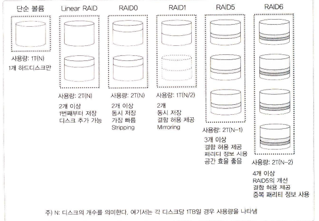
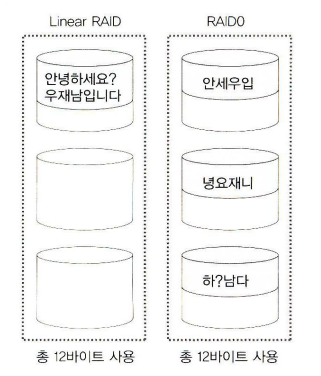
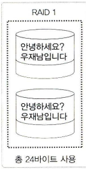
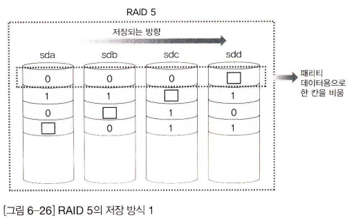
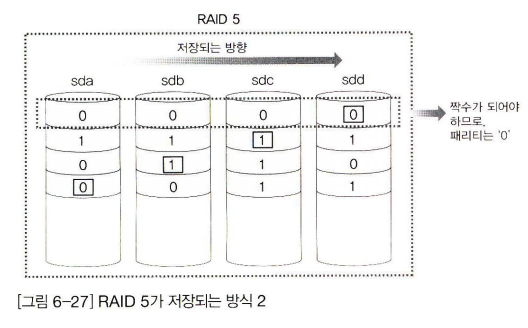
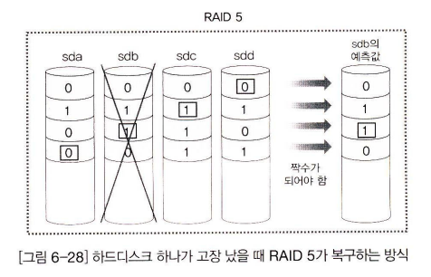
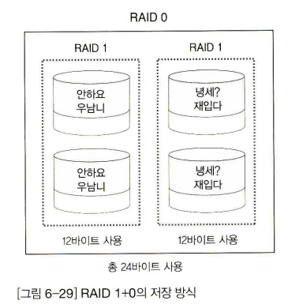

# RAID 정의 및 개념
- 서버 컴퓨터의 저장 장치 대부분은 하드웨어 RAID 또는 소프트웨어 RAID 방식을 사용한다.

## RAID 정의
- RAID(Redundant Array of Inexpensive Disks)는 여러 개의 디스크를 하나의 디스크처럼 사용함.
- 비용을 절감하면서도 더 신뢰성을 높이며, 성능까지 향상시킬 수 있다.

## 하드웨어 RAID
- 하드웨어 제조업체에서 여러 개의 하드디스크를 가지고 장비를 만들어서 그 자체를 공급하는 것이다.
- 좀 더 안정적이고 각 제조업체에서 기술 지원을 받을 수 있기 때문에 많이 선호하는 방법이다.
- 최근에는 저렴한 가격의 제품도 출시되었지만, 안정적이고 성능 좋은 제품은 상당한 고가이다.

## 소프트웨어 RAID
- 고가의 하드웨어 RAID의 대안으로, 하드디스크만 여러 개 있으면 운영체제에서 지원하는 방식으로 RAID를 구성하는 방법을 말한다.
- 하드웨어 RAID 비교하면 신뢰성이나 속도가 떨어지지만 저렴한 비용으로 점 더 안전한 데이터의 저장이 가능하다.
 
# RAID 레벨
- 기본적으로 구성방식에 따라 Linear RAID, RAID 0, RAID 1, RAID 2, RAID 3, RAID 4, RAID 5까지 일곱 가지로 분류한다.
- 실무에서는 주로 사용되는 방식은 Linear RAID, RAID 0, RAID 1, RAID 5와 RAID 5의 변형인 RAID 6, 그리고 RAID 1과 0의 혼합인 RAID 1+0 등이다.

## Linear RAID와 RAID 0
- 두 방식 모두 최소 2개의 하드디스크가 필요
- 2개 이상의 하드디스크를 1개의 볼륨으로 사용하는 점은 비슷하다.
- 가장 큰 차이는 저장되는 방식

## Linear RAID 개요
- 2개 이상의 하드디스크를 1개의 볼륨으로 사용.
- 앞 디스크부터 차례로 저장한다.(앞 하드디스크가 완전히 저장된 후, 다음 디스크에 데이터를 저장)
- 100%의 공간효율성(= 비용 저렴).

## RAID 0 개요
- 모든 디스크에 동시에 저장 된다.
- 이렇게 여러 개의 하드디스크에 동시에 저장되는 방식을 <strong>스트라이핑</strong>방식이라고 부른다.
- 100%의 공간효율성(= 비용 저렴).
- 신뢰성 낮음.
- 빠른 성능을 요구하되, 혹시 전부 잃어버려도 큰 문제가 되지 않는 자료가 적당함.
 

## RAID 1 개요
- RAID1 방식의 핵심은 미러링(Mirroring)이라 할 수 있다.
- 즉, 똑같은 데이터의 거울을 만들어 놓는다는 것이다.
- 데이터 저장에 두 배의 용량이 필요하다.(총 하드디스크의 용량의 절반밖에 사용하지 못한다.)
- <strong>결함 허용(Falut-tolerance)</strong>을 제공(= 신뢰성 높음).
- 두 배의 저장 공간 = 비용이 두 배 = 공간효율 나쁨.
- 저장속도(성능)는 변함 없음.
- 중요한 데이터를 저장하기에 적절함.
 

### RAID 0와 RAID 1 비교
구분	                  RAID 0	                RAID 1
성능(속도)	              뛰어남	               변화 없음
데이터 안전성(결함 허용)	 보장 못함(결함 허용 X)	     보장함(결함 허용 O)
공간 효율성	              좋음	                   나쁨
 

## RAID 5 개요
- RAID1의 데이터 안전성 + RAID 0처럼 공간 효율성을 가진다.
- 최소한 3개 이상의 하드디스크가 있어야만 구성이 가능하며 대개는 5개 이상의 하드디스크로 구성한다.
- 오류가 발생할 때는 패리티(Parity)를 이용해서 데이터를 복구.
- 아래 그림에서 네모로 표시된 데이터는 패리티 데이터.

### RAID 5 특징
- 어느 정도의 결함 허용을 해 주면서 저장 공간의 효율도 좋다.
- 전체 용량의 90%(디스크의 개수 -1)의 공간을 사용한다.
- 그러므로 여러 개 하드디스크로 RAID 5를 구성할수록 저장 공간의 효율을 높일 수 있따.
 

## RAID 6, RAID 1+0
- RAID 5보다 신뢰도를 높은 RAID 6.
- 신뢰도와 속도 두 마리 토끼를 잡기 위한 RAID 1+0.
- RAID 6은 패리티를 2개 사용하기 떄문에 최소 4개의 디스크가 필요.
- RAID 1+0도 최소 4개 디스크가 필요.
- RAID 6의 공간효율은 N-2
- RAID 1+0의 공간효율은 50%

# LVM 개념 이해
- LVM은 Logical Volume Manager의 약자로 '논리 하드디스크 관리자'라고 할 수 있으며 줄여서 그냥 LVM이라 부른다.
- 여러 개의 하드디스크를 합쳐서 한 개의 파티션으로 구성한 후에, 다시 필요에 따라서 다시 나눌 수 있다.

## LVM 용어
- 물리 볼륨 : /dev/sda1, /dev/sdb 1 등의 파티션을 말한다.
- 볼륨 그룹 : 물리 볼륨을 합쳐서 1개의 물리 그룹으로 만든 것이다.
- 논리 볼륨 : 볼륨 그룹을 1개 이상으로 나눈 것으로 논리적 그룹이라고도 한다.

# 쿼터 - 사용자 공간 할당
- 파일시스템마다 사용자나 그룹이 생성할 수 있는 파일의 용량 및 개수를 제한하는 것.
- 파일시스템을 루트(/)로 지정하는 것보다는, 별도의 파일시스템을 지정해서 해당 부분을 쓰도록 하는것이 좋다.
- 파일 시스템을 많은 사용자가 동시에 사용하게 되면, 서버를 운영하기 위해서 디스크를 읽고 쓰는 작업과 일반 사용자가 디스크를 읽고 쓰는 작업이 동시에 발생하므로 전반적으로 시스템의 성능이 저하된다.