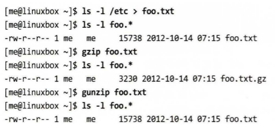
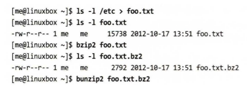
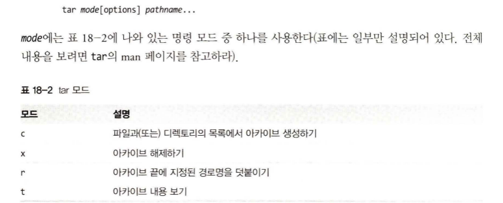
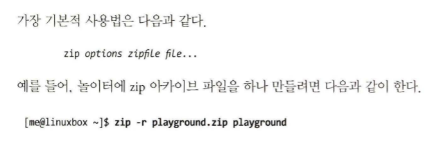
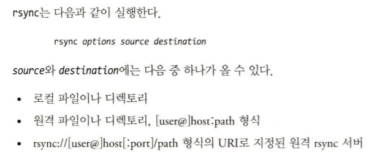

## 파일 시스템을 관리하는 데 있어 가장 기초적인 작업 중 하나가 바로 시스템의 데이터를 안전하게 유지하는 것

### 파일 압축 프로그램
- gzip : 파일 압축 및 압축 해제하기
- bzip2 : 블록 단위의 파일 압축 프로그램

### 파일 보관을 위한 프로그램
- tar : 테이프 아카이빙 유틸리티
- zip : 파일을 묶고 압축하기

### 파일 동기화 프로그램
- rsync : 원격 파일 및 디렉토리 동기화

## 파일 압축하기
- 오늘날 우리가 당연하다고 여기는 휴대용 음악 재생기, 고하질의 TV 또는 브로드밴드 인터넷과 같은 데이터 서비스의 대부분이 사실은 <strong>데이터 압축</strong> 기법이 있어 가능한 것들이다.
- 데이터 압축은 불필요하거나 중복된 데이터를 제거하는 과정을 말한다.

## 압축 알고리즘

### 무손실 방식
- 압축 파일이 복구되면 그 파일은 압축되기 이전의 원본과 정확히 똑같다.

### 손실 방식
- 압축이 수행될 때 데이터의 일부를 삭제하는데 그 이유는 압축율을 높이기 위해서다.
- 원본과는 똑같지 않지만 거의 비슷한 수준이다.
- 대표적인 예로 JPEG(이미지용), MP3(음악 파일용)

# gzip - 파일 압축 및 압축 해제하기
- 하나 이상의 파일을 압축할 때 사용된다.
- 이 프로그램을 실행하면 원본 파일은 압축 버전의 파일로 대체된다.
- 이와 함께 사용되는 gunzip 프로그램은 압축 파일을 압축되기 이전의 원본 상태로 복원시켜준다.

### -> 원본 파일이 압축 파일로 바뀌었고, 원본에 비해 1/5 수준의 크기밖에 되지 않는다.
### -> 압축 파일은 원본과 똑같은 퍼미션과 날짜, 시간을 가지고 있다.

# bzip2 - 속도는 느리지만 고성능 압축 프로그램
- gzip과 유사하나 다른 압축 알고리즘을 사용한다.
- 압축 속도는 느리지만 높은 압축율을 자랑하며 .bz2로 표시된다.

### -> bzip2 프로그램은 gzip과 같은 방식으로 사용할 수 있다.
### -> bzip2와 짝을 이루는 압축 해제 프로그램은 bunzip2와 bzcat이다.
### -> bzip2에는 bzip2recover라는 프로그램이 있는데 손상된 .bz2 파일을 복구시켜준다.

# tar - 테이프 아카이빙 유틸리티
- 유닉스 세상에서 tar 프로그램은 파일 보관을 위한 전통적인 툴이다.
- tape archive의 준말로, 백업 테이프를 만들기 위한 도구에서 유래됐다.
- .tar나 .tgz를 확장자로 가진 파일은 tar 아카이브와 gzip으로 압축된 아카이브이다.

# zip - 파일을 묶고 압축하기
- zip 프로그램은 파일 압축과 보관을 한 번에 할 수 있는 프로그램이다.
- 리눅스에서는 gzip이 일반적이고 그 다음이 bzip2를 많이 사용한다.
- 그래서 리눅스 사용자는 zip 프로그램으로 파일을 압축하는 대신 윈도우 시스템과 파일을 교환할 때 사용한다.

# rsync - 원격 파일 및 디렉토리 기화
- rsync는 파일 복사 및 동기화를 위한 유틸리티이며, 손실 없는 데이터 전송 프로그램입니다. - 이것은 파일이 전송되는 동안 데이터의 일부가 손실되지 않음을 의미합니다. 
- rsync는 파일을 동기화하는 과정에서 변경된 부분만 전송하기 때문에 전체 파일을 다시 전송하는 것보다 훨씬 효율적입니다. 
-따라서 이러한 방식으로 데이터를 전송하면 원본과 동일한 데이터를 보존합니다.
