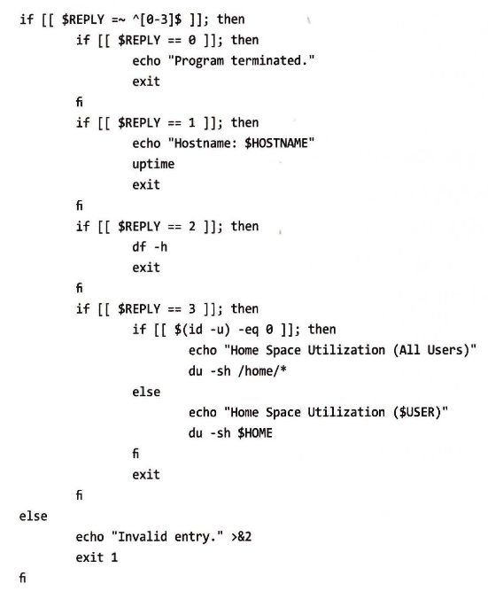
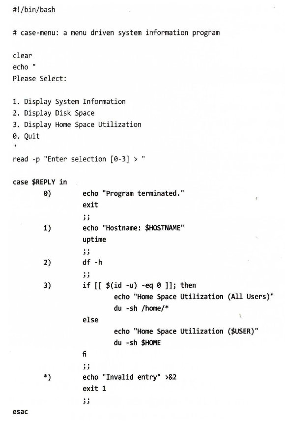
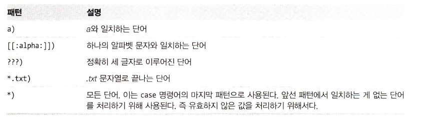
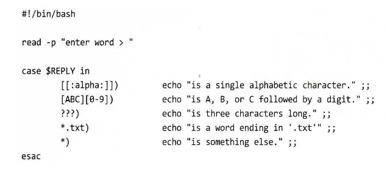
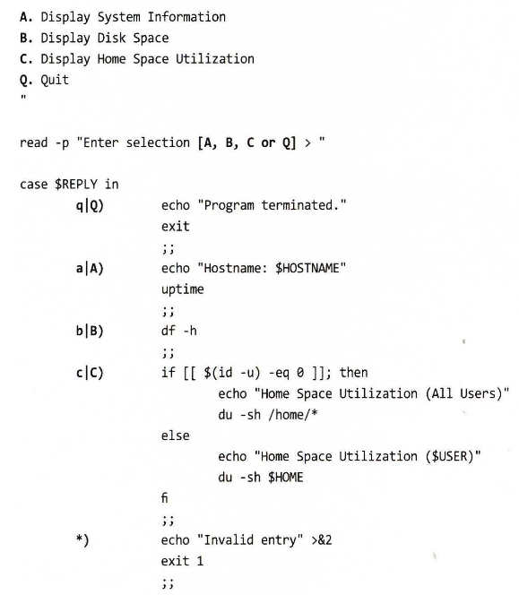

# case
- bash의 다중 선택 합성 명령어는 case라고 하며 다음 문법을 따른다. 
case word in
    [pattern [ I pattern] ... ) commands ; ; ] ...
esac

### 실제 문법
 
위의 로직을 case를 사용하여 이 로직을 좀 더 간단하게 구성
 

- case 명령어는 단어의 값(이 예제에서는 REPLY 변수의 값)을 확인하고 그 값과 일치하는 패턴을 찾는다. 
- 일치하는 패턴이 있으면 해당 패턴의 명령들을 실행한다. 
- 일치하는 패턴을 찾은 후에는 더 이상 패턴을 찾지 않는다.

## 패턴
- case에서 시용하는 패턴은 경로명 확장에서 사용되는 패턴과 동일하다. 
- 이 패턴들은 ')' 문자로 끝난다.
 

다음은 패턴 예제다.
 

### 패턴 결합
- 수직바를 구분자로 사용하여 여러 패턴들을 결합하여 사용하는 것도 가능하다. 
- 이것은 "OR" 조건 패턴을 생성하며 대문자와 소문자 모두를 제어할 때 편리하다. 
 