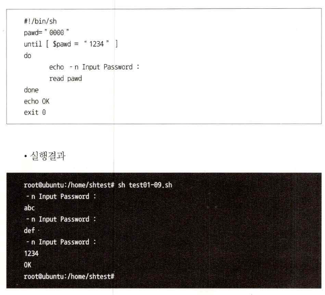

# 쉘 명령어
- 쉘 프로그래밍은 하나하나의 쉘 명령어의 모음이다. 
- 리눅스 시스템을 운영하고 모니터링을 위하여 쉘 프로그램을 많이 사용한다. 

# 쉘 명령어 사용 전 용어정리
## 쉘
- 커널과 사용자간의 인터페이스로서 중간매개의 역할을 담당한다.
- 명령어를 해석하고 최초 유닉스에서는 ksh(콘쉘), 이후 발전된 csh(씨쉘) 동이 사용되었으나,리눅스에서는 bash(배쉘)이 많이 사용된다.

## 쉘 스크립트, 쉘 프로그램
- 하나의 쉘 명령어를 여러 개 묶어서 실행 가능하다.
- 쉘 명령어를 나열하여 text file로 기록하여 이를 실행한다.
- 이러한 묶음 명령어를 쉘 스크립트 또는 쉘 프로그램이라고 한다.

### 쉘 스크립트의 장점
- 타 프로그래밍 언어에 비해 실행속도가 빠르다.
- 컴파일 과정이 필요없이 빠르게 실행 가능하다.
- 시스템 운영이나 유지보수 때 사용하기 용이하다.

### 쉘 스크립트 실행
- 쉘 스크립트를 실행하는 방법은 명령어를 나열하여 파일로 저장 후, 실행권한을 부여한 후 해당 파일명을 실행하는 방법이다.

#### 1.명령어를묶어서실행
- 여러 명령어를 한번에 실행하기 위하여 ;(세미콜론)을사용
- home 디렉토리로 이동한 후 ls명령어를 실행 
- pwd;cd /home;ls -l;pwd
 

#### 2.쉘 스크립트 파일을 작성 후 실행
- vi 등 편집기로 실행함 명령어를 한 줄씩 작성 후 저장
 
- 해당파일명으로 명령어 실행
- 하지만 쉘 스크립트 파일을 실행하기 위하여 쉘 파일의 권한과 패스를 고려하여야 하기 때문에 실행 안 됨.
 

#### 3.권한
- sh shell_script_file 형식으로 실행 ex)sh my.sh
 
- sh shell_script_file 형식으로 실행 ex)sh my.sh
 

#### 4.PATH
- 스크립트 파일 내 모든 명령은 절대 패스로 명령어 기술(full path)
- 쉘 스크립트 파일보다 일반 명령어 실행이 우선되므로 쉘 스크립트 파일도 패스를 지정해야 함: ex)./mysh.sh
- 쉘 스크립트 파일에 환경변수를 인지하도록 하는 방법 
  

# 자주 쓰는 쉘 프로그래밍 기법
- 쉘 프로그램을 작성하다 보면 ‘리다이렉션’. ‘파이프’. ‘echo', 'cut’과 같은 명령어를 매우 유용하게 사용할 수 있다.

## 1.리다이렉션
- 어떤 명령의 결과의 출력은 기본적으로 모니터에 출력되는데, 이 출력값을 모니터가 아닌 다른 장치나 파일로 출력할 때 리다이렉션을 사용한다.
### 리다이렉션(>, redirection)
- 명령 > filename: 어떤 명령의 결과를 파일을 새로 생성하여 기록
- 명령 >> filename: 어떤 명령의 결과를 파일 뒤로 계속 첨부 기록
- 명령 < filename: 어떤 명령의 입력으로 파일의 내용을 사용하여 실행함.
### 리다이렉션 예제
#### ifconfig echo > myfile
- ifconfig echo 내용이 myfile에 기록됨

## 2.파이프
- 어떤 명령의 결과를 받아서 다른명령을 실행하는 경우 파이프를 많이 사용한다.

### 파이프 (|, pipe)
- 명령1 | 명령2 : 명령1의 결과를 입력으로 받아 명령2를 실행
- 파이프를 좋아하는 명령으로 more, sort, grep이 많이 사용됨. 

### 파이프예제
#### cat /etc/services | grep telnet > a.out ; cat a.out
- /etc/services 파일을 cat으로 출력
- 해당출력값을 입력값으로 telnet이라는 문장을 찾음. 
- 이 찾은값을 a.out에 저장, 여기까지 하나의 명령어임. 
- 다음 명령으로 a .out 파일을 출력함.

#### ps | sort > ps.sort
- p로 보이는 프로세스를 첫 필드순(프로세스 번호)으로 정렬하여 ps.sort 파일에 기록
#### ps -aux | sort | more
- ps -aux로 보이는 프로세스를 이름순으로 정렬하여 모니터의 화면 만큼 출력 후 아무키나 누르는 경우 계속 보여줌.

## 3.echo
- echo는 프로그램 변수나 지정된 문자열을 출력해 주는 함수이다.
#### echo 사용 예
- echo $PATH: 현재 설정되어 있는 패스 디렉토리를 보여줌. 
- echo "hello kopo": hellokopo라는 문자를 보여줌.

## 4.cut
- 텍스트 파일이나 명령어의 결과 중 필요한 부분을 간단히 추출할 때 cut 명령어를 사용한다.

#### 옵션 -b,-c 사용사례
- -b 옵션은 바이트(byte), -c는 글자(character)를 의미 
- 한글은 2바이트가 1글자로 취급되는 것을 주의
 

#### 옵션 -d -f 사용 사례
- -d 옵션은 delimiter, 즉 구분자 의미
- ps를 실행하면 각 필드는 빈칸(‘')으로 구분되어 출력
- 빈칸이 여러 개가 있으면 해당 개수 만큼 구분자
- f옵션은 구분자로 구분한 후 몇 번째 필드인가를 의미
- [ps | cut -d '' -f3] : ps의 결과를 ''(빈칸)을 구분자로 했을 때 3번째 항목만 추출
- [ps | cut - d '' 一f4-8]: ps의 결과를 ''(빈칸)을 구분자로 했을 때 4번째부터 8번째 항목만 추출
 

# 쉘 프로그래밍 기초
## 1.변수
- 프로그래밍에서 변수란 문자나 숫자 형태의 데이터를 보관하여 처리과정 중 사용할 수 있는공간이다.
### 1) 변수의 사용
변수는 쉘 프로그램 내에서 간단한 데이터 저장소로 기본은 문자형태의 데이 터를저장하는공간이다.
- 기본은 [변수명="값"] 으로 입력하고 [echo $변수명]으로 사용
- 단 =(등호) 사이는 띄어쓰기를 하지 않음. ex) A=B(o), A = B (x)
- 숫자형과 문자형을 가리지 않고 저장
- 숫자형 계산 A='expr4 + 5'
-  단 연산자 + 사이에 양쪽으로 빈칸을 두어야 함.
- 쉘프로그래밍은 빈칸의 의미가 크다.
- 쉘 명령어 실행 후 결과 저장은 '을 사용(키보드 1의 왼쪽 역 따옴표)
 

### 2) 매개변수의 사용
- 매개변수는 실행 명령어 뒤에 공백으로 구분하여 주어지는 값을 의미한다.
- 예를 들어 [cp afile bfile]이라고 명령한다면 cp는 명령어 afile은 첫 번째 매개변수, bfil은 두 번째 매개변수
- 쉘 프로그래밍에서 $0, $1, $2 .$3 ... $n으로 표현 
- 특별한 매개변수 표현도 있음. [$HOME, $PATH]
 

## 2.조건문
- 조건문은 제시된 조건의 참과 거짓에 따라 실행되는 부분을 달리하는 문장이다.

### 1) if 조건문 
- if 조건문은 조건을 비교하여 참과 거짓에 따라 주어진 블록을 실행하는 조건문이다.

#### if, else, ti 조건문
- if[조건]/then/.../else/../fi : if문 다음의 나오는 내용의 상태에 따라 then과 elif 문장이 나 elif와 fi사이에 쉘 내용을 수행함.
- 조건의 비교방법은 숫자의 대소나 문자열의 같고 다름, 그리고 파일을 비교하는 기능이 있음. 

#### 문자비교
- [ "문자1" = "문자2" ] : 두 문자열이 같은 경우 
- [ "문자l" ! "문자2" ] : 두 문자열이 다른 경우
- [ -z "문자" ] : 문자열의 길이가 0인 경우
- [ -n "문자" ] : 문자열의 길이가 O이 아닌 경우

#### 숫자비교
- [ $A -gt $B ] : A가 B보다 큰 경우
- [ $A -lt $B ] : A가 B보다 작은 경우
- [ $A -ge $B ] : A가 B보다 크거나 같은 경우
- [ $A -le $B ] : A가 B보다 작거나 같은 경우
- [ $A -eq $B ] : A와 B가 같은 경우
- [ $A -ne $B ] : A와 B가 같지 않은 경우
 
 

## 3.반복문
- 반복문은 주어진 조건이나 반복 지시에 따라 특정한 블록을 반복하는 문장이다.

### 1).for 반복문
- for 반복문은 제시된 내용을 조건에 맞는 경우 반복블록에 반영하여 실행한다.
 

### 2).while 반복문
- while 반복문은 제시된 내용을 조건에 맞는 경우 반복 블록에 반영하여 실행하고 조건이 맞지 않으면 반복을 빠져나온다.
 

### 3).until 반복문
- until 반복문은 제시된 내용을 조건에 맞지 않는 경우 반복 블록에 반영하여 실행하고 조건이 맞으면 반복을 빠져나온다.
 

### 4).break 루프 탈출
- 반복문의 루프를 강제로 탈출하려면 break문을 사용한다.
 

## 4.조건의 AND, OR
### 1)다중 조건 나열
- 불리안(boolean)식의 AND(&&)와 OR(||)를 표현하는 방법
  

# 쉘 프로그래밍 응용
## 1.함수, 전역변수, 지역변수
- 함수를 사용하는 경우 변수의 영향 범위를 고려하여야 한다. 
- 전체 쉘 프로그래밍 영역과 함수 내부에서만 사용되는 변수로 나눌 수 있는데, 이를 전역변수와 지역변수라고 한다.

### 1)전역변수, 지역변수
- 전역변수는 함수 내부및 전체 쉘프로그램 영역에서 변수의 영향범위를 미침
- 지역변수는 함수 내부에서만 영향범위를 미침
- 지역변수는 처음 선언 앞에 local이라고 명시함
 

### 2)다중 조건문
- case조건/a)../b)../···/esac 조건이 a)일 경우 a문장을, b)일 경우 b)문장을 실행함.
- 다중의 조건을 간단히 표현
- 각 조건의 종료를 ;; (세미콜론두 개)로 표현
 
 

### 3)주기적으로 처리
- 시스템을 시용하다 보면 특정 작업을 주기적으로 감시하거나 디스크 공간, 메모리 등 시스템 자원을 모니터링하는 경우가 있다.
- 주기적인 처리를 할 때 while, sleep을 많이 시용한다.
- while : , do, done 구분은 do~done 블록을 무한 반복함.
- 반복을 중지시키기 위하여 ctrl+c키를 사용
- 화면이 빠른 속도로 스크롤되는 것과, 특정한 주기시간을 부여하기 위하여 sleep 문장을 시용
 